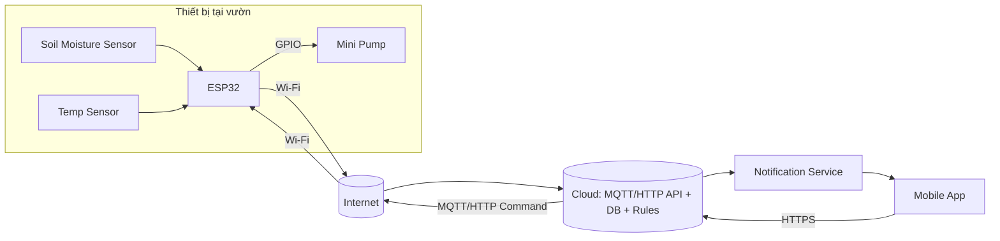

# CHƯƠNG 1: TỔNG QUAN DỰ ÁN

## 1.1. Giới thiệu dự án

### 1.1.1. Tên dự án
**Lập kế hoạch phát triển dự án IoT “Vườn thông minh GreenThumb”.**

### 1.1.2. Mô tả tổng quan hệ thống
GreenThumb là một hệ thống IoT hỗ trợ chăm sóc cây trồng tại gia thông qua việc giám sát các chỉ số môi trường và cho phép tưới nước chủ động/từ xa. Hệ thống gồm hai thành phần chính:

- **Phần cứng (thiết bị IoT):** sử dụng vi điều khiển **ESP32**, tích hợp cảm biến **độ ẩm đất** và **nhiệt độ**. Thiết bị kết nối **Wi‑Fi** để gửi dữ liệu lên nền tảng cloud, đồng thời có thể nhận lệnh điều khiển **bật/tắt bơm** từ cloud.
- **Phần mềm:** gồm **hạ tầng cloud** (MQTT/HTTP, lưu trữ dữ liệu, xử lý cảnh báo) và **ứng dụng di động** giúp người dùng theo dõi số liệu, xem lịch sử, nhận thông báo khi độ ẩm thấp và điều khiển bơm từ xa.

Trong phạm vi học phần, nhóm tập trung xây dựng **kế hoạch quản lý dự án** (phạm vi, WBS, tiến độ, chi phí, rủi ro, chất lượng và triển khai). Việc triển khai sản phẩm hoàn chỉnh (nếu có) chỉ mang tính minh họa để phục vụ lập kế hoạch.

**Hệ thống được thiết kế theo kiến trúc IoT điển hình, đảm bảo khả năng mở rộng và phù hợp với mục tiêu điều khiển, giám sát từ xa trong bối cảnh thực tế.**

### 1.1.3. Bối cảnh và ý nghĩa dự án
Nhu cầu chăm sóc cây trồng tại gia ngày càng tăng, tuy nhiên người dùng thường gặp khó khăn như quên tưới, tưới chưa đúng thời điểm hoặc thiếu thông tin về độ ẩm và nhiệt độ. Ứng dụng IoT giúp tự động hóa quá trình theo dõi, cung cấp cảnh báo kịp thời và hỗ trợ điều khiển tưới từ xa.

Về mặt học phần, GreenThumb phù hợp để mô phỏng một dự án IoT có tính liên ngành (phần cứng–firmware–cloud–mobile), có rủi ro đặc thù và yêu cầu phối hợp song song giữa các nhánh công việc, qua đó giúp nhóm vận dụng kiến thức quản lý dự án CNTT một cách toàn diện.

## 1.2. Mục tiêu dự án

### 1.2.1. Mục tiêu tổng thể
Xây dựng bộ kế hoạch quản lý dự án tương đối đầy đủ và nhất quán cho dự án IoT GreenThumb, đảm bảo tính khả thi theo nguồn lực **05 thành viên** trong **07 tuần**.

### 1.2.2. Mục tiêu cụ thể
(1) Xác định mô hình hệ thống GreenThumb theo hướng IoT kết nối **Wi‑Fi + Cloud (MQTT/HTTP) + Ứng dụng di động**.

(2) Phân tích yêu cầu ban đầu và xác định phạm vi dự án (in-scope/out-of-scope) rõ ràng cho cả phần cứng và phần mềm.

(3) Xây dựng kế hoạch thực hiện gồm **WBS** thể hiện các nhánh công việc song song, **lịch trình tổng hợp (Gantt)** có quan hệ phụ thuộc, các **mốc (milestones)** và đường găng ở mức tổng quan.

(4) Lập dự toán ngân sách sơ bộ có cơ sở/giả định (linh kiện, tích hợp, chi phí phát sinh).

(5) Xây dựng kế hoạch quản lý rủi ro và kế hoạch quản lý chất lượng/kiểm thử phù hợp đặc thù dự án IoT.

(6) Đề xuất kế hoạch triển khai sản phẩm ra thị trường ở mức giả định (phát hành ứng dụng, sản xuất hàng loạt giả định, hỗ trợ sau bán).

## 1.3. Phạm vi tổng quan

### 1.3.1. Phạm vi hệ thống
Hệ thống GreenThumb trong báo cáo gồm các khối chức năng chính:

- **Thiết bị IoT:** đo độ ẩm đất, nhiệt độ; truyền dữ liệu lên cloud; nhận lệnh điều khiển bơm.
- **Cloud:** tiếp nhận dữ liệu (MQTT/HTTP), lưu trữ, cung cấp API/luồng dữ liệu cho ứng dụng; xử lý cảnh báo theo ngưỡng; chuyển lệnh điều khiển xuống thiết bị.
- **Ứng dụng di động:** hiển thị dữ liệu và lịch sử; nhận thông báo; điều khiển bơm từ xa; hiển thị trạng thái kết nối cơ bản.

Các thành phần trên liên kết với nhau thông qua kiến trúc **client–server**, đảm bảo luồng dữ liệu **hai chiều** giữa thiết bị và người dùng.

Nhóm giả định có **02 thiết bị mẫu (02 prototypes)** để phục vụ kiểm thử tích hợp và dự phòng rủi ro linh kiện.

### 1.3.2. Đối tượng sử dụng
- Người dùng chính: cá nhân/hộ gia đình trồng cây tại nhà.
- Đối tượng liên quan: nhóm phát triển/vận hành (xử lý lỗi, hỗ trợ), giảng viên/đơn vị đánh giá trong bối cảnh học phần.

## 1.4. Các giả định (Assumptions)
Bảng 1.1 dưới đây liệt kê các giả định và tác động đến việc lập kế hoạch dự án.

**Bảng 1.1. Assumptions**

| Mã | Giả định | Tác động đến kế hoạch |
|---|---|---|
| A1 | Thiết bị sử dụng ESP32 và có kết nối Wi‑Fi ổn định trong điều kiện triển khai giả định. | Ảnh hưởng thiết kế kiến trúc, tiến độ tích hợp và kế hoạch kiểm thử kết nối. |
| A2 | Kênh truyền giữa thiết bị và cloud sử dụng MQTT hoặc HTTP qua Internet; có xác thực cơ bản bằng token. | Cần đặc tả API/Topic sớm; bổ sung test bảo mật cơ bản và test giao tiếp end‑to‑end. |
| A3 | Cloud sử dụng hạ tầng mức demo/free-tier trong giai đoạn học phần. | Ràng buộc tài nguyên; cần ưu tiên tính năng tối thiểu và phương án dự phòng khi giới hạn dịch vụ. |
| A4 | Nhóm chuẩn bị 02 prototypes để kiểm thử và dự phòng hỏng hóc/thiếu linh kiện. | Tăng ngân sách linh kiện; giảm rủi ro tiến độ do hỏng thiết bị; hỗ trợ test song song. |
| A5 | Yêu cầu người dùng ở mức gia đình; không yêu cầu chứng chỉ/chuẩn công nghiệp trong phạm vi bài. | Giới hạn phạm vi chất lượng (không chứng nhận); tập trung kiểm thử chức năng và độ ổn định cơ bản. |
| A6 | Dự án thực hiện trong 07 tuần với 05 thành viên theo kế hoạch học phần. | Ảnh hưởng ước tính thời lượng, phân công, và lựa chọn phương pháp Hybrid/sprint 1 tuần. |

## 1.5. Các ràng buộc (Constraints)
Bảng 1.2 dưới đây liệt kê các ràng buộc chính và hướng xử lý sơ bộ.

**Bảng 1.2. Constraints**

| Mã | Ràng buộc | Hướng xử lý sơ bộ |
|---|---|---|
| C1 | Thời gian thực hiện: 07 tuần. | Chia theo mốc tuần/sprint; chốt baseline sớm; ưu tiên chức năng lõi để kịp tích hợp và UAT. |
| C2 | Nguồn lực: 05 thành viên; thời gian tham gia giới hạn theo lịch học. | Phân vai rõ ràng (PM/BA, HW, FW, Cloud/QA, Mobile); dùng RACI để tránh chồng chéo. |
| C3 | Chi phí linh kiện và phát sinh bị giới hạn theo ngân sách SV. | Ưu tiên linh kiện phổ biến; mua theo BOM tối thiểu; dự phòng khoản phát sinh; tận dụng công cụ miễn phí. |
| C4 | Ràng buộc kỹ thuật: chất lượng cảm biến, ổn định nguồn khi điều khiển bơm, chất lượng mạng. | Đưa rủi ro kỹ thuật vào Risk Register; test tải bơm sớm; thiết kế cơ chế reconnect/buffer. |
| C5 | Trọng tâm học phần là quản lý dự án; sản phẩm (nếu có) mang tính minh họa. | Tập trung hoàn thiện WBS/Gantt/Budget/Risk/Quality nhất quán; giới hạn phạm vi kỹ thuật chi tiết. |
| C6 | Phụ thuộc bên ngoài: thời gian cung ứng linh kiện, nền tảng cloud/app store (giả định). | Mua linh kiện sớm; có linh kiện thay thế; mô phỏng phát hành app bằng checklist thay vì triển khai thật. |

## (Gợi ý) Hình 1.1 – Kiến trúc hệ thống
Hình 1.1 dưới đây mô tả tổng quan kiến trúc hệ thống GreenThumb.

- File hình tham chiếu: xem [Hinh-1-1-Kien-truc-he-thong.html](Hinh-1-1-Kien-truc-he-thong.html) để xuất ảnh chèn Word.
