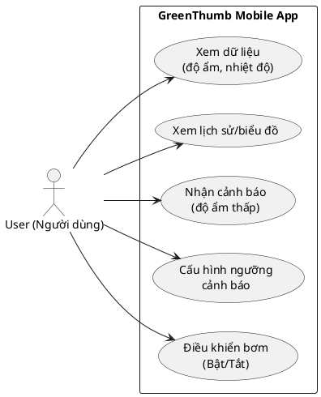

# CHƯƠNG 2: YÊU CẦU & PHẠM VI

## 2.1. Tổng quan yêu cầu hệ thống

### 2.1.1. Giới thiệu chung
Chương này trình bày các yêu cầu của hệ thống GreenThumb dưới góc nhìn **quản lý dự án** nhằm làm cơ sở cho việc xây dựng phạm vi (scope), WBS, tiến độ (Gantt), ngân sách, kế hoạch rủi ro và kế hoạch chất lượng/kiểm thử.

Hệ thống GreenThumb được định hướng theo mô hình IoT gồm:
- Thiết bị IoT (ESP32 + cảm biến + bơm)
- Kết nối Wi‑Fi và nền tảng cloud (MQTT/HTTP)
- Ứng dụng di động (giám sát, cảnh báo, điều khiển bơm)

### 2.1.2. Mục tiêu chức năng hệ thống
- Hỗ trợ người dùng **theo dõi** độ ẩm đất và nhiệt độ môi trường.
- Cung cấp **cảnh báo** khi độ ẩm thấp hơn ngưỡng.
- Cho phép **điều khiển bơm từ xa** (bật/tắt) thông qua cloud.
- Lưu trữ dữ liệu để người dùng xem **lịch sử/biểu đồ**.

## 2.2. Yêu cầu chức năng (Functional Requirements)

### 2.2.1. Đối với phần cứng/firmware
**Bảng 2.1. Yêu cầu chức năng phần cứng/firmware**

| Mã | Yêu cầu | Mô tả ngắn | Tiêu chí chấp nhận (tóm tắt) |
|---|---|---|---|
| HW-FR1 | Đo độ ẩm đất | Đọc giá trị độ ẩm từ cảm biến theo chu kỳ cấu hình. | Có giá trị đọc được, ổn định theo chu kỳ. |
| HW-FR2 | Đo nhiệt độ | Đọc nhiệt độ môi trường từ cảm biến. | Có giá trị đọc được và cập nhật định kỳ. |
| HW-FR3 | Gửi dữ liệu lên cloud | Gửi telemetry (độ ẩm, nhiệt độ, thời gian, trạng thái) lên cloud bằng Wi‑Fi. | Dữ liệu xuất hiện ở cloud/app theo chu kỳ. |
| HW-FR4 | Tự khôi phục kết nối | Tự reconnect khi mất Wi‑Fi hoặc mất kết nối cloud. | Sau khi mạng ổn định, tự gửi lại dữ liệu. |
| HW-FR5 | Nhận lệnh điều khiển | Nhận lệnh bật/tắt bơm từ cloud. | Nhận lệnh và phản hồi trạng thái thực thi. |
| HW-FR6 | Điều khiển bơm an toàn | Bật/tắt bơm; giới hạn thời gian bơm (chống chạy quá lâu). | Không bơm quá thời lượng tối đa cấu hình. |
| HW-FR7 | Gửi trạng thái thiết bị | Gửi trạng thái online/offline, lỗi cơ bản (nếu có). | App hiển thị được trạng thái kết nối. |

### 2.2.2. Đối với phần mềm (cloud + ứng dụng di động)

#### 2.2.2.1. Yêu cầu chức năng cloud
**Bảng 2.2. Yêu cầu chức năng cloud**

| Mã | Yêu cầu | Mô tả ngắn | Tiêu chí chấp nhận (tóm tắt) |
|---|---|---|---|
| CL-FR1 | Tiếp nhận telemetry | Nhận dữ liệu từ thiết bị qua MQTT/HTTP. | Dữ liệu được ghi nhận đúng cấu trúc. |
| CL-FR2 | Lưu trữ dữ liệu | Lưu dữ liệu đo để truy xuất lịch sử. | Truy vấn được theo khoảng thời gian. |
| CL-FR3 | Cung cấp API cho app | App có thể lấy dữ liệu hiện tại và lịch sử. | App hiển thị được dữ liệu từ API. |
| CL-FR4 | Chuyển lệnh điều khiển | Nhận lệnh từ app và gửi xuống thiết bị. | Thiết bị nhận lệnh và cập nhật trạng thái. |
| CL-FR5 | Xử lý cảnh báo | So sánh độ ẩm với ngưỡng và tạo cảnh báo. | Có bản ghi cảnh báo/trigger khi vượt ngưỡng. |
| CL-FR6 | Gửi thông báo | Gửi thông báo (push/in-app) đến app (mức giả định). | Người dùng nhận được thông báo trong demo. |

#### 2.2.2.2. Yêu cầu chức năng ứng dụng di động
**Bảng 2.3. Yêu cầu chức năng ứng dụng di động**

| Mã | Yêu cầu | Mô tả ngắn | Tiêu chí chấp nhận (tóm tắt) |
|---|---|---|---|
| SW-FR1 | Xem dữ liệu hiện tại | Hiển thị độ ẩm, nhiệt độ, trạng thái thiết bị. | Số liệu hiển thị đúng và cập nhật. |
| SW-FR2 | Xem lịch sử | Xem biểu đồ/ danh sách lịch sử theo ngày/tuần. | Có thể chọn khoảng thời gian và xem dữ liệu. |
| SW-FR3 | Cảnh báo độ ẩm thấp | Hiển thị cảnh báo khi độ ẩm dưới ngưỡng. | Người dùng nhìn thấy cảnh báo/nhận thông báo. |
| SW-FR4 | Cấu hình ngưỡng cảnh báo | Cho phép đặt ngưỡng độ ẩm tối thiểu. | Ngưỡng được lưu và áp dụng cho cảnh báo. |
| SW-FR5 | Điều khiển bơm từ xa | Bật/tắt bơm và xem trạng thái. | Thiết bị phản hồi và app hiển thị trạng thái. |
| SW-FR6 | Xử lý lỗi kết nối | Thông báo offline, lỗi mạng, retry cơ bản. | Có thông điệp rõ ràng, không “treo” UI. |

## 2.3. Yêu cầu phi chức năng (Non-functional Requirements)

**Bảng 2.4. Yêu cầu phi chức năng (NFR)**

| Mã | Nhóm | Yêu cầu | Tiêu chí chấp nhận (tóm tắt) |
|---|---|---|---|
| NFR1 | Hiệu năng | Dữ liệu cập nhật gần thời gian thực. | Trễ hiển thị mục tiêu ≤ 10 giây (điều kiện mạng ổn định). |
| NFR2 | Tin cậy | Thiết bị tự phục hồi kết nối khi mất mạng. | Sau khi mạng ổn định, tự reconnect và gửi tiếp dữ liệu. |
| NFR3 | Bảo mật | Dùng token cho thiết bị/app; ưu tiên TLS (giả định). | Không hard-code credential trong app; có cơ chế xác thực cơ bản. |
| NFR4 | Khả dụng | Hệ thống thông báo trạng thái offline. | App hiển thị offline khi thiết bị/cloud lỗi. |
| NFR5 | Dễ sử dụng | Giao diện rõ ràng, thao tác điều khiển đơn giản. | Người dùng thực hiện xem dữ liệu/điều khiển trong ≤ 3 bước. |
| NFR6 | Bảo trì | Có log sự kiện chính (gửi dữ liệu, nhận lệnh). | Truy vết được lỗi tích hợp trong demo. |

## 2.4. Phân tích Use Case

### 2.4.1. Danh sách Use Case
**Actor chính:** Người dùng (User)

**Bảng 2.5. Danh sách Use Case**

| Mã | Use Case | Actor | Mô tả ngắn |
|---|---|---|---|
| UC01 | Xem dữ liệu cảm biến | User | Xem độ ẩm, nhiệt độ và trạng thái thiết bị trên app. |
| UC02 | Xem lịch sử/biểu đồ | User | Xem dữ liệu theo khoảng thời gian. |
| UC03 | Nhận cảnh báo | User | Nhận cảnh báo khi độ ẩm thấp hơn ngưỡng. |
| UC04 | Cấu hình ngưỡng cảnh báo | User | Đặt ngưỡng độ ẩm tối thiểu để cảnh báo. |
| UC05 | Điều khiển bơm từ xa | User | Bật/tắt bơm và xem trạng thái phản hồi. |

### 2.4.2. Mô tả Use Case chính

#### UC01 – Xem dữ liệu cảm biến
- **Actor:** User
- **Tiền điều kiện:** User có thể truy cập app; thiết bị đã được định danh (device id/token) (giả định).
- **Luồng chính:**
  1) User mở app và vào màn hình Dashboard.
  2) App gọi API cloud để lấy dữ liệu hiện tại.
  3) App hiển thị độ ẩm, nhiệt độ và trạng thái thiết bị.
- **Luồng thay thế:**
  - A1: Thiết bị offline → app hiển thị “offline” và dữ liệu gần nhất.
  - A2: Mất mạng → app thông báo lỗi kết nối và cho phép thử lại.
- **Hậu điều kiện:** Dữ liệu được hiển thị, user nắm được trạng thái hiện tại.

#### UC05 – Điều khiển bơm từ xa
- **Actor:** User
- **Tiền điều kiện:** Thiết bị online; cloud sẵn sàng nhận lệnh.
- **Luồng chính:**
  1) User chọn chức năng điều khiển bơm.
  2) User nhấn Bật/Tắt.
  3) App gửi lệnh lên cloud.
  4) Cloud chuyển lệnh tới thiết bị.
  5) Thiết bị thực thi và phản hồi trạng thái.
  6) App cập nhật trạng thái bơm.
- **Luồng thay thế:**
  - A1: Thiết bị không phản hồi → app thông báo thất bại và cho phép gửi lại.
  - A2: Cloud lỗi → app thông báo lỗi hệ thống.
- **Hậu điều kiện:** Bơm đổi trạng thái hoặc hệ thống ghi nhận lệnh thất bại.

### 2.4.3. Sơ đồ Use Case (nếu có)
Hình 2.1 mô tả Use Case Diagram ở mức tổng quan.

*(Nếu không render PlantUML, có thể dùng hình flowchart Mermaid trong file HTML đi kèm để xuất ảnh đưa vào Word.)*

- File hình tham chiếu: xem [Hinh-2-1-Use-case.html](Hinh-2-1-Use-case.html) để xuất ảnh chèn Word.

## 2.5. Xác định phạm vi dự án

### 2.5.1. In-scope
- Phân tích và đặc tả yêu cầu (FR/NFR) cho thiết bị, cloud và app.
- Thiết kế kế hoạch triển khai theo kiến trúc Wi‑Fi + cloud (MQTT/HTTP).
- Kế hoạch WBS, tiến độ (Gantt), ngân sách, rủi ro, chất lượng/kiểm thử.
- Giả định có **02 prototypes** để phục vụ kiểm thử tích hợp.
- Kế hoạch phát hành ứng dụng (mức giả định) và hỗ trợ sau bán.

### 2.5.2. Out-of-scope
- Chứng nhận an toàn điện, tiêu chuẩn IP chống nước/bụi, thử nghiệm công nghiệp.
- Sản xuất hàng loạt thực tế (chỉ lập kế hoạch giả định), tối ưu dây chuyền sản xuất.
- Tính năng nâng cao: đa thiết bị phức tạp, chia sẻ thiết bị cho nhiều tài khoản, thanh toán, thương mại điện tử.
- Bảo mật nâng cao/đáp ứng tiêu chuẩn tuân thủ (chỉ nêu định hướng ở mức cơ bản).
