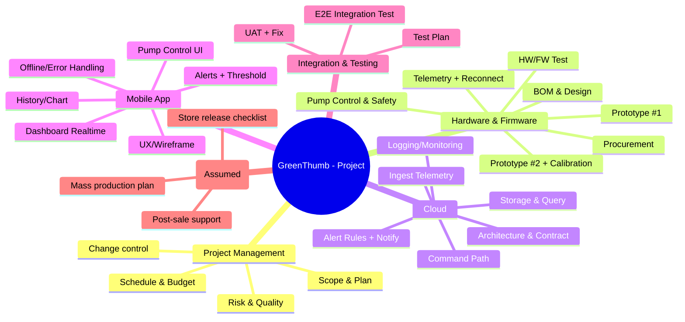

# CHƯƠNG 4: WBS & PHÂN CÔNG

## 4.1. Mục tiêu & nguyên tắc
Chương này trình bày WBS (Work Breakdown Structure) để **phân rã phạm vi in-scope** của GreenThumb thành các gói công việc có thể ước lượng, giao trách nhiệm và theo dõi tiến độ.

Nguyên tắc áp dụng:
- **100% Rule:** WBS bao phủ toàn bộ phạm vi in-scope.
- Phân rã đến mức **work package** có deliverable/tiêu chí nghiệm thu rõ.
- Thể hiện 2 nhánh song song **HW/FW** và **Cloud/Mobile**, hội tụ ở **tích hợp end‑to‑end** và **UAT**.

## 4.2. WBS tổng quan

### 4.2.1. WBS cấp cao (Level 1)
- 1.0 Quản lý dự án
- 2.0 Phần cứng & firmware (HW/FW)
- 3.0 Cloud (MQTT/HTTP + DB + Rules)
- 4.0 Ứng dụng di động
- 5.0 Tích hợp & kiểm thử
- 6.0 Triển khai & bàn giao (giả định)

### 4.2.2. WBS chi tiết (đến work packages)
**Bảng 4.1. WBS chi tiết (tóm tắt theo deliverables)**

| WBS ID | Hạng mục | Mô tả ngắn | Deliverable chính |
|---|---|---|---|
| 1.1 | Lập kế hoạch tổng thể | Scope/FR-NFR, giả định/ràng buộc, baseline | Chương 1–2 (tóm tắt), baseline scope |
| 1.2 | Quản lý tiến độ/chi phí | Theo dõi kế hoạch, cập nhật | Báo cáo tiến độ (giả định) |
| 1.3 | Quản lý thay đổi | Ghi nhận thay đổi, đánh giá tác động | Change log (giả định) |
| 2.1 | BOM & thiết kế khối | Chọn linh kiện, sơ đồ khối, nguồn/bơm | BOM + block diagram |
| 2.2 | Mua linh kiện | Đặt mua linh kiện cho 02 prototypes | Danh sách mua hàng |
| 2.3 | Lắp prototype #1 | Lắp ráp, kiểm tra nguồn, kết nối | Prototype #1 |
| 2.4 | FW đọc cảm biến | Đọc độ ẩm/nhiệt; format dữ liệu | FW telemetry basic |
| 2.5 | FW kết nối cloud | Wi‑Fi + MQTT/HTTP + reconnect | Telemetry gửi cloud |
| 2.6 | Điều khiển bơm an toàn | Nhận lệnh, bật/tắt, giới hạn thời gian | Pump control stable |
| 2.7 | Prototype #2 + hiệu chuẩn | Ổn định & hiệu chuẩn đo đạc | Prototype #2 ổn định |
| 2.8 | Test HW/FW | Test tải bơm, độ ổn định, độ chính xác | Biên bản test (tóm tắt) |
| 3.1 | Kiến trúc cloud + contract | API/topic naming, payload schema | API/MQTT contract |
| 3.2 | Ingest telemetry | Endpoint/broker nhận dữ liệu | Ingest chạy demo |
| 3.3 | Lưu trữ & truy vấn | DB + query lịch sử | API lịch sử |
| 3.4 | Command path | App→cloud→device command | Command chạy demo |
| 3.5 | Alert rules + notify | Rule ngưỡng + thông báo (giả định) | Cảnh báo hoạt động |
| 3.6 | Logging/monitoring | Log sự kiện chính (tối thiểu) | Log/checklist |
| 4.1 | UX flow + wireframe | Luồng màn hình, bố cục | Wireframe/mockup |
| 4.2 | Dashboard realtime | Hiển thị dữ liệu hiện tại | Màn dashboard |
| 4.3 | Lịch sử/biểu đồ | Xem lịch sử theo ngày/tuần | Màn lịch sử |
| 4.4 | Cảnh báo + cấu hình ngưỡng | Thiết lập ngưỡng, hiển thị cảnh báo | Màn cảnh báo |
| 4.5 | Điều khiển bơm | Bật/tắt + trạng thái | Màn điều khiển |
| 4.6 | Xử lý lỗi kết nối | Offline/error UI, retry cơ bản | UX lỗi kết nối |
| 5.1 | Test plan + test cases | Kế hoạch test HW/SW/Integration | Test plan + sample cases |
| 5.2 | Integration test end-to-end | Test luồng dữ liệu & command | Kết quả test tích hợp |
| 5.3 | UAT + nghiệm thu | Kịch bản UAT, tiêu chí nghiệm thu | Biên bản UAT (tóm tắt) |
| 6.1 | Kế hoạch triển khai | Sản xuất giả định, phát hành app | Deployment checklist |
| 6.2 | Hỗ trợ sau bán | Kênh hỗ trợ, SLA giả định | Support plan |
| 6.3 | Hoàn thiện báo cáo/slide | Tổng hợp tài liệu & phụ lục | Báo cáo + slide |

## 4.3. Work Packages (gán owner)
Work package là đơn vị quản lý để giao việc, theo dõi phụ thuộc và nghiệm thu.

**Bảng 4.2. Work packages (tóm tắt quản lý)**

| WP ID | WBS ID | Work Package | Owner (chịu trách nhiệm chính) | Phụ thuộc chính |
|---|---|---|---|---|
| WP01 | 1.1 | Scope + yêu cầu + baseline | Trương Quang Huy (#) | - |
| WP02 | 2.1 | BOM + thiết kế nguồn/bơm | Đặng Thị Thu Giang | WP01 |
| WP03 | 2.2 | Mua linh kiện 02 prototypes | Đặng Thị Thu Giang | WP02 |
| WP04 | 2.3 | Lắp prototype #1 | Đặng Thị Thu Giang | WP03 |
| WP05 | 3.1 | Cloud architecture + API/MQTT contract | Phạm Thị Phương | WP01 |
| WP06 | 2.4–2.5 | Firmware telemetry + reconnect | Đặng Thành Dương | WP04, WP05 |
| WP07 | 3.2–3.3 | Ingest + storage + query | Phạm Thị Phương | WP05 |
| WP08 | 4.1–4.2 | UX + dashboard (mock→demo) | Nguyễn Thùy Dương | WP05 |
| WP09 | 2.6 | Command + bơm an toàn | Đặng Thành Dương | WP06 |
| WP10 | 3.4 | Command path (cloud) | Phạm Thị Phương | WP07 |
| WP11 | 4.5 | Điều khiển bơm (app) | Nguyễn Thùy Dương | WP08, WP10 |
| WP12 | 2.7 | Prototype #2 ổn định + hiệu chuẩn | Đặng Thị Thu Giang | WP06 |
| WP13 | 5.1–5.2 | Test plan + integration test | Phạm Thị Phương | WP11, WP12 |
| WP14 | 5.3 | UAT + nghiệm thu | Trương Quang Huy (#) | WP13 |
| WP15 | 6.1–6.3 | Deployment plan + báo cáo/slide | Trương Quang Huy (#) | WP14 |

## 4.4. Phân công công việc

### 4.4.1. Danh sách thành viên
- Trương Quang Huy (#) — PM/BA
- Đặng Thị Thu Giang — Hardware
- Đặng Thành Dương — Firmware/IoT
- Nguyễn Thùy Dương — Mobile
- Phạm Thị Phương — Cloud/QA

### 4.4.2. Bảng phân công theo mẫu
**Bảng 4.4. Phân công nhiệm vụ theo tiến độ thực hiện (tối đa 10)**

| STT | Tên nhiệm vụ | Người thực hiện |
|---:|---|---|
| 1 | Giới thiệu đề tài, mục tiêu, phạm vi hệ thống (Chương 1) | Trương Quang Huy (#) |
| 2 | Yêu cầu & phạm vi: FR/NFR + in-scope/out-scope (Chương 2) | Đặng Thị Thu Giang; Phạm Thị Phương |
| 3 | Use Case: danh sách UC + mô tả UC chính (Chương 2) | Phạm Thị Phương; Nguyễn Thùy Dương |
| 4 | Stakeholders + Power–Interest + phương pháp quản lý (Chương 3) | Nguyễn Thùy Dương; Trương Quang Huy (#) |
| 5 | WBS + Work Package + RACI + phân công (Chương 4) | Trương Quang Huy (#); Phạm Thị Phương |
| 6 | Tiến độ: milestone + phụ thuộc + Gantt (Chương 5 – tiến độ) | Đặng Thị Thu Giang; Trương Quang Huy (#) |
| 7 | Ngân sách dự kiến + dự phòng (Chương 5 – ngân sách) | Đặng Thị Thu Giang |
| 8 | Rủi ro: Risk Register + Risk Matrix + biện pháp (Chương 6 – rủi ro) | Nguyễn Thùy Dương; Phạm Thị Phương |
| 9 | Chất lượng/kiểm thử: test plan + test case + tiêu chí nghiệm thu (Chương 6 – chất lượng) | Đặng Thành Dương; Nguyễn Thùy Dương |
| 10 | Triển khai + bảo trì/hỗ trợ + KPI + kết luận + phụ lục Jira minh chứng (Chương 7 + Phụ lục) | Trương Quang Huy (#); Cả nhóm |

**Bảng 4.5. Phân công nhiệm vụ theo thành viên thực hiện (ngắn gọn)**

| STT | Thành viên | Nhiệm vụ | Chữ ký |
|---:|---|---|---|
| 1 | Trương Quang Huy (#) | Trưởng nhóm; tổng hợp báo cáo; WBS/RACI; vận hành Jira; UAT + nghiệm thu |  |
| 2 | Đặng Thị Thu Giang | HW: BOM/mua/lắp 2 prototype; Gantt + ngân sách; hỗ trợ chuẩn hóa hình/bảng |  |
| 3 | Đặng Thành Dương | FW/IoT: telemetry + reconnect + bơm an toàn; test thiết bị; log/minh chứng |  |
| 4 | Nguyễn Thùy Dương | Mobile: UX/dashboard/history/alerts/control; hỗ trợ UAT; cập nhật Jira/report |  |
| 5 | Phạm Thị Phương | Cloud/QA: contract + ingest/storage/command; test plan + integration; risk/biện pháp hỗ trợ |  |

## 4.5. Ma trận RACI (tóm tắt)
Quy ước: **R** (thực hiện), **A** (chịu trách nhiệm cuối), **C** (tham vấn), **I** (thông báo).

**Bảng 4.3. RACI theo deliverables chính**

| Deliverable | Trương Quang Huy (#) | Đặng Thị Thu Giang | Đặng Thành Dương | Nguyễn Thùy Dương | Phạm Thị Phương |
|---|---|---|---|---|---|
| Scope + FR/NFR + in/out | A/R | C | C | C | C |
| WBS + phân công | A/R | C | C | C | C |
| Gantt + milestones + critical path | A/R | C | C | C | C |
| BOM + thiết kế nguồn/bơm | I | A/R | C | I | C |
| Prototype #1/#2 | I | A/R | R | I | I |
| Firmware telemetry + command | I | C | A/R | I | C |
| Cloud ingest/storage/command | I | I | C | C | A/R |
| Mobile app UI + integrate | I | I | C | A/R | C |
| Test plan + integration test | C | C | C | C | A/R |
| UAT + acceptance | A/R | C | C | C | C |
| Deployment checklist (giả định) | A/R | C | C | C | C |
| Final report + slide | A/R | C | C | C | C |

## (Gợi ý) Hình 4.1 – Sơ đồ WBS
Hình 4.1 thể hiện WBS theo dạng sơ đồ cây.

- File hình tham chiếu: xem [Hinh-4-1-WBS.html](Hinh-4-1-WBS.html) để xuất ảnh chèn Word.
