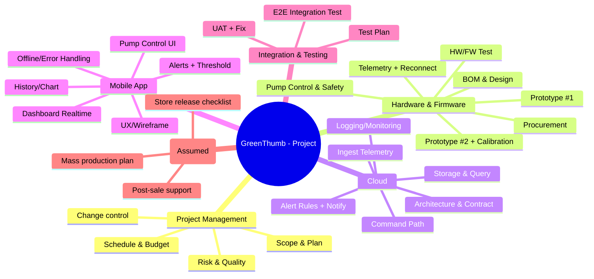

# CHƯƠNG 4: WBS & PHÂN CÔNG

## 4.1. Tổng quan WBS

### 4.1.1. Khái niệm WBS
WBS (Work Breakdown Structure) là cấu trúc phân rã phạm vi dự án thành các hạng mục/gói công việc (work packages) theo cấp bậc, giúp lập kế hoạch tiến độ, chi phí, phân công trách nhiệm và kiểm soát phạm vi.

### 4.1.2. Nguyên tắc xây dựng
- Tuân thủ nguyên tắc **100%**: WBS bao phủ toàn bộ phạm vi in-scope của dự án.
- Phân rã đến mức **work package** có thể ước tính thời gian/chi phí và gán người chịu trách nhiệm.
- Thể hiện rõ hai nhánh công việc **song song** của dự án IoT: (1) phần cứng/firmware và (2) phần mềm (cloud + mobile), có các điểm hội tụ ở giai đoạn tích hợp/kiểm thử.

## 4.2. Cấu trúc phân rã công việc

### 4.2.1. WBS cấp cao (Level 1–2)
- 1.0 Quản lý dự án
- 2.0 Phần cứng & firmware (HW/FW)
- 3.0 Cloud (MQTT/HTTP + DB + Rules)
- 4.0 Ứng dụng di động
- 5.0 Tích hợp & kiểm thử
- 6.0 Triển khai & bàn giao (giả định)

### 4.2.2. WBS chi tiết (đến Work Packages)
**Bảng 4.1. WBS chi tiết (đến work packages)**

| WBS ID | Hạng mục | Mô tả ngắn | Deliverable chính |
|---|---|---|---|
| 1.1 | Lập kế hoạch tổng thể | Scope/FR-NFR, giả định/ràng buộc, baseline | Chương 1–2 (tóm tắt), baseline scope |
| 1.2 | Quản lý tiến độ/chi phí | Theo dõi kế hoạch, cập nhật | Báo cáo tiến độ (giả định) |
| 1.3 | Quản lý thay đổi | Ghi nhận thay đổi, đánh giá tác động | Change log (giả định) |
| 2.1 | BOM & thiết kế khối | Chọn linh kiện, sơ đồ khối, nguồn/bơm | BOM + block diagram |
| 2.2 | Mua linh kiện | Đặt mua linh kiện cho 02 prototypes | Danh sách mua hàng |
| 2.3 | Lắp prototype #1 | Lắp ráp, kiểm tra nguồn, kết nối | Prototype #1 |
| 2.4 | FW đọc cảm biến | Đọc độ ẩm/nhiệt; format dữ liệu | FW telemetry basic |
| 2.5 | FW kết nối cloud | Wi‑Fi + MQTT/HTTP + reconnect | Telemetry gửi cloud |
| 2.6 | Điều khiển bơm an toàn | Nhận lệnh, bật/tắt, giới hạn thời gian | Pump control stable |
| 2.7 | Prototype #2 + hiệu chuẩn | Ổn định & hiệu chuẩn đo đạc | Prototype #2 ổn định |
| 2.8 | Test HW/FW | Test tải bơm, độ ổn định, độ chính xác | Biên bản test (tóm tắt) |
| 3.1 | Kiến trúc cloud + contract | API/topic naming, payload schema | API/MQTT contract |
| 3.2 | Ingest telemetry | Endpoint/broker nhận dữ liệu | Ingest chạy demo |
| 3.3 | Lưu trữ & truy vấn | DB + query lịch sử | API lịch sử |
| 3.4 | Command path | App→cloud→device command | Command chạy demo |
| 3.5 | Alert rules + notify | Rule ngưỡng + thông báo (giả định) | Cảnh báo hoạt động |
| 3.6 | Logging/monitoring | Log sự kiện chính (tối thiểu) | Log/checklist |
| 4.1 | UX flow + wireframe | Luồng màn hình, bố cục | Wireframe/mockup |
| 4.2 | Dashboard realtime | Hiển thị dữ liệu hiện tại | Màn dashboard |
| 4.3 | Lịch sử/biểu đồ | Xem lịch sử theo ngày/tuần | Màn lịch sử |
| 4.4 | Cảnh báo + cấu hình ngưỡng | Thiết lập ngưỡng, hiển thị cảnh báo | Màn cảnh báo |
| 4.5 | Điều khiển bơm | Bật/tắt + trạng thái | Màn điều khiển |
| 4.6 | Xử lý lỗi kết nối | Offline/error UI, retry cơ bản | UX lỗi kết nối |
| 5.1 | Test plan + test cases | Kế hoạch test HW/SW/Integration | Test plan + sample cases |
| 5.2 | Integration test end-to-end | Test luồng dữ liệu & command | Kết quả test tích hợp |
| 5.3 | UAT + nghiệm thu | Kịch bản UAT, tiêu chí nghiệm thu | Biên bản UAT (tóm tắt) |
| 6.1 | Kế hoạch triển khai | Sản xuất giả định, phát hành app | Deployment checklist |
| 6.2 | Hỗ trợ sau bán | Kênh hỗ trợ, SLA giả định | Support plan |
| 6.3 | Hoàn thiện báo cáo/slide | Tổng hợp tài liệu & phụ lục | Báo cáo + slide |

## 4.3. Work Packages

### 4.3.1. Danh sách work packages (tóm tắt quản lý)
**Bảng 4.2. Work packages (quản lý – gán owner)**

| WP ID | WBS ID | Work Package | Owner (chịu trách nhiệm chính) | Phụ thuộc chính |
|---|---|---|---|---|
| WP01 | 1.1 | Scope + yêu cầu + baseline | SV1 (PM/BA) | - |
| WP02 | 2.1 | BOM + thiết kế nguồn/bơm | SV2 (HW) | WP01 |
| WP03 | 2.2 | Mua linh kiện 02 prototypes | SV2 (HW) | WP02 |
| WP04 | 2.3 | Lắp prototype #1 | SV2 (HW) | WP03 |
| WP05 | 3.1 | Cloud architecture + API/MQTT contract | SV5 (Cloud/QA) | WP01 |
| WP06 | 2.4–2.5 | Firmware telemetry + reconnect | SV3 (FW/IoT) | WP04, WP05 |
| WP07 | 3.2–3.3 | Ingest + storage + query | SV5 (Cloud/QA) | WP05 |
| WP08 | 4.1–4.2 | UX + Dashboard mock→real | SV4 (Mobile) | WP05 |
| WP09 | 2.6 | Command + bơm an toàn | SV3 (FW/IoT) | WP06 |
| WP10 | 3.4 | Command path (cloud) | SV5 (Cloud/QA) | WP07 |
| WP11 | 4.5 | Điều khiển bơm (app) | SV4 (Mobile) | WP08, WP10 |
| WP12 | 2.7 | Prototype #2 ổn định + hiệu chuẩn | SV2 (HW) | WP06 |
| WP13 | 5.1–5.2 | Test plan + integration test | SV5 (Cloud/QA) | WP11, WP12 |
| WP14 | 5.3 | UAT + nghiệm thu | SV1 (PM/BA) | WP13 |
| WP15 | 6.1–6.3 | Deployment plan + báo cáo/slide | SV1 (PM/BA) | WP14 |

### 4.3.2. Mô tả chi tiết mẫu cho một số gói (template)
Nhóm áp dụng template mô tả work package để kiểm soát phạm vi và nghiệm thu:

**Mẫu Work Package**
- Mục tiêu:
- Đầu ra (Deliverable):
- Tiêu chí nghiệm thu (Acceptance):
- Người thực hiện chính (Owner):
- Phụ thuộc:
- Rủi ro chính:

*(Có thể đưa mô tả chi tiết cho toàn bộ WP vào Phụ lục nếu cần.)*

## 4.4. Phân công công việc

### 4.4.1. Danh sách thành viên (quy ước)
- **SV1:** PM/BA
- **SV2:** Hardware
- **SV3:** Firmware/IoT
- **SV4:** Mobile
- **SV5:** Cloud/QA

### 4.4.2. Phân công nhiệm vụ theo nhánh
- **SV1 (PM/BA):** scope, WBS, Gantt, ngân sách, quản lý thay đổi, tổng hợp báo cáo/slide, phối hợp UAT.
- **SV2 (HW):** BOM, mua linh kiện, lắp 02 prototypes, test tải bơm/nguồn, phối hợp hiệu chuẩn.
- **SV3 (FW/IoT):** firmware đọc cảm biến, gửi dữ liệu, nhận lệnh, điều khiển bơm an toàn, reconnect.
- **SV4 (Mobile):** UX flow, dashboard, lịch sử, cảnh báo, điều khiển bơm, xử lý lỗi UI.
- **SV5 (Cloud/QA):** contract MQTT/HTTP, ingest/storage/query, command path, rule cảnh báo, test plan + integration test.

## 4.5. Ma trận RACI

### 4.5.1. Xây dựng ma trận
Quy ước:
- **R (Responsible):** thực hiện
- **A (Accountable):** chịu trách nhiệm cuối cùng
- **C (Consulted):** được tham vấn
- **I (Informed):** được thông báo

### 4.5.2. Ma trận RACI (tóm tắt theo deliverables chính)
**Bảng 4.3. RACI**

| Deliverable | SV1 (PM/BA) | SV2 (HW) | SV3 (FW) | SV4 (Mobile) | SV5 (Cloud/QA) |
|---|---|---|---|---|---|
| Scope + FR/NFR + in/out | A/R | C | C | C | C |
| WBS + phân công | A/R | C | C | C | C |
| Gantt + milestones + critical path | A/R | C | C | C | C |
| BOM + thiết kế nguồn/bơm | I | A/R | C | I | C |
| Prototype #1/#2 | I | A/R | R | I | I |
| Firmware telemetry + command | I | C | A/R | I | C |
| Cloud ingest/storage/command | I | I | C | C | A/R |
| Mobile app UI + integrate | I | I | C | A/R | C |
| Test plan + integration test | C | C | C | C | A/R |
| UAT + acceptance | A/R | C | C | C | C |
| Deployment checklist (giả định) | A/R | C | C | C | C |
| Final report + slide | A/R | C | C | C | C |

## (Gợi ý) Hình 4.1 – Sơ đồ WBS
Hình 4.1 dưới đây thể hiện WBS theo dạng sơ đồ cây.




# CHƯƠNG 5: TIẾN ĐỘ & NGÂN SÁCH

## 5.1. Xác định công việc

### 5.1.1. Danh sách task chính
Dựa trên WBS ở Chương 4, nhóm xây dựng danh sách các công việc chính để lập tiến độ tổng hợp trong 07 tuần.

**Bảng 5.1. Danh sách task (tổng hợp)**

| Mã task | Nhóm | Nội dung công việc | Thời lượng (ước tính) |
|---|---|---|---|
| T1 | PM | Kickoff + chốt scope + FR/NFR + stakeholders | 1 tuần |
| T2 | Cloud/PM | Kiến trúc + API/MQTT contract (payload/topic) | 1 tuần |
| T3 | HW | BOM + thiết kế nguồn/bơm + phương án linh kiện thay thế | 1 tuần |
| T4 | HW | Mua linh kiện cho 02 prototypes | 1 tuần |
| T5 | HW | Lắp prototype #1 + kiểm tra nguồn | 0.5 tuần |
| T6 | FW | Firmware đọc cảm biến + telemetry + reconnect | 1–1.5 tuần |
| T7 | Cloud | Ingest telemetry + lưu trữ + API truy vấn | 1–1.5 tuần |
| T8 | Mobile | App skeleton + dashboard + mock data | 1 tuần |
| T9 | Cloud/FW | Command path (cloud↔device) + bơm an toàn | 1 tuần |
| T10 | Mobile | App tích hợp dữ liệu thật + điều khiển bơm | 1 tuần |
| T11 | HW/FW | Prototype #2 ổn định + hiệu chuẩn | 1 tuần |
| T12 | QA | Integration test end-to-end | 1 tuần |
| T13 | All | UAT + sửa lỗi + chốt nghiệm thu | 1 tuần |
| T14 | PM | Hoàn thiện báo cáo + phụ lục + slide | 1 tuần |

### 5.1.2. Thứ tự thực hiện (nguyên tắc)
- Các hạng mục **thiết kế/contract** cần chốt sớm để HW/FW và SW có thể làm **song song**.
- **Tích hợp end-to-end** chỉ thực hiện hiệu quả khi có **prototype ổn định** (prototype #2) và command path hoạt động.

## 5.2. Biểu đồ Gantt

### 5.2.1. Mô tả biểu đồ
Biểu đồ Gantt được xây dựng theo kế hoạch 07 tuần, thể hiện các công việc HW/FW và Cloud/Mobile chạy song song, đồng thời thể hiện các quan hệ phụ thuộc quan trọng để kiểm soát rủi ro tiến độ.

### 5.2.2. Thời gian thực hiện
**Hình 5.1** (Gantt Chart) được xuất từ sơ đồ Mermaid (file HTML kèm theo) để chèn vào Word.

- File hình tham chiếu: xem [Hinh-5-1-Gantt.html](Hinh-5-1-Gantt.html) để xuất ảnh chèn Word.

## 5.3. Mối quan hệ phụ thuộc (Dependencies)

### 5.3.1. Quan hệ giữa các task (tóm tắt)
**Bảng 5.2. Dependencies chính**

| Task | Phụ thuộc | Lý do |
|---|---|---|
| T2 (contract) | T1 | Chỉ chốt contract sau khi thống nhất phạm vi/yêu cầu |
| T3 (BOM/thiết kế) | T1 | Thiết kế theo yêu cầu và ràng buộc |
| T4 (mua linh kiện) | T3 | Mua theo BOM đã chốt |
| T5 (prototype #1) | T4 | Có linh kiện mới lắp được |
| T6 (FW telemetry) | T5, T2 | Cần thiết bị để chạy FW và cần contract để gửi dữ liệu đúng |
| T7 (cloud ingest/storage) | T2 | Cần contract để thiết kế endpoint/topic/schema |
| T8 (app skeleton) | T2 | Cần biết dữ liệu/luồng chính để dựng UI đúng |
| T9 (command + bơm) | T6, T7 | Command dựa trên FW + cloud |
| T10 (app integrate + control) | T8, T9 | App tích hợp sau khi command path có sẵn |
| T11 (prototype #2 ổn định) | T6 | Ổn định/hiệu chuẩn sau khi telemetry cơ bản hoạt động |
| T12 (integration test) | T10, T11 | Test end-to-end chỉ hiệu quả khi app + prototype ổn định |
| T13 (UAT) | T12 | UAT sau khi integration test đạt mức tối thiểu |
| T14 (final) | T13 | Chốt kết quả và tài liệu sau nghiệm thu |

### 5.3.2. Ảnh hưởng tiến độ
Các phụ thuộc T4→T5→T6→T11→T12 là chuỗi quan trọng vì liên quan đến phần cứng và khả năng tích hợp. Nhóm cần đặt mua linh kiện sớm và có phương án dự phòng để giảm nguy cơ trễ.

## 5.4. Các mốc quan trọng (Milestones)

### 5.4.1. Mốc chính
**Bảng 5.3. Milestones**

| Mã mốc | Thời điểm (tuần) | Mô tả |
|---|---|---|
| M1 | Cuối tuần 1 | Baseline scope + phương pháp + danh sách yêu cầu |
| M2 | Cuối tuần 3 | Prototype #1 gửi telemetry lên cloud |
| M3 | Cuối tuần 5 | Prototype #2 ổn định + app điều khiển bơm qua cloud (demo) |
| M4 | Cuối tuần 6 | UAT đạt tiêu chí nghiệm thu tối thiểu |
| M5 | Cuối tuần 7 | Nộp báo cáo + phụ lục + slide |

### 5.4.2. Ý nghĩa từng mốc
- **M1** giúp “đóng” phạm vi để lập WBS/Gantt/Budget nhất quán.
- **M2–M3** là các mốc kỹ thuật then chốt để giảm rủi ro tích hợp (IoT thường trễ ở giai đoạn này).
- **M4** là mốc xác nhận chất lượng ở mức demo và sẵn sàng tổng kết.

## 5.5. Dự toán ngân sách

### 5.5.1. Nguyên tắc và giả định dự toán
- Dự toán phục vụ mục tiêu lập kế hoạch học phần; số liệu mang tính ước tính dựa trên giá thị trường phổ biến.
- Dự án giả định có **02 prototypes** để phục vụ kiểm thử tích hợp và dự phòng rủi ro linh kiện.
- Không bắt buộc tính chi phí nhân sự; nếu cần có thể xem như **chi phí cơ hội**.

### 5.5.2. Bảng ngân sách sơ bộ (có phân loại)
**Bảng 5.4. Ngân sách sơ bộ**

| Hạng mục | Nhóm chi phí | Tính chất | Số lượng | Đơn giá (VND) | Thành tiền (VND) | Ghi chú/giả định |
|---|---|---|---:|---:|---:|---|
| Linh kiện prototype | Direct | Variable | 2 | 1,050,000 | 2,100,000 | ESP32 + sensor + relay/MOSFET + bơm + vật tư cơ bản |
| Vật tư phụ | Direct | Variable | 1 | 400,000 | 400,000 | Dây, ống, jack, keo, phụ kiện |
| Dụng cụ (nếu cần) | Direct | Fixed | 1 | 600,000 | 600,000 | Có thể = 0 nếu mượn/đã có |
| Ship/đi lại/in ấn | Indirect | Fixed | 1 | 300,000 | 300,000 | Ước tính |
| Cloud (free-tier) dự phòng | Indirect | Fixed | 1 | 200,000 | 200,000 | Phát sinh dịch vụ/duy trì demo |
| **Tổng tạm tính** |  |  |  |  | **3,600,000** | Không bao gồm chi phí nhân sự |

### 5.5.3. Dự phòng rủi ro chi phí (Contingency)
Nhóm đề xuất dự phòng **10%** cho các phát sinh thường gặp (thiếu linh kiện, hỏng cảm biến/bơm, phí vận chuyển tăng).

- Dự phòng (10%): 360,000 VND
- **Tổng dự kiến (bao gồm dự phòng): 3,960,000 VND**

### 5.5.4. Chi phí nhân sự (tuỳ chọn – chi phí cơ hội)
Nếu cần mô phỏng chi phí nhân sự theo giờ:
- Giả định 05 thành viên × 07 tuần × 06 giờ/tuần = 210 giờ
- Đơn giá giả định: 30,000 VND/giờ → 6,300,000 VND

*(Khoản này dùng để minh họa phân tích chi phí, không bắt buộc trong phạm vi học phần nếu giảng viên không yêu cầu.)*

## 5.6. Đường găng (Critical Path) – mức tổng quan
Dựa trên các phụ thuộc chính, đường găng tổng quan của dự án được xác định theo chuỗi:

**T1 → T3 → T4 → T5 → T6 → T11 → T12 → T13 → T14**

Chuỗi trên tập trung vào các hoạt động có rủi ro gây trễ cao (cung ứng linh kiện, ổn định prototype, tích hợp end‑to‑end và UAT). Vì vậy, nhóm ưu tiên theo dõi chặt các task này và chuẩn bị phương án dự phòng.


- File hình tham chiếu: xem [Hinh-4-1-WBS.html](Hinh-4-1-WBS.html) để xuất ảnh chèn Word.
# CHƯƠNG 6: RỦI RO & CHẤT LƯỢNG

## 6.1. Tổng quan rủi ro

### 6.1.1. Khái niệm
Rủi ro là các sự kiện/điều kiện không chắc chắn, nếu xảy ra có thể ảnh hưởng tiêu cực đến mục tiêu dự án (phạm vi, tiến độ, chi phí, chất lượng). Dự án IoT GreenThumb có rủi ro đặc thù do phụ thuộc **phần cứng**, **kết nối mạng** và **tích hợp đa thành phần** (device–cloud–mobile).

### 6.1.2. Vai trò quản lý rủi ro
Quản lý rủi ro giúp nhóm:
- Nhận diện sớm các rủi ro trọng yếu (đặc biệt ở chuỗi cung ứng và tích hợp).
- Ưu tiên xử lý dựa trên xác suất và mức độ ảnh hưởng.
- Chuẩn bị phương án ứng phó, giảm tác động và tránh trễ tiến độ.

## 6.2. Nhận diện rủi ro

### 6.2.1. Nhóm rủi ro (phân loại)
- **Rủi ro kỹ thuật:** lỗi giao tiếp, reset do sụt áp, sai số cảm biến, lỗi phần mềm.
- **Rủi ro thiết bị/cung ứng:** chậm linh kiện, linh kiện lỗi, bơm hỏng.
- **Rủi ro quản lý/tiến độ:** ước lượng sai, phụ thuộc task tích hợp, thay đổi yêu cầu.
- **Rủi ro chất lượng:** test thiếu bao phủ, lỗi lọt qua UAT.

### 6.2.2. Thang đo đánh giá
Nhóm sử dụng thang đo 1–5 cho **Xác suất (P)** và **Ảnh hưởng (I)**:
- P: 1 rất thấp … 5 rất cao
- I: 1 nhỏ … 5 nghiêm trọng

Điểm rủi ro: **Score = P × I**
- **High:** 15–25
- **Medium:** 8–14
- **Low:** 1–7

## 6.3. Ma trận rủi ro

### 6.3.1. Xác suất
Xác suất đánh giá dựa trên kinh nghiệm nhóm, tính phổ biến của sự cố trong dự án IoT và các phụ thuộc bên ngoài.

### 6.3.2. Mức độ ảnh hưởng
Ảnh hưởng được đánh giá theo tác động lên tiến độ (trễ milestone), chi phí (mua lại linh kiện), chất lượng (không đạt tiêu chí nghiệm thu) và trải nghiệm người dùng.

### 6.3.3. Hình ma trận
**Hình 6.1** thể hiện ma trận rủi ro (Probability–Impact) và vị trí các rủi ro chính.

- File hình tham chiếu: xem [Hinh-6-1-Risk-matrix.html](Hinh-6-1-Risk-matrix.html) để xuất ảnh chèn Word.

## 6.4. Kế hoạch xử lý rủi ro

### 6.4.1. Chiến lược ứng phó
Nhóm áp dụng 4 chiến lược:
- **Tránh (Avoid):** thay đổi kế hoạch để loại bỏ rủi ro.
- **Giảm thiểu (Mitigate):** giảm xác suất hoặc giảm tác động.
- **Chuyển giao (Transfer):** chuyển trách nhiệm/tác động cho bên khác (hạn chế trong bài học phần).
- **Chấp nhận (Accept):** chấp nhận và chuẩn bị phương án dự phòng.

### 6.4.2. Sổ theo dõi rủi ro (Risk Register)
**Bảng 6.1. Risk Register**

| ID | Rủi ro | Nhóm | Nguyên nhân | P | I | Score | Mức | Ứng phó (sơ bộ) | Hành động giảm thiểu | Risk owner | Trigger |
|---|---|---|---|---:|---:|---:|---|---|---|---|---|
| R1 | Chậm cung ứng linh kiện | Cung ứng | Nhà cung cấp/vận chuyển trễ, hết hàng | 4 | 4 | 16 | High | Giảm thiểu | Đặt mua sớm (tuần 2), có linh kiện thay thế, mua dư hạng mục quan trọng | SV2 | Quá hạn giao hàng/không tracking |
| R2 | Lỗi giao tiếp app–cloud–device | Kỹ thuật | Contract không rõ, sai payload/topic, thiếu test tích hợp | 3 | 5 | 15 | High | Giảm thiểu | Chốt API/MQTT contract sớm; mock dữ liệu; test contract trước tích hợp | SV5 | Nhiều lỗi parse/timeout khi tích hợp |
| R3 | Reset ESP32 khi bật bơm (sụt áp) | Thiết bị | Bơm kéo dòng lớn, nguồn không đủ, thiết kế mạch chưa phù hợp | 3 | 4 | 12 | Med | Giảm thiểu | Tách nguồn/đệm tụ; test tải sớm; giới hạn thời gian bơm | SV2/SV3 | Thiết bị reset khi bơm chạy |
| R4 | Sai lệch cảm biến độ ẩm theo loại đất | Chất lượng | Cảm biến giá rẻ, môi trường đo biến thiên | 4 | 3 | 12 | Med | Giảm thiểu | Hiệu chuẩn 2–3 điểm; lọc số; cho phép cấu hình ngưỡng theo profile | SV3 | Dữ liệu dao động bất thường |
| R5 | Mất Wi‑Fi/Internet làm gián đoạn dữ liệu | Kỹ thuật | Môi trường mạng không ổn định, router lỗi | 3 | 3 | 9 | Med | Giảm thiểu | Reconnect/backoff; buffer dữ liệu; hiển thị offline | SV3/SV5 | Mất dữ liệu liên tục, device offline |
| R6 | Lộ token/credential (bảo mật) | Bảo mật | Hard-code key, chia sẻ repo không kiểm soát | 2 | 5 | 10 | Med | Giảm thiểu | Không hard-code; dùng env/secret; token theo thiết bị; reset token khi lộ | SV5 | Thấy key trong source / log |
| R7 | Ước lượng sai thời gian tích hợp | Tiến độ | Tích hợp IoT thường phát sinh lỗi khó đoán | 4 | 3 | 12 | Med | Chấp nhận/giảm thiểu | Dự phòng buffer 10–20%; ưu tiên chuỗi đường găng; demo sớm | SV1 | Trễ task T12/T13 |
| R8 | Lỗi cảnh báo (false positive/negative) | Chất lượng | Ngưỡng không phù hợp, dữ liệu nhiễu, rule đơn giản | 3 | 3 | 9 | Med | Giảm thiểu | Lọc dữ liệu; hysteresis đơn giản; test kịch bản đất khô/ẩm | SV5/SV4 | Cảnh báo sai nhiều |
| R9 | Bơm kẹt/chạy khô gây hỏng | Thiết bị | Không có nước, cơ khí kẹt | 2 | 4 | 8 | Med | Giảm thiểu | Giới hạn thời gian bơm; kiểm tra bơm trước demo; dự phòng bơm | SV2 | Bơm kêu to, không hút nước |
| R10 | Thiếu test bao phủ dẫn đến lỗi lọt UAT | Chất lượng | Không có test plan rõ, thiếu test case lỗi mạng | 3 | 4 | 12 | Med | Giảm thiểu | Lập test plan; chạy test theo checklist; log lỗi & ưu tiên sửa | SV5 | Nhiều bug phát hiện muộn ở UAT |

### 6.4.3. Theo dõi và cập nhật
- Cập nhật Risk Register hàng tuần (trạng thái, rủi ro mới, mức ưu tiên).
- Với rủi ro High (R1, R2), nhóm theo dõi theo **mốc** và cập nhật ngay khi có tín hiệu trigger.

## 6.5. Quản lý chất lượng

### 6.5.1. Tiêu chuẩn chất lượng (mức dự án học phần)
Nhóm đặt mục tiêu chất lượng theo tiêu chí:
- Chức năng lõi hoạt động ổn định ở mức demo: **đo cảm biến – hiển thị – cảnh báo – điều khiển bơm**.
- Tích hợp end‑to‑end đạt mức tin cậy tối thiểu theo kịch bản UAT.
- Tài liệu kế hoạch (WBS/Gantt/Budget/Risk/QA) **nhất quán** và có minh chứng.

### 6.5.2. Quy trình kiểm thử phần cứng/firmware
- **Kiểm thử chức năng cảm biến:** đọc dữ liệu theo chu kỳ, kiểm tra ổn định.
- **Kiểm thử độ chính xác tương đối:** so sánh 2–3 trạng thái (đất khô/ẩm) và theo dõi xu hướng.
- **Kiểm thử tải bơm/nguồn:** bật bơm nhiều lần, không reset; đo dòng/điện áp (nếu có điều kiện).
- **Kiểm thử mất kết nối:** ngắt Wi‑Fi, quan sát reconnect và buffer.

### 6.5.3. Quy trình kiểm thử phần mềm (cloud + mobile)
- **Functional test:** dashboard, lịch sử, cảnh báo, điều khiển bơm.
- **Integration test:** app↔cloud↔device, gồm cả trường hợp lỗi (timeout/offline).
- **Connectivity test:** mạng yếu, mất mạng, reconnect.
- **Security basic check:** không hard-code key; token kiểm soát truy cập.

### 6.5.4. Vai trò và trách nhiệm chất lượng
- **SV5 (Cloud/QA):** lập test plan, điều phối chạy test tích hợp, tổng hợp lỗi.
- **SV2/SV3:** chịu trách nhiệm test HW/FW (nguồn, bơm, ổn định).
- **SV4:** test UI/UX và luồng điều khiển/cảnh báo.
- **SV1:** chốt tiêu chí nghiệm thu và điều phối UAT.

### 6.5.5. Tiêu chí nghiệm thu (Acceptance Criteria)
**Bảng 6.2. Acceptance Criteria (tối thiểu cho demo)**

| Mã | Tiêu chí | Mức đạt |
|---|---|---|
| AC1 | App hiển thị đúng độ ẩm, nhiệt độ từ prototype #2 | Có dữ liệu cập nhật; hiển thị trạng thái online/offline |
| AC2 | Điều khiển bơm từ app qua cloud hoạt động | Lệnh bật/tắt thành công trong điều kiện mạng ổn định |
| AC3 | Cảnh báo độ ẩm thấp hoạt động | Khi độ ẩm dưới ngưỡng, có cảnh báo/in-app notification |
| AC4 | Hệ thống xử lý mất kết nối cơ bản | Device/app tự phục hồi; app không “treo”, có thông báo lỗi |

## 6.6. Test Cases mẫu

### 6.6.1. Test cases phần cứng/firmware
**Bảng 6.3. Test cases HW/FW (mẫu)**

| TC ID | Mục tiêu | Bước kiểm thử (tóm tắt) | Kết quả mong đợi |
|---|---|---|---|
| HWTC01 | Đọc cảm biến ổn định | Chạy thiết bị 30 phút, chu kỳ 10s | Dữ liệu không bị gián đoạn bất thường |
| HWTC02 | Reconnect Wi‑Fi | Ngắt Wi‑Fi 2 phút rồi bật lại | Thiết bị tự reconnect và gửi lại dữ liệu |
| HWTC03 | Điều khiển bơm an toàn | Gửi lệnh bật bơm liên tục 5 lần | Không reset; bơm tắt theo giới hạn thời gian |
| HWTC04 | Sai số tương đối | So sánh đất khô vs đất ẩm | Dữ liệu phản ánh xu hướng tăng/giảm hợp lý |

### 6.6.2. Test cases cloud
**Bảng 6.4. Test cases Cloud (mẫu)**

| TC ID | Mục tiêu | Bước kiểm thử (tóm tắt) | Kết quả mong đợi |
|---|---|---|---|
| CLTC01 | Ingest telemetry | Device gửi 10 bản ghi liên tiếp | Cloud nhận đủ và lưu trữ |
| CLTC02 | Query lịch sử | App gọi API lấy dữ liệu 24h | Trả dữ liệu đúng định dạng/thời gian |
| CLTC03 | Command delivery | App gửi lệnh bật/tắt | Cloud chuyển lệnh tới device, có ack |
| CLTC04 | Trigger cảnh báo | Đặt độ ẩm dưới ngưỡng | Cloud tạo sự kiện cảnh báo |

### 6.6.3. Test cases ứng dụng di động
**Bảng 6.5. Test cases Mobile (mẫu)**

| TC ID | Mục tiêu | Bước kiểm thử (tóm tắt) | Kết quả mong đợi |
|---|---|---|---|
| SWTC01 | Hiển thị dashboard | Mở app, xem dashboard | Hiển thị độ ẩm/nhiệt/trạng thái |
| SWTC02 | Điều khiển bơm | Nhấn bật/tắt, quan sát phản hồi | Trạng thái cập nhật đúng; có loading/error |
| SWTC03 | Offline UI | Tắt mạng điện thoại | App báo lỗi kết nối, không crash |
| SWTC04 | Cảnh báo | Độ ẩm thấp hơn ngưỡng | App hiển thị cảnh báo/in-app notification |

## 6.7. UAT (tóm tắt)
Nhóm thực hiện UAT theo các kịch bản bám sát Use Case (UC01, UC03, UC05) và chốt nghiệm thu theo các tiêu chí AC1–AC4. Kết quả UAT (nếu có) và danh sách lỗi/khắc phục có thể đưa vào Phụ lục.

# CHƯƠNG 7: TRIỂN KHAI & KẾT LUẬN

## 7.1. Kế hoạch triển khai

### 7.1.1. Sản xuất (giả định)
Trong phạm vi học phần, nhóm chỉ mô phỏng kế hoạch triển khai và sản xuất. Ở bối cảnh thực tế, quy trình sản xuất có thể được triển khai theo các bước:

- **Chốt thiết kế & BOM:** cố định danh sách linh kiện (BOM), lựa chọn phương án thay thế cho linh kiện rủi ro cao.
- **Sản xuất thử (Pilot run):** sản xuất lô nhỏ để kiểm tra lỗi lắp ráp, độ ổn định nguồn/bơm và sai số cảm biến.
- **Kiểm tra chất lượng (QC) đầu vào/đầu ra:** kiểm tra linh kiện chính (ESP32, cảm biến, bơm), test nhanh sau lắp ráp.
- **Đóng gói:** hướng dẫn sử dụng, cảnh báo an toàn, tem nhãn.

**Bảng 7.1. Checklist triển khai sản xuất (giả định)**

| Hạng mục | Nội dung | Kết quả mong đợi |
|---|---|---|
| BOM + linh kiện thay thế | Danh sách linh kiện + phương án thay thế | Giảm rủi ro thiếu hàng |
| Quy trình lắp ráp | Các bước lắp và kiểm tra nhanh | Rút ngắn thời gian lắp |
| Test xuất xưởng | Test nguồn/bơm, cảm biến, kết nối Wi‑Fi | Phát hiện lỗi sớm |
| Tài liệu hướng dẫn | HDSD, lưu ý an toàn, bảo hành | Người dùng dễ tiếp cận |

### 7.1.2. Triển khai ứng dụng (App Store/Google Play)
Nhóm mô phỏng kế hoạch phát hành ứng dụng theo checklist chuẩn, nhằm đảm bảo sản phẩm sẵn sàng ra mắt.

**Bảng 7.2. Checklist phát hành ứng dụng (giả định)**

| Hạng mục | Nội dung |
|---|---|
| Phiên bản (versioning) | Đặt phiên bản, ghi chú phát hành (release notes) |
| Thông tin store | Tên app, mô tả ngắn/dài, từ khóa |
| Hình ảnh | Screenshot màn hình chính, icon, banner (nếu có) |
| Chính sách | Mô tả quyền truy cập (network/notification), chính sách riêng tư mức cơ bản |
| Kiểm thử trước phát hành | Smoke test, test kết nối, test điều khiển bơm |

### 7.1.3. Phân phối sản phẩm
Kế hoạch phân phối (giả định) tập trung vào kênh bán hàng đơn giản và hỗ trợ thiết lập ban đầu:
- Kênh phân phối: online/offline (cửa hàng nhỏ, sàn thương mại điện tử – nếu mở rộng).
- Hỗ trợ onboarding: hướng dẫn kết nối Wi‑Fi, thêm thiết bị, thiết lập ngưỡng cảnh báo.
- Chính sách bảo hành/đổi trả (giả định) để tăng niềm tin người dùng.

## 7.2. Bảo trì và hỗ trợ

### 7.2.1. Bảo trì hệ thống
Nhóm đề xuất phân loại bảo trì theo 3 nhóm:
- **Bảo trì sửa lỗi (Corrective):** sửa lỗi firmware/app/cloud khi phát sinh.
- **Bảo trì phòng ngừa (Preventive):** cải thiện ổn định kết nối, giảm reset, tối ưu cảnh báo.
- **Bảo trì cải tiến (Perfective):** bổ sung tính năng mới theo phản hồi (nâng cấp biểu đồ, nhiều profile cây).

### 7.2.2. Hỗ trợ người dùng (giả định)
**Bảng 7.3. Kế hoạch hỗ trợ sau bán (giả định)**

| Nội dung | Mô tả |
|---|---|
| Kênh hỗ trợ | Email/Zalo/Fanpage (tùy điều kiện) |
| Thời gian phản hồi | 24–48 giờ làm việc (giả định) |
| Phân loại vấn đề | Kết nối Wi‑Fi, cảnh báo, điều khiển bơm, phần cứng (bơm/cảm biến) |
| Quy trình xử lý | Tiếp nhận → phân loại → hướng dẫn khắc phục → ghi nhận lỗi → cập nhật bản vá |
| Tài liệu hỗ trợ | FAQ, hướng dẫn reset thiết bị, hướng dẫn kết nối lại |

## 7.3. KPIs theo dõi (giả định)
Để đo lường hiệu quả quản lý và “sức khỏe” dự án, nhóm đề xuất các KPIs đơn giản (có thể báo cáo theo tuần/sprint):

**Bảng 7.4. KPIs đề xuất**

| KPI | Công thức/định nghĩa | Mục tiêu (giả định) |
|---|---|---|
| KPI1 – Tỷ lệ hoàn thành đúng hạn | Task Done đúng deadline / Task planned | ≥ 80% |
| KPI2 – Test pass rate | Test case Pass / Tổng test case chạy | ≥ 90% |
| KPI3 – Lỗi phát hiện ở UAT | Số lỗi phát hiện ở UAT | Giảm dần theo tuần |
| KPI4 – Tỷ lệ lệnh điều khiển thành công | Số lệnh thành công / tổng lệnh | ≥ 95% (mạng ổn định) |

*(Nếu học phần yêu cầu EVM, nhóm có thể mở rộng thêm SPI/CPI dựa trên dữ liệu giả định.)*

## 7.4. Kết luận
Dự án GreenThumb được xây dựng dưới dạng một hồ sơ lập kế hoạch phát triển dự án IoT, bao gồm phân tích yêu cầu và phạm vi, nhận diện stakeholders, lựa chọn phương pháp quản lý phù hợp, xây dựng WBS, lập tiến độ và ngân sách, đồng thời đề xuất kế hoạch quản lý rủi ro và kế hoạch kiểm thử/đảm bảo chất lượng. Kế hoạch triển khai và hỗ trợ sau bán cũng được mô phỏng để hoàn thiện bức tranh vòng đời sản phẩm.

Trong quá trình thực hiện, nhóm nhận thấy điểm quan trọng của dự án IoT là quản lý tốt sự phụ thuộc giữa phần cứng và phần mềm, đặc biệt ở giai đoạn tích hợp end‑to‑end. Do đó, các mốc prototype và kế hoạch kiểm thử tích hợp được ưu tiên theo dõi nhằm giảm rủi ro trễ tiến độ và không đạt tiêu chí nghiệm thu.

## 7.5. Lessons Learned (giả định)
- Ước lượng cho các hạng mục tích hợp IoT nên có buffer do độ bất định cao (đề xuất hệ số 1.3–1.5 cho task tích hợp).
- Chốt **API/MQTT contract** sớm giúp phần mềm phát triển song song với phần cứng và giảm rework.
- Rủi ro về **nguồn/bơm** (sụt áp, reset) cần được test sớm ngay từ prototype #1 để tránh dồn lỗi đến giai đoạn tích hợp.
- Việc dùng công cụ quản lý (Jira) và cập nhật trạng thái thường xuyên giúp minh bạch tiến độ và hỗ trợ báo cáo theo tuần.

## 7.6. Hướng phát triển
- Bổ sung thêm cảm biến (ánh sáng, độ ẩm không khí) và xây dựng profile theo loại cây.
- Tự động tưới theo lịch/tham số (auto mode) thay vì chỉ bật/tắt.
- Nâng cấp bảo mật (xoay token, audit log), cải thiện trải nghiệm onboarding.
- Tối ưu phần cứng: vỏ chống nước, cải thiện tiêu thụ năng lượng, pin/solar (nếu mở rộng).

## (Gợi ý) Hình 7.1 – Luồng triển khai (giả định)
Hình 7.1 dưới đây mô tả luồng triển khai tổng quan.

```mermaid
flowchart LR
  A[Chốt BOM + thiết kế] --> B[Pilot run (lô thử)]
  B --> C[QC + Test xuất xưởng]
  C --> D[Đóng gói + HDSD]
  D --> E[Phân phối thiết bị]

  F[Chuẩn bị phát hành app] --> G[Smoke test]
  G --> H[Đăng tải store (giả định)]
  H --> I[Người dùng cài app]

  E --> J[Onboarding: kết nối Wi‑Fi + thêm thiết bị]
  I --> J
  J --> K[Vận hành + hỗ trợ sau bán]
```

- File hình tham chiếu: xem [Hinh-7-1-Deployment-flow.html](Hinh-7-1-Deployment-flow.html) để xuất ảnh chèn Word.

# TÀI LIỆU THAM KHẢO

1. Espressif Systems. **ESP32 Series Datasheet**. https://www.espressif.com/sites/default/files/documentation/esp32_datasheet_en.pdf (truy cập: 2026-04-07)
2. Espressif Systems. **ESP-IDF Programming Guide (ESP32)**. https://docs.espressif.com/projects/esp-idf/en/latest/esp32/ (truy cập: 2026-04-07)
3. OASIS. **MQTT Version 3.1.1 (OASIS Standard)**. https://docs.oasis-open.org/mqtt/mqtt/v3.1.1/os/mqtt-v3.1.1-os.html (truy cập: 2026-04-07)
4. RFC Editor. **RFC 9110: HTTP Semantics**. https://www.rfc-editor.org/rfc/rfc9110 (truy cập: 2026-04-07)
5. HiveMQ. **MQTT Essentials (Series)**. https://www.hivemq.com/mqtt-essentials/ (truy cập: 2026-04-07)
6. Google Firebase. **Cloud Messaging documentation**. https://firebase.google.com/docs/cloud-messaging (truy cập: 2026-04-07)
7. OWASP. **OWASP Internet of Things Project**. https://owasp.org/www-project-internet-of-things/ (truy cập: 2026-04-07)
8. Scrum Guides. **The Scrum Guide (2020)**. https://scrumguides.org/scrum-guide.html (truy cập: 2026-04-07)
