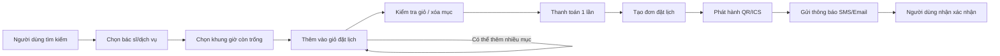

# CHƯƠNG 1. TỔNG QUAN VỀ ĐỀ TÀI

## 1.1 Bối cảnh và lý do chọn đề tài

### 1.1.1 Thực trạng và nhu cầu số hóa trong y tế

Trong bối cảnh chuyển đổi số diễn ra mạnh mẽ, lĩnh vực y tế đang có nhu cầu ngày càng lớn về các nền tảng hỗ trợ khám chữa bệnh theo hướng thuận tiện, minh bạch và có khả năng tích hợp. Việc cung cấp thông tin bác sĩ/chuyên khoa, giá dịch vụ, khung giờ còn trống và hỗ trợ đặt lịch trực tuyến giúp giảm tải cho khâu tiếp nhận, đồng thời nâng cao trải nghiệm của người bệnh.

Bên cạnh đó, các kịch bản hợp tác giữa cơ sở y tế và đối tác (bảo hiểm, doanh nghiệp) ngày càng phổ biến. Nền tảng đặt lịch có thể được nhúng vào website đối tác và trao đổi dữ liệu theo chuẩn thống nhất sẽ giúp mở rộng kênh tiếp cận, đồng thời giảm chi phí vận hành.

### 1.1.2 Các bất cập của quy trình đặt lịch truyền thống

Quy trình đặt lịch khám truyền thống thường gặp một số hạn chế:

- Người bệnh khó tra cứu tập trung thông tin bác sĩ/chuyên khoa/dịch vụ, khó so sánh và lựa chọn.
- Đăng ký khám chủ yếu qua điện thoại/quầy tiếp nhận dẫn đến chờ đợi, phụ thuộc thời gian làm việc và dễ quá tải.
- Khó đồng bộ lịch trống và xác nhận lịch hẹn, đặc biệt khi có thay đổi hoặc hủy lịch.
- Thiếu cơ chế thanh toán trực tuyến và quản lý hoàn/hủy minh bạch.
- Khi tích hợp với đối tác, dữ liệu thường phân tán, khó chuẩn hóa và khó mở rộng.

### 1.1.3 Ý nghĩa thực tiễn và lợi ích kỳ vọng của hệ thống

Đề tài hướng tới một nền tảng đặt lịch khám trực tuyến giúp:

- Hỗ trợ người bệnh tìm kiếm, lựa chọn và đặt lịch thuận tiện.
- Chuẩn hóa luồng nghiệp vụ đặt lịch–thanh toán–xác nhận.
- Hỗ trợ chính sách hủy/hoàn và theo dõi trạng thái đơn đặt lịch.
- Cho phép tích hợp đối tác thông qua mini-catalog và chuẩn trao đổi XML.
- Định hướng kiến trúc linh hoạt để phát triển nhiều front-end khác nhau (web, mobile, desktop) mà không ảnh hưởng lõi nghiệp vụ.

## 1.2 Mục tiêu của đề tài

### 1.2.1 Mục tiêu tổng quát

Mô hình hóa và thiết kế một hệ thống đặt lịch khám bệnh trực tuyến theo phương pháp phát triển hướng đối tượng, đảm bảo đầy đủ các nghiệp vụ chính, có khả năng tích hợp và mở rộng theo yêu cầu đề bài.

### 1.2.2 Mục tiêu cụ thể

Các mục tiêu cụ thể gồm:

- Đặt lịch khám/đăng ký dịch vụ y tế trực tuyến, tiếp nhận đơn đặt lịch.
- Quản lý giỏ đặt lịch (cart): thêm lịch khám/dịch vụ trước khi thanh toán và cho phép xóa mục khỏi giỏ.
- Duy trì danh sách mong muốn (wishlist) để lưu bác sĩ/phòng khám yêu thích và đặt sau.
- Thanh toán bằng thẻ hoặc ví điện tử.
- Hủy đơn đặt lịch trước thời điểm check-in hoặc trước cut-off do cơ sở y tế quy định.
- Yêu cầu hoàn tiền theo chính sách hoàn/hủy.
- Nhúng mini-catalog vào website đối tác, mini-catalog được định nghĩa bằng XML.
- Phát hành xác nhận lịch hẹn (QR/ICS) và gửi thông báo qua dịch vụ bên thứ ba (SMS/email/CDN).
- Quản lý tài khoản khách hàng và hồ sơ: tên, email, số điện thoại, ngày sinh, thông tin bảo hiểm.
- Cho phép đăng đánh giá (review) kèm xếp hạng 1–5; đánh giá được kiểm duyệt trước khi xuất bản; đánh giá dài được rút gọn trên trang chi tiết.
- Cho phép biên tập viên đăng bài nhận định/hướng dẫn (editorial review) hiển thị tại trang chi tiết.

## 1.3 Phạm vi và đối tượng sử dụng

### 1.3.1 Phạm vi chức năng

Bảng dưới đây tóm tắt phạm vi chức năng chính trong báo cáo.

| Nhóm chức năng | Mô tả ngắn |
|---|---|
| Tìm kiếm & xem chi tiết | Tìm theo tên bác sĩ/chuyên khoa/từ khóa/địa điểm/khung giờ; xem hồ sơ, giá, lịch trống |
| Giỏ đặt lịch (Cart) | Thêm lịch khám/dịch vụ vào giỏ; xóa mục; chuẩn bị thanh toán |
| Đặt lịch & xác nhận | Tạo đơn đặt lịch; phát hành QR/ICS; gửi thông báo |
| Thanh toán | Thanh toán bằng thẻ/ ví điện tử; lưu trạng thái thanh toán |
| Hủy & hoàn | Hủy trước check-in/cut-off; yêu cầu hoàn theo chính sách |
| Wishlist | Lưu bác sĩ/phòng khám yêu thích để đặt sau |
| Tài khoản & hồ sơ | Tạo tài khoản, đăng nhập; lưu hồ sơ và bảo hiểm |
| Review & kiểm duyệt | Khách hàng gửi review (1–5); nhân viên kiểm duyệt; rút gọn review dài |
| Nội dung biên tập | Biên tập viên đăng editorial review |
| Đối tác & mini-catalog | Nhúng mini-catalog sinh từ catalog tổng; trao đổi XML; nhập dữ liệu đối tác |

### 1.3.2 Ngoài phạm vi

Trong phạm vi học phần và báo cáo thiết kế, các nội dung sau chỉ nêu định hướng (không triển khai đầy đủ):

- Tối ưu thuật toán tìm kiếm nâng cao (xếp hạng theo ML, gợi ý cá nhân hóa).
- Quy trình nghiệp vụ nội bộ của bệnh viện (quản trị lịch trực tiếp của bác sĩ, phân công phòng).
- Kết nối trực tiếp với hệ thống HIS/EMR thực tế (chỉ mô tả tích hợp ở mức khái niệm).
- Kiểm toán/báo cáo tài chính chuyên sâu.

### 1.3.3 Đối tượng sử dụng và các bên liên quan (stakeholders)

Bảng sau liệt kê các nhóm tác nhân/bên liên quan chính.

| Nhóm | Vai trò trong hệ thống |
|---|---|
| Khách hàng | Tìm kiếm, đặt lịch, thanh toán, hủy/hoàn, wishlist, review |
| Nhân viên kiểm duyệt | Duyệt/ẩn review trước khi hiển thị |
| Biên tập viên y tế | Đăng bài nhận định/hướng dẫn (editorial review) |
| Cơ sở y tế đối tác | Cung cấp catalog bác sĩ/dịch vụ; cấu hình cut-off; tiếp nhận đơn đặt lịch |
| Hệ thống đối tác (bảo hiểm/doanh nghiệp) | Nhúng mini-catalog; trao đổi dữ liệu XML |
| Cổng thanh toán | Xử lý thanh toán thẻ/ ví; phản hồi trạng thái |
| Dịch vụ thông báo/ phát hành xác nhận | Gửi SMS/email; phát hành QR/ICS; phân phối qua CDN (nếu có) |

## 1.4 Mô tả tổng quan hệ thống (Problem Overview)

### 1.4.1 Mô hình hoạt động tổng quát theo luồng giá trị (Value Stream)

Thay vì thanh toán từng dịch vụ riêng lẻ, hệ thống sử dụng **giỏ đặt lịch** để người dùng có thể gom nhiều dịch vụ cho cùng một buổi khám (ví dụ: khám tổng quát + xét nghiệm + chẩn đoán hình ảnh), sau đó thực hiện **một lần thanh toán**. Cách tiếp cận này giúp giảm thao tác, giảm phí giao dịch và nâng cao trải nghiệm.

**Hình 1.1 – Luồng giá trị đặt lịch (minh họa)**



### 1.4.2 Yêu cầu kiến trúc linh hoạt đa kênh (API-First/Headless)

Đề bài yêu cầu hệ thống ban đầu là nền web nhưng phải linh hoạt để phát triển các front-end thay thế. Vì vậy, hệ thống được định hướng theo **API-First/Headless Architecture**:

- Web chỉ là **một client** của hệ thống.
- Lõi nghiệp vụ (business logic) được tổ chức trong backend (các service/use case) và được truy cập thông qua API.
- Các client khác (mobile/desktop/đối tác) có thể tái sử dụng cùng API, hạn chế phụ thuộc vào giao diện.

**Hình 1.2 – Kiến trúc tổng quan (minh họa)**

```mermaid
flowchart TB
    subgraph Clients[Clients]
        W[Web App]
        M[Mobile App]
        D[Desktop App]
        P[Partner Website (embed mini-catalog)]
    end

    subgraph Backend[Backend API (Headless/API-First)]
        API[API Gateway / Backend API]
        S1[Booking Service]
        S2[Catalog Service]
        S3[Identity/Profile Service]
        S4[Review & Moderation Service]
        S5[Payment & Refund Service]
    end

    subgraph Data[Central Data]
        DB[(CSDL trung tâm)]
    end

    subgraph External[Third-party]
        Pay[Payment Gateway]
        Noti[SMS/Email Provider]
        Ticket[QR/ICS Issuer]
        CDN[CDN (tùy chọn)]
    end

    W --> API
    M --> API
    D --> API
    P --> API

    API --> S1
    API --> S2
    API --> S3
    API --> S4
    API --> S5

    S1 --> DB
    S2 --> DB
    S3 --> DB
    S4 --> DB
    S5 --> DB

    S5 --> Pay
    S1 --> Ticket
    Ticket --> Noti
    Noti --> CDN
```

### 1.4.3 Tích hợp hệ thống bên ngoài

Bảng sau tóm tắt các tích hợp chính (ở mức tổng quan).

| Tích hợp | Vai trò | Dữ liệu/định dạng |
|---|---|---|
| Cổng thanh toán | Xử lý giao dịch thẻ/ ví; trả kết quả | Request/response theo API của cổng thanh toán |
| SMS/Email/CDN | Gửi thông báo lịch hẹn và trạng thái | Nội dung thông báo; liên kết/đính kèm |
| Phát hành QR/ICS | Tạo mã QR hoặc file ICS lịch hẹn | QR payload; ICS (iCalendar) |
| Đối tác | Nhúng mini-catalog; trao đổi dữ liệu catalog | XML mini-catalog (theo schema thống nhất) |

### 1.4.4 Các đối tượng nghiệp vụ chính (định hướng cho mô hình miền)

Để thống nhất cách hiểu về miền bài toán ngay từ đầu, hệ thống được định hướng xoay quanh các đối tượng nghiệp vụ chính sau (chi tiết quan hệ và thuộc tính sẽ được trình bày ở Chương 3 – Mô hình miền): tài khoản khách hàng và hồ sơ (thông tin cá nhân, bảo hiểm), bác sĩ/cơ sở y tế/chuyên khoa, dịch vụ hoặc gói khám, khung giờ còn trống (availability/slot), giỏ đặt lịch và các mục trong giỏ, đơn đặt lịch (booking/order) và trạng thái, thanh toán và giao dịch, hủy lịch và yêu cầu hoàn tiền, đánh giá của khách hàng (review) và trạng thái kiểm duyệt, nội dung biên tập (editorial review), catalog tổng và mini-catalog (XML) cho đối tác.

## 1.5 Giả định, ràng buộc và thuật ngữ

### 1.5.1 Giả định (Assumptions)

Các giả định được đặt ra để giới hạn phạm vi và làm rõ cách hệ thống vận hành:

- Dữ liệu bác sĩ/dịch vụ/giá/lịch trống được cung cấp từ cơ sở y tế hoặc đối tác và được nhập vào catalog tổng.
- Mỗi cơ sở y tế có thể cấu hình quy định **cut-off** (mốc thời gian cuối cùng được phép hủy).
- Hệ thống có cơ chế xác thực nhằm hạn chế tài khoản ảo, ví dụ xác thực số điện thoại qua OTP hoặc tích hợp nhà cung cấp định danh (OAuth2/SSO) ở mức khái niệm.
- Dịch vụ gửi thông báo và phát hành QR/ICS do bên thứ ba cung cấp, hệ thống gọi qua API.

### 1.5.2 Ràng buộc (Constraints)

Các ràng buộc quan trọng từ đề bài:

- **CSDL trung tâm** lưu danh sách tài khoản và catalog tổng; các module truy cập thống nhất.
- Khi đăng nhập, mật khẩu phải được đối chiếu với danh sách tài khoản gốc trong CSDL trung tâm.
- Mini-catalog nhúng vào website đối tác phải được **định nghĩa bằng XML** để trao đổi với hệ thống bên ngoài.
- Review của khách hàng phải được **kiểm duyệt bởi nhân viên** trước khi xuất bản.
- Review dài phải được **rút gọn** trên trang chi tiết và có khả năng xem đầy đủ.
- Đáp ứng khả năng mở rộng theo lộ trình:
  - Tài khoản: tối đa 100.000 trong 6 tháng đầu, sau đó tăng đến 1.000.000.
  - Người dùng đồng thời: 1.000, sau đó tăng đến 10.000.
  - Tìm kiếm: 100 yêu cầu/phút, sau đó tăng đến 1.000/phút.
  - Đơn đặt lịch: 100 đơn/giờ, sau đó tăng đến 1.000/giờ.

**Bảng 1.1 – Tóm tắt chỉ tiêu mở rộng (đặt nền cho Chương 2)**

| Hạng mục | Giai đoạn 1 | Sau 6 tháng |
|---|---:|---:|
| Số tài khoản | 100.000 | 1.000.000 |
| Người dùng đồng thời | 1.000 | 10.000 |
| Tìm kiếm / phút | 100 | 1.000 |
| Đơn đặt lịch / giờ | 100 | 1.000 |

### 1.5.3 Thuật ngữ/viết tắt

| Thuật ngữ | Ý nghĩa |
|---|---|
| Cart (Giỏ đặt lịch) | Danh sách lịch khám/dịch vụ người dùng chọn trước khi thanh toán |
| Wishlist | Danh sách mong muốn (bác sĩ/phòng khám yêu thích) |
| Booking/Order | Đơn đặt lịch khám/dịch vụ (trạng thái: tạo, thanh toán, hủy, hoàn…) |
| Cut-off | Mốc thời gian cuối cùng cho phép hủy lịch theo quy định cơ sở y tế |
| QR | Mã xác nhận (có thể dùng khi check-in) |
| ICS | Định dạng iCalendar để lưu lịch hẹn vào ứng dụng lịch |
| Mini-catalog | Danh mục con dành cho đối tác, sinh từ catalog tổng |
| Moderation | Quy trình kiểm duyệt review trước khi xuất bản |

## 1.6 Cấu trúc báo cáo

### 1.6.1 Tóm tắt nội dung từng chương và mối liên hệ (Analysis → Design)

- **Chương 1** trình bày bối cảnh, mục tiêu, phạm vi, các giả định/ràng buộc và mô tả tổng quan hệ thống.
- **Chương 2** cụ thể hóa các yêu cầu từ Chương 1 thành yêu cầu chức năng/phi chức năng, các tác nhân và mô hình Use Case, đồng thời đặc tả một số Use Case quan trọng.
- **Chương 3** sử dụng kết quả từ Chương 2 để xây dựng mô hình miền và phân tích luồng điều khiển thông qua sơ đồ Robustness cho các kịch bản nghiệp vụ chính.
- **Chương 4** chuyển các mô hình phân tích ở Chương 3 thành mô hình thiết kế chi tiết: kiến trúc, sơ đồ trình tự và sơ đồ lớp, đồng thời ánh xạ tổng quan sang thiết kế dữ liệu.
- **Chương 5** đề xuất hướng hiện thực hóa và đánh giá khả năng đáp ứng theo các chỉ tiêu mở rộng, nêu kết luận và hướng phát triển.

> Ghi chú trình bày: Các hình minh họa trong Chương 1 có thể được dựng bằng Mermaid để thuận tiện chỉnh sửa; khi đưa vào Word/PDF có thể xuất hình hoặc chụp màn hình sau khi render.
