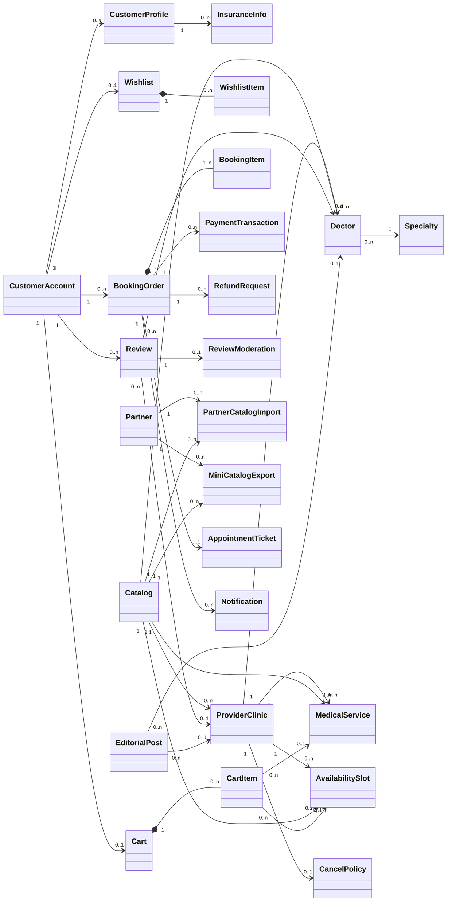
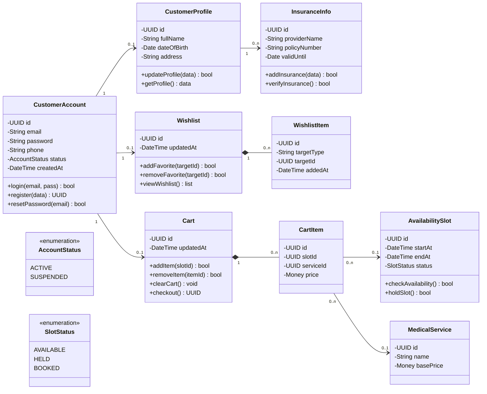
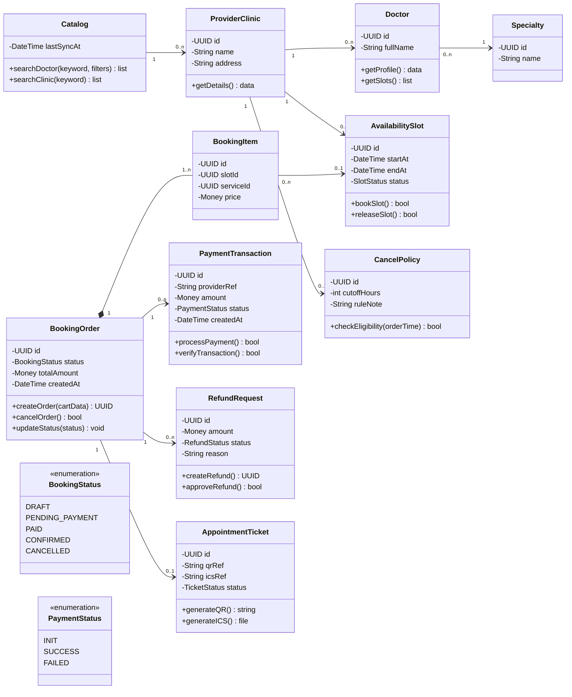
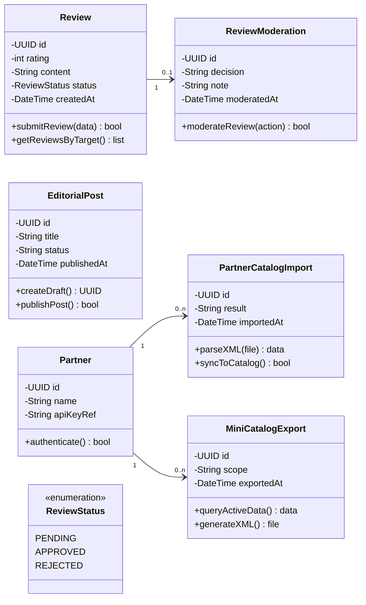
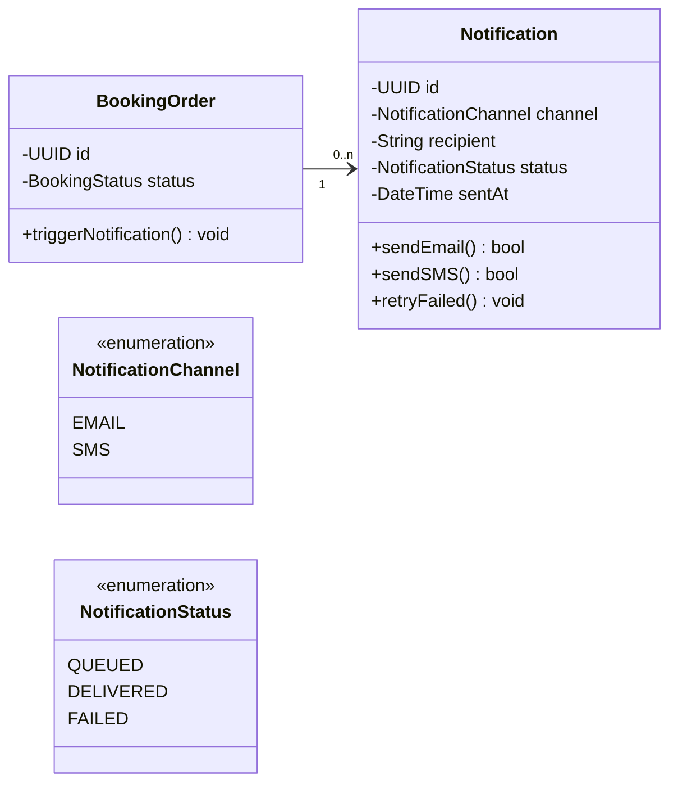

# CHƯƠNG 5. BIỂU ĐỒ LỚP (CLASS DIAGRAM)

## 5.1 Nền tảng và quy ước trình bày
Trong phương pháp ICONIX và Kỹ thuật phần mềm, **Class Diagram** là bước thiết kế tĩnh cực kỳ quan trọng được xây đắp từ Sơ đồ Tuần tự (Sequence Diagram). Dựa trên yêu cầu đồ án (1M user, Book lịch, Cart, Thanh toán, Review, XML Catalog...), sơ đồ lớp ở chương này được thiết kế và tuân thủ chặt chẽ các chuẩn mực như hình mẫu của Giảng viên:
- **Tính đóng gói (Encapsulation):** Tất cả các thuộc tính (Attributes) đều được bảo vệ ở mức `private` (ký hiệu `-`), ngăn chặn truy cập trực tiếp.
- **Tính hành vi (Operations):** Trang bị đầy đủ các Hàm/Phương thức (Methods) ở mức `public` (ký hiệu `+`) nhằm mô tả các thao tác nghiệp vụ hệ thống.
- **Quan hệ & Bội số (Multiplicity):** Tái sử dụng quan hệ từ Domain Model, bao gồm Composition (`*--`) cho các vòng đời phụ thuộc chặt chẽ (Cart chứa CartItem) và Association (`-->`) cho tham chiếu chéo.

---

## 5.2 Sơ đồ lớp tổng quan
Sơ đồ tổng quan thể hiện bức tranh toàn cảnh về mặt cấu trúc liên kết giữa các nhóm Entity chính trong hệ thống đặt lịch khám bệnh trực tuyến. Ở sơ đồ này, các thuộc tính và hàm được làm ẩn đi để tập trung vào kiến trúc liên kết ở cấp độ vĩ mô.

**Hình 5.1 – Class Diagram tổng quan kiến trúc hệ thống dữ liệu**

---

## 5.3 Sơ đồ lớp chi tiết theo nhóm chức năng
Phần này bóc tách sơ đồ tổng quan thành các phân hệ lõi, bổ sung đầy đủ chi tiết **Thuộc tính (private)** và **Phương thức (public)** bám sát template chuẩn mà giảng viên hướng dẫn yêu cầu.

### 5.3.1 Nhóm UC-00/UC-02/UC-03: Tài khoản – Hồ sơ – Wishlist/Cart

**Hình 5.2 – Class Diagram chi tiết: Module Quản lý Người dùng & Giỏ hàng**

### 5.3.2 Nhóm UC-01/UC-04/UC-05/UC-06/UC-12: Catalog – Đặt lịch – Thanh toán – Hủy/Hoàn

**Hình 5.3 – Class Diagram: Module Đặt lịch, Thanh toán, Ticket & Hủy/Hoàn**

### 5.3.3 Nhóm UC-07/UC-08/UC-09/UC-10/UC-11: Review – Biên tập – Đối tác XML

**Hình 5.4 – Class Diagram chi tiết: Module Đánh giá, Nội dung & Tích hợp Đối tác XML**

### 5.3.4 Nhóm UC-12: Thông báo (Notification)

**Hình 5.5 – Class Diagram chi tiết: Module Thông báo (Notification Alert)**
