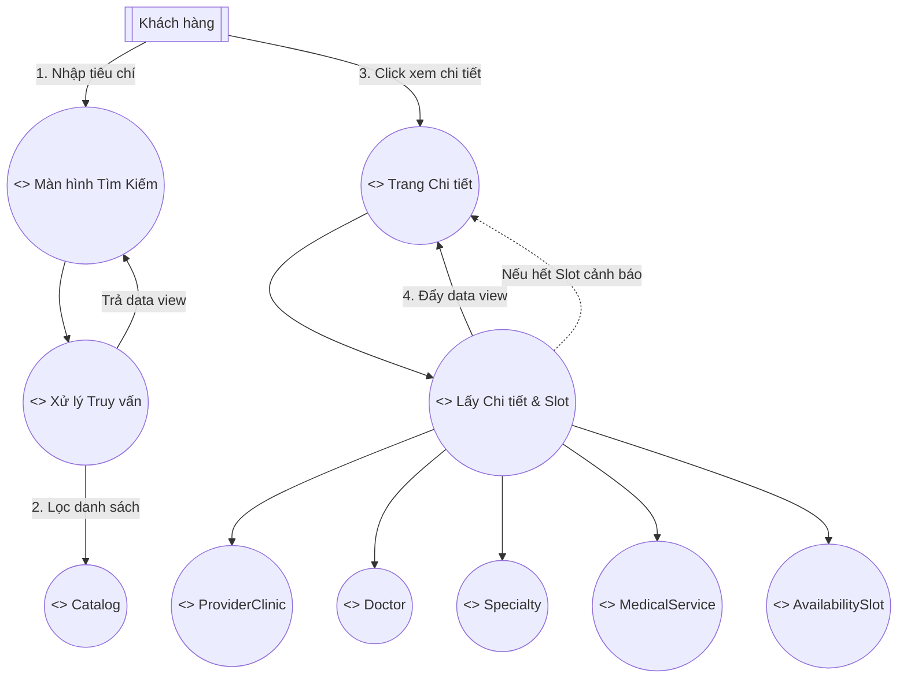
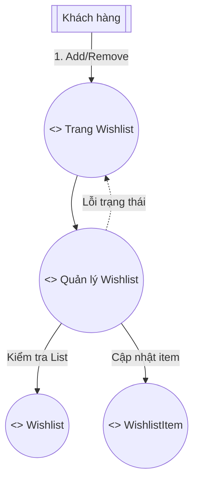
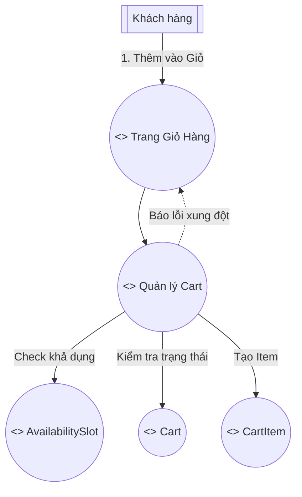
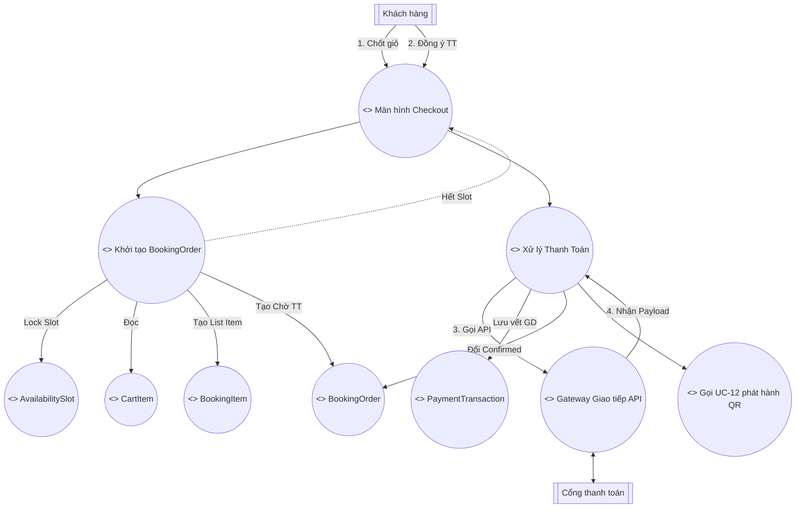
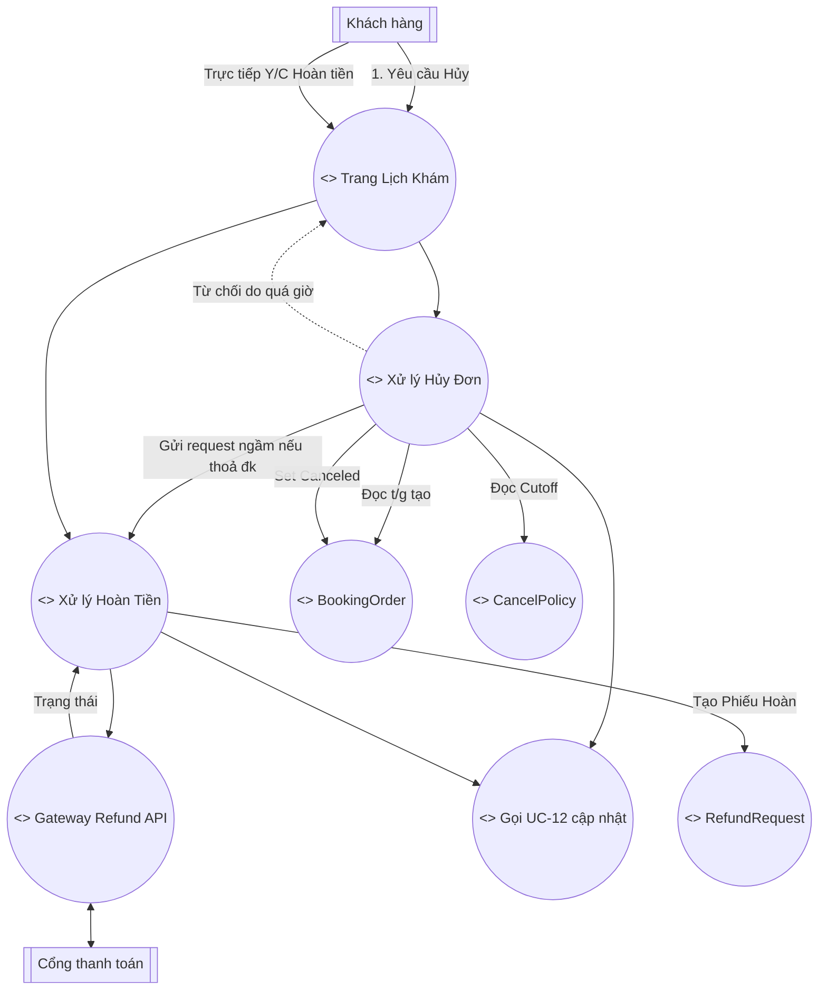
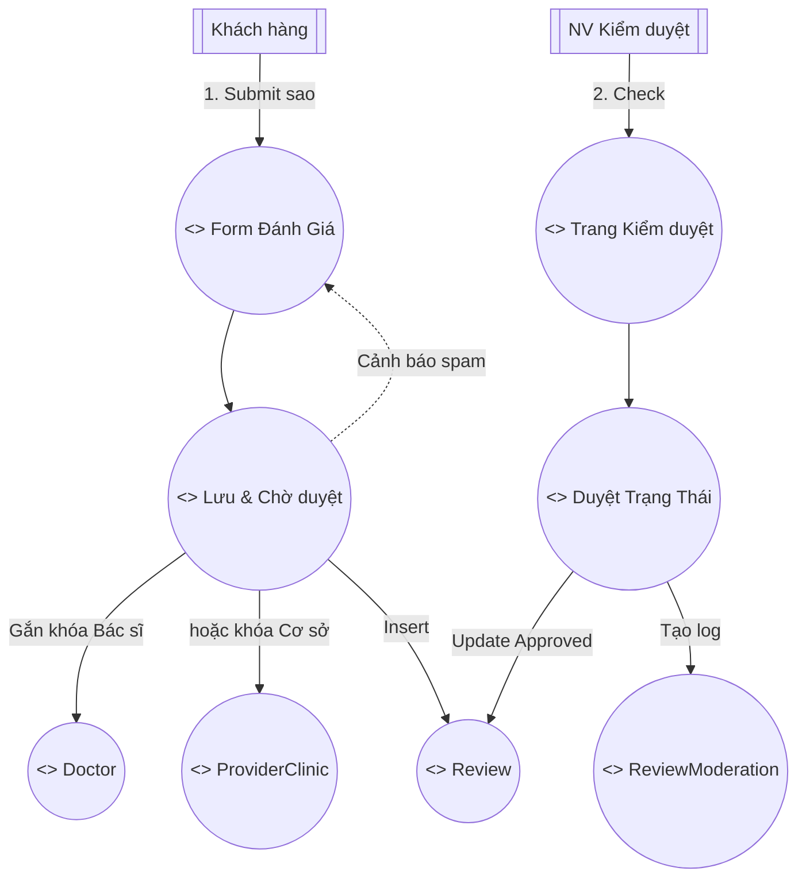
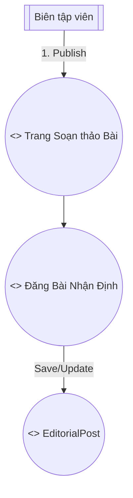
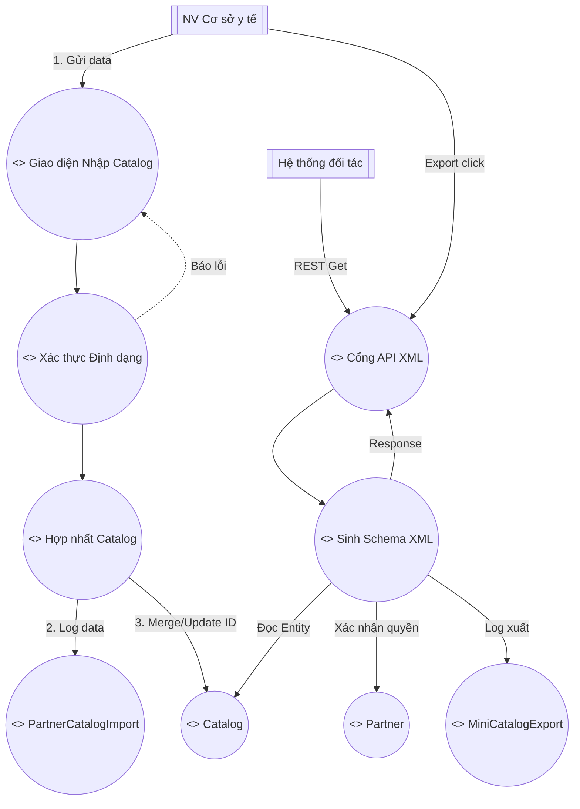
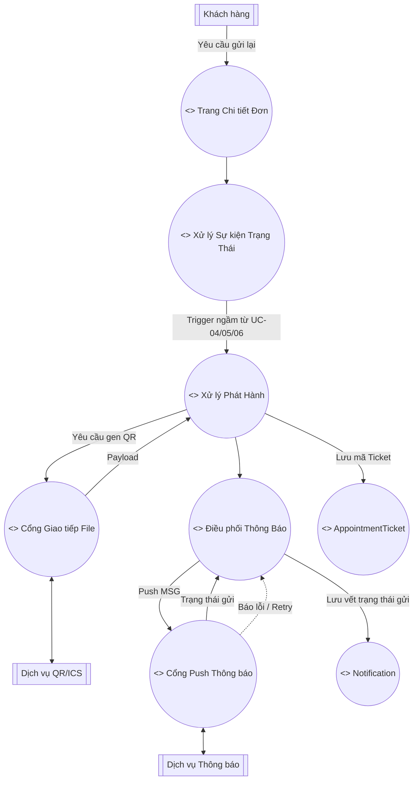

# CHƯƠNG 3. BIỂU ĐỒ MẠNH MẼ (ROBUSTNESS DIAGRAM)

## 3.1 Nền tảng phân tích và quy ước ký hiệu
Trong tiến trình mô hình hóa định hướng Use-Case (ICONIX), Sơ đồ Robustness đóng vai trò là "cầu nối" (phân tích) kết nối giữa các kịch bản Use Case (Chương 2) và các lớp tĩnh trong Domain Model (Chương 1). 

Mục tiêu của sơ đồ là phân tích luồng sự kiện (BASIC/ALTERNATE COURSE) thành các nhóm đối tượng (Actor–Boundary–Control–Entity) nhằm chứng minh mô hình miền đã đủ sức mạnh để chạy kịch bản Use Case:
1. **Tác nhân (Actor)**: Yếu tố bên ngoài tương tác với hệ thống.
2. **Giao diện (Boundary)**: Nơi Actor tương tác (Màn hình, Cổng API v.v).
3. **Xử lý (Control)**: Đóng vai trò thực thi nghiệp vụ, kiểm tra tính hợp lệ.
4. **Thực thể (Entity)**: Các dữ liệu nghiệp vụ có từ Domain Model.

**Bốn quy tắc vàng (ICONIX rules) áp dụng nghiêm ngặt:**
*   Actor KHÔNG trực tiếp gọi Entity.
*   Boundary KHÔNG trực tiếp gọi Entity (mà phải giao tiếp qua Control).
*   Boundary KHÔNG nối trực tiếp với Boundary (ngoại trừ điều hướng hiển thị).
*   Actor chỉ tương tác với Boundary.

Để thống nhất cách trình bày sơ đồ trong báo cáo (dễ đọc và dễ đối chiếu theo ICONIX), phần Robustness được mô tả theo chuẩn Boundary–Control–Entity (BCE) với 4 nhóm đối tượng:

*   **Actor**: tác nhân bên ngoài hệ thống.
*   **Boundary**: điểm tương tác (màn hình, form, trang, cổng/gateway API, v.v.).
*   **Control**: lớp điều phối xử lý nghiệp vụ, kiểm tra hợp lệ, áp quy tắc.
*   **Entity**: dữ liệu nghiệp vụ (các lớp trong Domain Model).

Khi vẽ bằng StarUML, có thể gắn stereotype tương ứng (<<boundary>>, <<control>>, <<entity>>) để phân biệt; Actor dùng ký pháp UML chuẩn.

---

## 3.2 Các sơ đồ Robustness chi tiết cho từng Use Case

### 3.2.1 Sơ đồ thiết kế cho UC-00 – Đăng ký/Đăng nhập & quản lý hồ sơ (RB-UC00)

| Use Case: UC-00 – Đăng ký/Đăng nhập & quản lý hồ sơ |
|---|
| **Tác nhân chính**: Khách hàng<br>**Mục tiêu**: Đăng ký/đăng nhập và quản lý hồ sơ cá nhân (kèm bảo hiểm nếu có).<br>**Tiền điều kiện**: Không (đăng ký) hoặc đã có tài khoản (đăng nhập).<br>**Hậu điều kiện**: Tạo tài khoản/phiên đăng nhập; hồ sơ được lưu nếu cập nhật thành công.<br><br>**BASIC COURSE (Luồng chính)**<br>1. Khách hàng chọn đăng ký hoặc đăng nhập.<br>2. Hệ thống hiển thị form và yêu cầu nhập email/số điện thoại + mật khẩu.<br>3. Với đăng ký: hệ thống kiểm tra trùng; tạo tài khoản; khởi tạo hồ sơ.<br>4. Với đăng nhập: hệ thống đối chiếu mật khẩu với tài khoản gốc trong CSDL trung tâm; tạo phiên đăng nhập.<br>5. Khách hàng cập nhật hồ sơ (họ tên, ngày sinh, thông tin liên hệ) và thông tin bảo hiểm (nếu có).<br>6. Hệ thống lưu thay đổi và hiển thị thông báo thành công.<br><br>**ALTERNATE COURSE (Luồng thay thế/ngoại lệ)**<br>- Email/số điện thoại đã tồn tại: hệ thống yêu cầu dùng thông tin khác.<br>- Thông tin đăng nhập sai: hệ thống thông báo và yêu cầu nhập lại.<br>- Dữ liệu hồ sơ/bảo hiểm không hợp lệ: hệ thống từ chối và nêu rõ trường lỗi. |

Sơ đồ thể hiện chu trình nhận form Đăng ký/Đăng nhập đến việc đối chiếu và khởi tạo `CustomerAccount` hoặc `CustomerProfile`.

```mermaid
flowchart TD
  A_CUS[[Khách hàng]]
  B_UI((<<boundary>> Màn hình Đăng ký/Đăng nhập))
  B_PROF((<<boundary>> Màn hình Hồ sơ))
  B_NOTICE((<<boundary>> Thông báo KQ))
  
  C_AUTH((<<control>> Xác thực / Đăng ký))
  C_PROF((<<control>> Cập nhật Hồ sơ))
  
  E_ACC((<<entity>> CustomerAccount))
  E_CRED((<<entity>> Credential))
  E_PROF((<<entity>> CustomerProfile))
  E_INS((<<entity>> InsuranceInfo))

  A_CUS -->|1. Nhập liệu| B_UI
  B_UI -->|2. Request| C_AUTH
  
  C_AUTH -.->|Báo lỗi trùng/sai| B_NOTICE
  B_NOTICE -->|Hiển thị| A_CUS
  C_AUTH -->|3. Đối chiếu Credential| E_CRED
  C_AUTH -->|4. Đọc/Tạo CustomerAccount| E_ACC
  C_AUTH -->|Khởi tạo Profile (đăng ký)| E_PROF
  C_AUTH -->|OK| B_NOTICE
  B_NOTICE -->|Điều hướng| B_PROF
  
  A_CUS -->|5. Sửa thông tin| B_PROF
  B_PROF -->|6. Gửi request| C_PROF
  C_PROF -->|7. Cập nhật| E_PROF
  C_PROF -->|Cập nhật BH| E_INS
  C_PROF -.->|Báo lỗi format| B_NOTICE
  C_PROF -->|OK| B_NOTICE
```

**Hình 3.1 – RB-UC00: Đăng ký/Đăng nhập & quản lý hồ sơ**

Nội dung Hình 3.1: Khách hàng thao tác trên màn hình Đăng ký/Đăng nhập và Hồ sơ (Boundary). Hệ thống xử lý xác thực/đăng ký và cập nhật hồ sơ (Control), đọc/ghi các Entity `Credential`, `CustomerAccount`, `CustomerProfile`, `InsuranceInfo`; có nhánh báo lỗi khi trùng/sai hoặc dữ liệu không hợp lệ.

### 3.2.2 Sơ đồ thiết kế cho UC-01 – Tìm kiếm & xem chi tiết (RB-UC01)

| Use Case: UC-01 – Tìm kiếm & xem chi tiết |
|---|
| **BASIC COURSE (Luồng chính)**<br>1. Khách hàng nhập tiêu chí tìm kiếm (tên bác sĩ, chuyên khoa, từ khóa, địa điểm, khung giờ).<br>2. Hệ thống truy vấn catalog tổng và hiển thị danh sách kết quả.<br>3. Khách hàng chọn một bác sĩ/cơ sở/dịch vụ.<br>4. Hệ thống hiển thị trang chi tiết (hồ sơ, giá, review rút gọn tối đa 200 ký tự) và danh sách slot còn trống.<br><br>**ALTERNATE COURSE (Luồng thay thế/ngoại lệ)**<br>- Không có kết quả: hệ thống hiển thị thông báo và gợi ý điều chỉnh tiêu chí.<br>- Slot vừa hết: hệ thống cập nhật lại danh sách slot khi người dùng thao tác. |

Sơ đồ thể hiện luồng tìm kiếm từ lúc khách hàng nhập tiêu chí (Boundary) đến khi hệ thống xử lý truy vấn và tải dữ liệu chi tiết/slot (Control), truy xuất các Entity như `Catalog`, `Doctor`, `Specialty`, `MedicalService`, `ProviderClinic`, `AvailabilitySlot`; đồng thời phản ánh các nhánh ngoại lệ khi không có kết quả hoặc slot vừa hết để UI cập nhật lại.



**Hình 3.2 – RB-UC01: Tìm kiếm & xem chi tiết**

Nội dung Hình 3.2: Khách hàng tìm kiếm và xem chi tiết (Boundary). Control xử lý truy vấn và tải chi tiết/slot, truy cập `Catalog` và các Entity `ProviderClinic`, `Doctor`, `Specialty`, `MedicalService`, `AvailabilitySlot`; có nhánh cảnh báo khi slot vừa hết.

### 3.2.3 Sơ đồ thiết kế cho UC-02 – Quản lý Wishlist (RB-UC02)

| Use Case: UC-02 – Quản lý Wishlist |
|---|
| **BASIC COURSE (Luồng chính)**<br>1. Khách hàng nhấn “Yêu thích/Lưu” tại trang chi tiết bác sĩ/cơ sở/dịch vụ.<br>2. Hệ thống thêm mục vào wishlist của khách hàng.<br>3. Khách hàng mở trang wishlist để xem danh sách.<br>4. Khách hàng xóa một mục khỏi wishlist.<br>5. Hệ thống cập nhật wishlist và hiển thị danh sách mới.<br><br>**ALTERNATE COURSE (Luồng thay thế/ngoại lệ)**<br>- Chưa đăng nhập: hệ thống yêu cầu đăng nhập trước khi lưu/xóa. |

Sơ đồ thể hiện luồng khách hàng thêm/xóa mục yêu thích tại Trang Wishlist (Boundary). Control quản lý wishlist kiểm tra trạng thái/điều kiện (ví dụ: yêu cầu đăng nhập) và cập nhật các Entity `Wishlist`, `WishlistItem`, đồng thời trả thông báo khi thao tác không hợp lệ.



**Hình 3.3 – RB-UC02: Quản lý Wishlist**

Nội dung Hình 3.3: Khách hàng thêm/xóa mục yêu thích trên Trang Wishlist (Boundary). Control quản lý wishlist kiểm tra trạng thái và cập nhật `Wishlist`/`WishlistItem`, trả thông báo lỗi khi trạng thái không hợp lệ.

### 3.2.4 Sơ đồ thiết kế cho UC-03 – Quản lý Cart (RB-UC03)

| Use Case: UC-03 – Quản lý Cart (giỏ đặt lịch) |
|---|
| **BASIC COURSE (Luồng chính)**<br>1. Khách hàng chọn slot/dịch vụ trên trang chi tiết.<br>2. Khách hàng nhấn “Thêm vào giỏ”.<br>3. Hệ thống thêm mục vào giỏ và hiển thị tổng quan giỏ.<br>4. Khách hàng xóa mục khỏi giỏ.<br>5. Khách hàng nhấn “Thanh toán/Đặt lịch”.<br><br>**ALTERNATE COURSE (Luồng thay thế/ngoại lệ)**<br>- Slot không còn trống: hệ thống từ chối thêm vào giỏ và yêu cầu chọn slot khác.<br>- Xung đột thời gian giữa các mục trong giỏ: hệ thống cảnh báo và yêu cầu điều chỉnh. |

Sơ đồ mô tả quy trình quản lý giỏ đặt lịch từ thao tác thêm/xóa mục (Boundary) đến xử lý nghiệp vụ kiểm tra slot và trạng thái giỏ (Control). Các cập nhật được thực hiện trên các Entity `Cart`, `CartItem`, `AvailabilitySlot`, đồng thời phản ánh các nhánh ngoại lệ như slot hết hoặc xung đột thời gian.



**Hình 3.4 – RB-UC03: Quản lý Cart (giỏ đặt lịch)**

Nội dung Hình 3.4: Khách hàng thao tác trên Trang Giỏ hàng (Boundary). Control quản lý cart kiểm tra khả dụng của `AvailabilitySlot`, kiểm tra `Cart` và tạo/cập nhật `CartItem`; có nhánh báo lỗi khi xung đột/lỗi trạng thái.

### 3.2.5 Sơ đồ thiết kế cho UC-04 – Đặt lịch & Thanh toán (RB-UC04)

| Use Case: UC-04 – Đặt lịch & Thanh toán |
|---|
| **BASIC COURSE (Luồng chính)**<br>1. Khách hàng xác nhận thông tin giỏ và thông tin hồ sơ cần thiết.<br>2. Hệ thống kiểm tra tính hợp lệ từng mục (slot còn trống, giá hiện hành) và đảm bảo các mục thanh toán thuộc cùng một cơ sở y tế.<br>3. Khách hàng chọn phương thức thanh toán (thẻ/ ví điện tử).<br>4. Hệ thống tạo yêu cầu thanh toán và chuyển sang cổng thanh toán.<br>5. Cổng thanh toán xử lý và trả kết quả thành công.<br>6. Hệ thống ghi nhận giao dịch, cập nhật trạng thái đơn đặt lịch sang “Paid” và (nếu tự xác nhận) “Confirmed”.<br>7. Khi đơn ở trạng thái “Confirmed”, hệ thống gọi **[UC-12 - Phát hành QR/ICS & gửi thông báo]** để phát hành QR/ICS và gửi thông báo xác nhận.<br><br>**ALTERNATE COURSE (Luồng thay thế/ngoại lệ)**<br>- Slot không còn trống: hệ thống thông báo và yêu cầu chọn slot khác hoặc xóa mục.<br>- Giỏ có mục thuộc nhiều cơ sở y tế: hệ thống yêu cầu tách thành nhiều đơn (mỗi đơn thuộc một cơ sở y tế) trước khi thanh toán.<br>- Thanh toán thất bại/hủy: hệ thống ghi nhận trạng thái và cho phép retry theo chính sách.<br>- Lỗi phát hành QR/ICS hoặc gửi thông báo: đơn vẫn hợp lệ; hệ thống ghi nhận lỗi và retry. |

Sơ đồ thể hiện luồng checkout từ xác nhận giỏ (Boundary) đến khởi tạo `BookingOrder` và các `BookingItem` (Control), khóa/kiểm tra `AvailabilitySlot`, và thực hiện thanh toán qua gateway/cổng thanh toán. Sau khi ghi nhận `PaymentTransaction` và cập nhật trạng thái đơn, hệ thống gọi UC-12 để phát hành QR/ICS và gửi thông báo xác nhận.



**Hình 3.5 – RB-UC04: Đặt lịch & Thanh toán**

Nội dung Hình 3.5: Khách hàng checkout (Boundary). Control khởi tạo đơn lock slot (`AvailabilitySlot`), đọc `CartItem`, tạo `BookingItem` và `BookingOrder`. Control thanh toán giao tiếp với gateway/cổng thanh toán, ghi `PaymentTransaction`, cập nhật trạng thái đơn và gọi UC-12 khi đủ điều kiện.

### 3.2.6 Sơ đồ thiết kế cho UC-05 & UC-06 – Hủy lịch & Hoàn tiền (RB-UC05-06)

| Use Case: UC-05 – Hủy lịch; UC-06 – Yêu cầu hoàn tiền |
|---|
| **UC-05 – BASIC COURSE (Luồng chính)**<br>1. Khách hàng mở danh sách đơn đặt lịch của mình.<br>2. Khách hàng chọn một đơn và nhấn “Hủy”.<br>3. Hệ thống kiểm tra điều kiện hủy theo cut-off của cơ sở y tế (thời điểm cut-off = thời điểm bắt đầu slot - `cutoffMinutes`).<br>4. Hệ thống cập nhật trạng thái đơn sang “Cancelled”.<br>5. Hệ thống gọi **[UC-12 - Phát hành QR/ICS & gửi thông báo]** để gửi thông báo kết quả hủy cho khách hàng.<br><br>**UC-05 – ALTERNATE COURSE (Luồng thay thế/ngoại lệ)**<br>- Quá cut-off: hệ thống từ chối hủy và nêu lý do.<br>- Đơn không tồn tại/không thuộc sở hữu khách hàng: hệ thống từ chối.<br>- Khách hàng chọn “Đổi lịch” (trước cut-off): hệ thống hủy đơn hiện tại theo chính sách và chuyển khách hàng sang UC-04 để tạo đơn mới với slot khác.<br><br>**UC-06 – BASIC COURSE (Luồng chính)**<br>1. Khách hàng chọn đơn đã thanh toán và yêu cầu hoàn tiền.<br>2. Hệ thống kiểm tra chính sách hoàn (điều kiện theo cut-off, mức hoàn theo % cấu hình trong `CancelPolicy`, thời gian xử lý).<br>3. Hệ thống tạo `RefundRequest` và gửi yêu cầu hoàn sang cổng thanh toán.<br>4. Cổng thanh toán phản hồi kết quả.<br>5. Hệ thống cập nhật trạng thái hoàn và gọi **[UC-12 - Phát hành QR/ICS & gửi thông báo]** cho khách hàng.<br><br>**UC-06 – ALTERNATE COURSE (Luồng thay thế/ngoại lệ)**<br>- Không đủ điều kiện hoàn: hệ thống từ chối và nêu lý do.<br>- Cổng thanh toán lỗi/tạm thời không khả dụng: hệ thống ghi nhận trạng thái và retry theo chính sách. |

Sơ đồ mô tả luồng hủy lịch và hoàn tiền từ thao tác của khách hàng trên Trang Lịch khám (Boundary) đến các xử lý nghiệp vụ (Control) như kiểm tra cut-off và chính sách hoàn trong `CancelPolicy`, cập nhật trạng thái `BookingOrder`, và tạo `RefundRequest` để giao tiếp gateway hoàn tiền. Sau khi trạng thái thay đổi, hệ thống gọi UC-12 để phát hành/cập nhật vé và gửi thông báo kết quả.



**Hình 3.6 – RB-UC05-06: Hủy lịch & Hoàn tiền**

Nội dung Hình 3.6: Khách hàng yêu cầu hủy/hoàn tiền trên Trang Lịch khám (Boundary). Control hủy đơn kiểm tra `CancelPolicy` và `BookingOrder` theo cut-off, cập nhật trạng thái; Control hoàn tiền tạo `RefundRequest` và giao tiếp gateway thanh toán. Sau các thay đổi quan trọng, hệ thống gọi UC-12 để cập nhật ticket/thông báo.

### 3.2.7 Sơ đồ thiết kế cho UC-07 & UC-08 – Đánh giá & Kiểm duyệt (RB-UC07-08)

| Use Case: UC-07 – Gửi review; UC-08 – Kiểm duyệt review |
|---|
| **UC-07 – BASIC COURSE (Luồng chính)**<br>1. Khách hàng mở trang chi tiết bác sĩ/cơ sở.<br>2. Khách hàng nhập tiêu đề, nội dung, rating 1–5 và gửi.<br>3. Hệ thống lưu review ở trạng thái “Pending” và thông báo đã tiếp nhận.<br><br>**UC-07 – ALTERNATE COURSE (Luồng thay thế/ngoại lệ)**<br>- Chưa đăng nhập: hệ thống yêu cầu đăng nhập.<br>- Nội dung quá dài/quá ngắn/điểm không hợp lệ: hệ thống từ chối và nêu lý do.<br><br>**UC-08 – BASIC COURSE (Luồng chính)**<br>1. Nhân viên kiểm duyệt mở danh sách review chờ duyệt.<br>2. Nhân viên kiểm duyệt xem chi tiết review.<br>3. Nhân viên kiểm duyệt phê duyệt hoặc từ chối.<br>4. Hệ thống cập nhật trạng thái; nếu phê duyệt thì review xuất bản (hiển thị rút gọn tối đa 200 ký tự trên trang chi tiết, có nút xem đầy đủ).<br><br>**UC-08 – ALTERNATE COURSE (Luồng thay thế/ngoại lệ)**<br>- Review không còn hợp lệ (đối tượng bị xóa/ẩn): hệ thống từ chối thao tác và yêu cầu làm mới danh sách. |

Sơ đồ thể hiện hai luồng liên tiếp: (1) khách hàng gửi review qua Form Đánh giá (Boundary) để Control kiểm tra hợp lệ và lưu `Review` ở trạng thái chờ duyệt; (2) nhân viên kiểm duyệt thao tác trên trang kiểm duyệt (Boundary) để Control cập nhật kết quả và ghi nhận `ReviewModeration`. Các liên kết review được gắn với `Doctor` hoặc `ProviderClinic` theo kịch bản.

Đã bổ sung liên kết Review tới cả Doctor và ProviderClinic như kịch bản đặt ra.



**Hình 3.7 – RB-UC07-08: Đánh giá & Kiểm duyệt**

Nội dung Hình 3.7: Khách hàng gửi đánh giá qua Form Đánh giá (Boundary). Control lưu & chờ duyệt tạo `Review` và liên kết tới `Doctor` hoặc `ProviderClinic`. Nhân viên kiểm duyệt thao tác trên Trang Kiểm duyệt (Boundary); Control duyệt trạng thái cập nhật kết quả và ghi `ReviewModeration`.

### 3.2.8 Sơ đồ thiết kế cho UC-09 – Quản lý nội dung biên tập (RB-UC09)

| Use Case: UC-09 – Quản lý editorial review |
|---|
| **BASIC COURSE (Luồng chính)**<br>1. Biên tập viên tạo bài nội dung biên tập và gắn với bác sĩ/cơ sở.<br>2. Hệ thống lưu bản nháp.<br>3. Biên tập viên xuất bản bài.<br>4. Hệ thống hiển thị bài editorial trên trang chi tiết.<br><br>**ALTERNATE COURSE (Luồng thay thế/ngoại lệ)**<br>- Thiếu thông tin bắt buộc (tiêu đề/nội dung/đối tượng gắn): hệ thống từ chối lưu hoặc xuất bản. |

Sơ đồ mô tả quy trình biên tập viên soạn thảo và xuất bản bài editorial trên Trang Soạn thảo (Boundary). Control xử lý đăng bài thực hiện lưu nháp/cập nhật `EditorialPost` và phản ánh nhánh ngoại lệ khi thiếu thông tin bắt buộc.



**Hình 3.8 – RB-UC09: Quản lý nội dung biên tập**

Nội dung Hình 3.8: Biên tập viên thao tác trên Trang soạn thảo (Boundary). Control đăng bài/biên tập tạo hoặc cập nhật Entity `EditorialPost`.

### 3.2.9 Sơ đồ thiết kế nhóm Đối tác & XML (RB-UC10-11)

| Use Case: UC-10 – Nhập catalog đối tác; UC-11 – Xuất mini-catalog XML |
|---|
| **UC-10 – BASIC COURSE (Luồng chính)**<br>1. Nhân viên cơ sở y tế cung cấp dữ liệu catalog bác sĩ/dịch vụ theo quy ước.<br>2. Hệ thống nhận dữ liệu và kiểm tra định dạng.<br>3. Hệ thống hợp nhất vào catalog tổng (cập nhật/ghi mới theo khóa định danh: `clinicId`, `doctorId`, `serviceId`, `slotId`; có thể kèm `externalId` nếu nhập từ hệ thống bên ngoài).<br>4. Hệ thống ghi nhận kết quả nhập (thành công/cảnh báo).<br><br>**UC-10 – ALTERNATE COURSE (Luồng thay thế/ngoại lệ)**<br>- Dữ liệu sai định dạng/thiếu trường: hệ thống từ chối và trả lỗi chi tiết.<br>- Trùng/không khớp định danh: hệ thống ghi nhận cảnh báo và áp dụng chính sách xử lý trùng.<br><br>**UC-11 – BASIC COURSE (Luồng chính)**<br>1. Hệ thống nhận yêu cầu xuất mini-catalog theo phạm vi (cơ sở, chuyên khoa, gói).<br>2. Hệ thống truy xuất dữ liệu từ catalog tổng.<br>3. Hệ thống tạo XML theo schema thống nhất, bao gồm các khóa định danh tối thiểu (`clinicId`, `doctorId`, `serviceId`, `slotId`) để đối tác có thể đối chiếu.<br>4. Hệ thống cung cấp XML cho đối tác (tải về hoặc endpoint).<br><br>**UC-11 – ALTERNATE COURSE (Luồng thay thế/ngoại lệ)**<br>- Thiếu dữ liệu: hệ thống trả XML rỗng kèm thông báo hoặc lỗi theo quy ước. |

Sơ đồ thể hiện hai nhóm chức năng đối tác: nhập catalog và xuất mini-catalog XML. Với UC-10, hệ thống nhận dữ liệu qua Boundary nhập, Control xác thực định dạng và hợp nhất vào `Catalog` đồng thời ghi log `PartnerCatalogImport`; với UC-11, hệ thống nhận yêu cầu xuất qua Boundary API XML, Control kiểm tra quyền theo `Partner`, đọc `Catalog`, ghi log `MiniCatalogExport` và trả XML theo schema.



**Hình 3.9 – RB-UC10-11: Nhập catalog đối tác & Xuất mini-catalog XML**

Nội dung Hình 3.9: Nhân viên cơ sở y tế nhập catalog qua Giao diện Nhập (Boundary), Control xác thực định dạng và hợp nhất catalog ghi log `PartnerCatalogImport` và cập nhật `Catalog`. Khi xuất XML, Control sinh schema kiểm tra quyền theo `Partner`, đọc `Catalog`, ghi log `MiniCatalogExport` và trả kết quả qua Cổng API XML.

### 3.2.10 Sơ đồ thiết kế phân đoạn cho UC-12 (RB-UC12)

| Use Case: UC-12 – Phát hành QR/ICS & gửi thông báo |
|---|
| **BASIC COURSE (Luồng chính)**<br>1. Khi đơn đặt lịch ở trạng thái “Confirmed” (hoặc khi hủy/hoàn thay đổi trạng thái), hệ thống tạo yêu cầu phát hành QR/ICS.<br>2. Dịch vụ QR/ICS trả về payload hoặc tham chiếu phiếu xác nhận.<br>3. Hệ thống gửi thông báo (email/SMS) qua dịch vụ thông báo.<br>4. Hệ thống lưu log trạng thái gửi.<br><br>**ALTERNATE COURSE (Luồng thay thế/ngoại lệ)**<br>- Dịch vụ QR/ICS hoặc thông báo lỗi: hệ thống ghi nhận lỗi và retry theo chính sách.<br>- Khách hàng yêu cầu “Gửi lại vé/ICS”: hệ thống dùng vé/ICS đã phát hành (hoặc phát hành lại nếu cần) và gửi lại thông báo. |

Sơ đồ mô tả UC-12 được kích hoạt bởi sự kiện trạng thái đơn (từ các UC thanh toán/hủy/hoàn) hoặc yêu cầu gửi lại từ người dùng (Boundary). Control phát hành vé tương tác dịch vụ QR/ICS và lưu `AppointmentTicket`, sau đó Control điều phối thông báo gửi qua dịch vụ thông báo và ghi nhận `Notification`, đồng thời thể hiện nhánh lỗi/retry khi các dịch vụ ngoài gặp sự cố.



**Hình 3.10 – RB-UC12: Phát hành QR/ICS & gửi thông báo**

Nội dung Hình 3.10: UC-12 được kích hoạt bởi sự kiện trạng thái đơn (từ UC-04/05/06) hoặc yêu cầu gửi lại từ Trang Chi tiết đơn (Boundary). Control phát hành tương tác dịch vụ QR/ICS và lưu `AppointmentTicket`; Control điều phối thông báo gửi qua cổng push, lưu vết `Notification` và xử lý retry khi lỗi.

---
*Ghi chú đánh giá độ bền vững (Robustness Verification)*: 
Quá trình thiết kế hệ thống đồ thị đã nỗ lực tuân thủ ICONIX. Sự nhất quán giữa Use Case (Chương 2) và Domain (Chương 1) được phân tích và trích xuất. Các cặp Entity tổ hợp đã được bóc tách và các Use Case đã được nhóm theo Ma trận truy vết ở Chương 2, tạo nền tảng mang ý nghĩa tham khảo 1:1 cho Sequence Diagram ở Chương 4.
