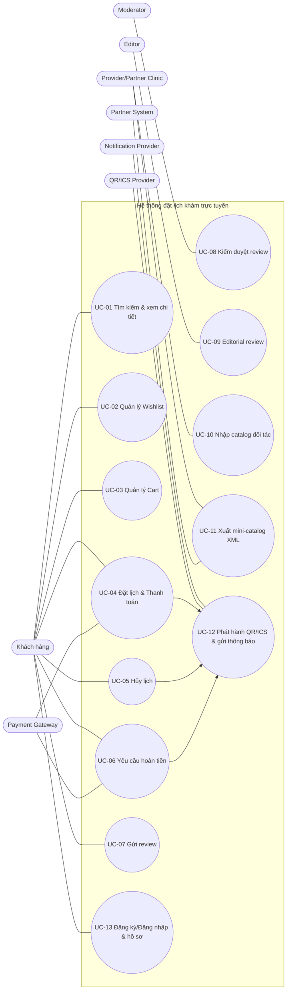

# CHƯƠNG 2. PHÂN TÍCH YÊU CẦU (REQUIREMENT ANALYSIS)

## 2.1 Tổng quan yêu cầu

### 2.1.1 Mục tiêu nghiệp vụ (Business Goals)

Hệ thống đặt lịch khám bệnh trực tuyến hướng tới các mục tiêu nghiệp vụ sau:

- Tăng khả năng tiếp cận dịch vụ y tế: người dùng có thể tìm kiếm, so sánh và đặt lịch trực tuyến theo nhiều tiêu chí.
- Chuẩn hóa quy trình đặt lịch–thanh toán–xác nhận, giảm thời gian chờ và giảm tải cho khâu tiếp nhận.
- Hỗ trợ hợp tác đối tác (bảo hiểm/doanh nghiệp) thông qua mini-catalog, nhằm mở rộng kênh phân phối dịch vụ.
- Tăng tính minh bạch và tin cậy thông qua review có kiểm duyệt và nội dung biên tập.

### 2.1.2 Phạm vi yêu cầu trong chương

Chương 2 cụ thể hóa các nội dung đã nêu ở Chương 1 thành:

- Danh sách tác nhân và phạm vi tương tác.
- Yêu cầu chức năng (FR) theo nhóm nghiệp vụ.
- Yêu cầu phi chức năng (NFR) theo chỉ tiêu đề bài.
- Mô hình Use Case và đặc tả Use Case trọng yếu.
- Tiêu chí chấp nhận và ma trận truy vết phục vụ các sơ đồ ở Chương 3–4.

### 2.1.3 Quy ước mô tả yêu cầu

- **FR-xx**: Functional Requirement (yêu cầu chức năng).
- **NFR-xx**: Non-functional Requirement (yêu cầu phi chức năng).
- **UC-xx**: Use Case.

## 2.2 Tác nhân và các bên liên quan (Actors & Stakeholders)

### 2.2.1 Danh sách tác nhân chính

- **A1 – Khách hàng (Customer)**: tìm kiếm, đặt lịch, thanh toán, hủy/hoàn, wishlist, review.
- **A2 – Nhân viên kiểm duyệt (Moderator)**: duyệt/ẩn review trước khi xuất bản.
- **A3 – Biên tập viên y tế (Editor)**: đăng bài nhận định/hướng dẫn (editorial review).
- **A4 – Cơ sở y tế/đối tác (Provider/Partner Clinic)**: cung cấp catalog, cấu hình cut-off, tiếp nhận đơn đặt lịch.
- **A5 – Hệ thống đối tác (Partner System)**: nhúng mini-catalog; trao đổi XML.
- **A6 – Cổng thanh toán (Payment Gateway)**: xử lý thanh toán thẻ/ ví.
- **A7 – Dịch vụ thông báo (Notification Provider)**: SMS/email/CDN.
- **A8 – Dịch vụ phát hành xác nhận (Ticket/ICS Provider)**: QR/ICS lịch hẹn.

> Lưu ý: Trong phạm vi báo cáo, các tích hợp A6–A8 được mô tả theo hướng **trung lập nhà cung cấp** (provider-agnostic).

### 2.2.2 Mô tả vai trò và quyền hạn (tóm tắt)

- **Khách hàng**: chỉ thao tác trên dữ liệu cá nhân (hồ sơ, wishlist, booking của chính mình), gửi review.
- **Moderator**: xem danh sách review chờ duyệt, phê duyệt/từ chối, chỉnh trạng thái hiển thị.
- **Editor**: tạo/sửa/xuất bản bài editorial review.
- **Provider/Partner Clinic**: cập nhật catalog bác sĩ/dịch vụ; thiết lập cut-off; xử lý tiếp nhận.
- **Partner System**: tiêu thụ mini-catalog XML và/hoặc nhúng mini-catalog vào website.

### 2.2.3 Ma trận tác nhân ↔ nhóm chức năng

| Nhóm chức năng | A1 Customer | A2 Moderator | A3 Editor | A4 Provider | A5 Partner System | A6 Payment | A7 Notify | A8 QR/ICS |
|---|:---:|:---:|:---:|:---:|:---:|:---:|:---:|:---:|
| Tìm kiếm & xem chi tiết | ✔ |  | ✔ (xem) | ✔ (cập nhật dữ liệu) |  |  |  |  |
| Wishlist | ✔ |  |  |  |  |  |  |  |
| Giỏ đặt lịch (Cart) | ✔ |  |  |  |  |  |  |  |
| Đặt lịch/Booking | ✔ |  |  | ✔ (tiếp nhận) |  |  |  |  |
| Thanh toán | ✔ |  |  |  |  | ✔ |  |  |
| Hủy & hoàn | ✔ |  |  | ✔ (chính sách/cut-off) |  | ✔ (hoàn nếu có) |  |  |
| Review & kiểm duyệt | ✔ (gửi) | ✔ (duyệt) |  |  |  |  |  |  |
| Nội dung biên tập |  |  | ✔ |  |  |  |  |  |
| Mini-catalog XML |  |  |  | ✔ (dữ liệu nguồn) | ✔ (tiêu thụ) |  |  |  |
| Thông báo & xác nhận | ✔ (nhận) |  |  |  |  |  | ✔ | ✔ |

## 2.3 Yêu cầu chức năng (Functional Requirements – FR)

### 2.3.1 FR – Quản lý tài khoản & hồ sơ khách hàng

- **FR-01**: Hệ thống cho phép khách hàng tạo tài khoản và lưu hồ sơ gồm: họ tên, email, số điện thoại, ngày sinh, thông tin bảo hiểm.
- **FR-02**: Hệ thống duy trì danh sách tài khoản trong **cơ sở dữ liệu trung tâm**.
- **FR-03**: Khi đăng nhập, hệ thống phải **đối chiếu mật khẩu** với danh sách tài khoản gốc trong cơ sở dữ liệu trung tâm (xác thực dựa trên thông tin lưu trữ gốc).
- **FR-04**: Hệ thống cho phép khách hàng cập nhật hồ sơ (trừ các trường bị ràng buộc theo chính sách, nếu có).

### 2.3.2 FR – Tìm kiếm & xem chi tiết

- **FR-05**: Hệ thống cho phép tìm kiếm theo tên bác sĩ, chuyên khoa, từ khóa, địa điểm, khung giờ.
- **FR-06**: Hệ thống hiển thị danh sách kết quả kèm thông tin tóm tắt (tên, chuyên khoa, cơ sở, giá/dải giá, đánh giá trung bình nếu có).
- **FR-07**: Người dùng xem trang chi tiết bác sĩ/cơ sở y tế, bao gồm hồ sơ, giá dịch vụ, và thời gian còn trống.

### 2.3.3 FR – Wishlist (danh sách mong muốn)

- **FR-08**: Hệ thống cho phép người dùng lưu bác sĩ/phòng khám yêu thích vào wishlist để đặt sau.
- **FR-09**: Hệ thống cho phép người dùng xóa mục khỏi wishlist.

### 2.3.4 FR – Giỏ đặt lịch (Cart)

- **FR-10**: Hệ thống cho phép người dùng thêm lịch khám/dịch vụ vào giỏ đặt lịch trước khi thanh toán.
- **FR-11**: Người dùng có thể **xóa mục khỏi giỏ**.
- **FR-12**: Hệ thống hiển thị tổng quan giỏ (danh sách mục, giá dự kiến, thông tin thời gian/địa điểm).

### 2.3.5 FR – Đặt lịch/đơn đặt lịch (Booking/Order)

- **FR-13**: Hệ thống cho phép tạo đơn đặt lịch từ giỏ đặt lịch sau khi người dùng xác nhận.
- **FR-14**: Hệ thống lưu trạng thái đơn đặt lịch (ví dụ: tạo mới, chờ thanh toán, đã thanh toán, đã xác nhận, đã hủy, hoàn tiền…).
- **FR-15**: Cơ sở y tế/đối tác có thể tiếp nhận đơn đặt lịch trực tuyến.

### 2.3.6 FR – Thanh toán

- **FR-16**: Hệ thống hỗ trợ thanh toán bằng **thẻ hoặc ví điện tử** thông qua cổng thanh toán.
- **FR-17**: Hệ thống ghi nhận kết quả thanh toán và cập nhật trạng thái đơn đặt lịch.

### 2.3.7 FR – Hủy & hoàn tiền

- **FR-18**: Người dùng có thể hủy đơn đặt lịch **trước thời điểm check-in** hoặc trước **cut-off** do cơ sở y tế quy định.
- **FR-19**: Người dùng có thể yêu cầu hoàn tiền theo chính sách hoàn/hủy.
- **FR-20**: Hệ thống ghi nhận yêu cầu hoàn tiền và trạng thái xử lý.

### 2.3.8 FR – Review & kiểm duyệt

- **FR-21**: Người dùng có thể đăng đánh giá (review) về bác sĩ/cơ sở y tế.
- **FR-22**: Review gồm xếp hạng 1–5 và nội dung; review thường hiển thị kèm tiêu đề trong danh sách.
- **FR-23**: Review của khách hàng phải được **kiểm duyệt** trước khi xuất bản.
- **FR-24**: Review dài được **rút gọn** trên trang chi tiết; người dùng có thể bấm để xem đầy đủ.

### 2.3.9 FR – Nội dung biên tập (Editorial Review)

- **FR-25**: Biên tập viên có thể đăng bài nhận định/hướng dẫn (editorial review) và hiển thị tại trang chi tiết.

### 2.3.10 FR – Catalog đối tác & mini-catalog XML

- **FR-26**: Cơ sở y tế/đối tác có thể thêm catalog bác sĩ/dịch vụ riêng.
- **FR-27**: Dữ liệu catalog đối tác được nhập vào **catalog tổng** để xuất hiện trong kết quả tìm kiếm.
- **FR-28**: Nền tảng có thể nhúng vào website đối tác dưới dạng mini-catalog.
- **FR-29**: Mini-catalog phải được **định nghĩa bằng XML** để trao đổi với hệ thống bên ngoài.

### 2.3.11 FR – Thông báo & phát hành xác nhận

- **FR-30**: Hệ thống phát hành phiếu xác nhận lịch hẹn (mã QR và/hoặc ICS lịch hẹn).
- **FR-31**: Hệ thống gửi thông báo (SMS/email/CDN) thông qua dịch vụ bên thứ ba.

## 2.4 Yêu cầu phi chức năng (Non-functional Requirements – NFR)

### 2.4.1 NFR – Hiệu năng & khả năng mở rộng (Scalability)

- **NFR-01**: Hệ thống hỗ trợ tối đa 100.000 tài khoản trong 6 tháng đầu; sau đó mở rộng đến 1.000.000 tài khoản.
- **NFR-02**: Hệ thống phục vụ 1.000 người dùng đồng thời; sau đó mở rộng đến 10.000 người dùng đồng thời.
- **NFR-03**: Hệ thống đáp ứng 100 yêu cầu tìm kiếm/phút; sau đó mở rộng đến 1.000 yêu cầu/phút.
- **NFR-04**: Hệ thống xử lý 100 đơn đặt lịch/giờ; sau đó mở rộng đến 1.000 đơn đặt lịch/giờ.

### 2.4.2 NFR – Tính sẵn sàng & độ tin cậy

- **NFR-05**: Hệ thống phải xử lý được tình huống lỗi/tạm thời không khả dụng của cổng thanh toán hoặc dịch vụ thông báo (ghi nhận trạng thái, cho phép retry theo chính sách).
- **NFR-06**: Các thao tác thanh toán và cập nhật trạng thái đơn đặt lịch cần có cơ chế tránh ghi nhận trùng (idempotency) ở mức thiết kế.

### 2.4.3 NFR – Bảo mật & quyền riêng tư

- **NFR-07**: Thông tin xác thực phải được lưu trữ an toàn (mật khẩu lưu dạng băm; không lưu plaintext).
- **NFR-08**: Phân quyền tối thiểu theo vai trò: khách hàng, moderator, editor, provider.
- **NFR-09**: Dữ liệu hồ sơ cá nhân và bảo hiểm cần được bảo vệ theo nguyên tắc tối thiểu và chỉ truy cập bởi chủ thể có quyền.

### 2.4.4 NFR – Tính tương chuẩn & tích hợp (Interoperability/Integration)

- **NFR-10**: Mini-catalog sử dụng **XML** để trao đổi liên hệ thống, giảm phụ thuộc công nghệ triển khai.
- **NFR-11**: Các tích hợp (payment/notify/QR-ICS) được thiết kế theo hướng **thay thế nhà cung cấp** (adapter), cấu hình bằng tham số.
- **NFR-12**: Trong phạm vi demo, có thể sử dụng môi trường thử nghiệm (sandbox) và cấu hình SMTP để minh họa luồng nghiệp vụ.

### 2.4.5 NFR – Khả năng bảo trì & mở rộng kênh

- **NFR-13**: Thiết kế tách lớp nghiệp vụ khỏi giao diện (API-first/headless), tạo điều kiện phát triển front-end thay thế.

### 2.4.6 NFR – Ràng buộc dữ liệu (CSDL trung tâm)

- **NFR-14**: Danh sách tài khoản và catalog tổng phải được quản lý nhất quán tại cơ sở dữ liệu trung tâm.

## 2.5 Mô hình Use Case

### 2.5.1 Use Case Diagram tổng (minh họa)



### 2.5.2 Nhóm Use Case theo nghiệp vụ

- **Nhóm tìm kiếm**: UC-01
- **Nhóm lập kế hoạch đặt lịch**: UC-02, UC-03
- **Nhóm đặt lịch & thanh toán**: UC-04, UC-12
- **Nhóm hủy/hoàn**: UC-05, UC-06, UC-12
- **Nhóm nội dung & đánh giá**: UC-07, UC-08, UC-09
- **Nhóm catalog & đối tác**: UC-10, UC-11
- **Nhóm tài khoản**: UC-13

### 2.5.3 Danh sách Use Case (tóm tắt)

| Mã UC | Tên Use Case | Tác nhân chính |
|---|---|---|
| UC-01 | Tìm kiếm & xem chi tiết | Khách hàng |
| UC-02 | Quản lý Wishlist | Khách hàng |
| UC-03 | Quản lý Cart | Khách hàng |
| UC-04 | Đặt lịch & Thanh toán | Khách hàng, Payment Gateway |
| UC-05 | Hủy lịch | Khách hàng |
| UC-06 | Yêu cầu hoàn tiền | Khách hàng, Payment Gateway |
| UC-07 | Gửi review | Khách hàng |
| UC-08 | Kiểm duyệt review | Moderator |
| UC-09 | Quản lý editorial review | Editor |
| UC-10 | Nhập catalog đối tác | Provider |
| UC-11 | Xuất mini-catalog XML | Provider, Partner System |
| UC-12 | Phát hành QR/ICS & gửi thông báo | QR/ICS Provider, Notification Provider |
| UC-13 | Đăng ký/Đăng nhập & quản lý hồ sơ | Khách hàng |

## 2.6 Đặc tả Use Case (Use Case Specification)

> Mục này đặc tả chi tiết các Use Case xương sống nhằm làm cơ sở cho sơ đồ Robustness (Chương 3) và Sequence/Class (Chương 4).

### 2.6.1 UC-04 – Đặt lịch & thanh toán (Cart → Checkout → Payment → Confirm)

- **Mục tiêu**: Người dùng đặt lịch một hoặc nhiều dịch vụ trong giỏ và thanh toán một lần; hệ thống tạo đơn và phát hành xác nhận.
- **Tác nhân chính**: Khách hàng (A1).
- **Tác nhân phụ**: Payment Gateway (A6), QR/ICS Provider (A8), Notification Provider (A7).
- **Tiền điều kiện**:
  - Người dùng đã đăng nhập hoặc cung cấp thông tin hồ sơ tối thiểu theo chính sách.
  - Giỏ đặt lịch có ít nhất một mục hợp lệ (slot còn trống).
- **Hậu điều kiện (thành công)**:
  - Đơn đặt lịch được tạo và ở trạng thái đã thanh toán/đã xác nhận.
  - Phiếu xác nhận QR/ICS được phát hành và thông báo được gửi.

**Luồng chính (Main Flow)**

1. Người dùng xem giỏ đặt lịch và xác nhận thông tin.
2. Hệ thống kiểm tra tính hợp lệ của từng mục (slot còn trống, giá hiện hành).
3. Người dùng chọn phương thức thanh toán (thẻ/ ví).
4. Hệ thống tạo yêu cầu thanh toán và chuyển sang cổng thanh toán.
5. Cổng thanh toán xử lý và trả kết quả.
6. Hệ thống ghi nhận giao dịch, cập nhật trạng thái đơn đặt lịch.
7. Hệ thống yêu cầu phát hành QR/ICS.
8. Hệ thống gửi thông báo xác nhận (SMS/email).

**Luồng thay thế/ngoại lệ (Alternative/Exception)**

- **A1 – Slot không còn trống**: hệ thống thông báo và yêu cầu người dùng chọn slot khác hoặc xóa mục.
- **A2 – Thanh toán thất bại/hủy**: đơn chuyển trạng thái thất bại/chờ; người dùng có thể retry theo chính sách.
- **A3 – Lỗi phát hành QR/ICS hoặc gửi thông báo**: đơn vẫn hợp lệ; hệ thống ghi nhận lỗi và retry gửi thông báo.

### 2.6.2 UC-05/UC-06 – Hủy lịch & yêu cầu hoàn tiền

- **Mục tiêu**: Người dùng hủy lịch trước check-in/cut-off; nếu đủ điều kiện thì gửi yêu cầu hoàn tiền.
- **Tác nhân chính**: Khách hàng (A1).
- **Tác nhân phụ**: Provider (A4), Payment Gateway (A6), Notification Provider (A7).
- **Tiền điều kiện**: Người dùng có đơn đặt lịch tồn tại.
- **Hậu điều kiện**: Đơn chuyển trạng thái hủy; yêu cầu hoàn được tạo (nếu áp dụng).

**Luồng chính**

1. Người dùng chọn đơn cần hủy.
2. Hệ thống kiểm tra điều kiện hủy (trước check-in/cut-off).
3. Hệ thống cập nhật trạng thái đơn sang đã hủy.
4. Nếu đơn đã thanh toán và chính sách cho phép, hệ thống tạo yêu cầu hoàn tiền.
5. Hệ thống gửi thông báo trạng thái hủy/hoàn cho người dùng.

**Ngoại lệ**

- **B1 – Quá cut-off**: hệ thống từ chối hủy và nêu lý do.
- **B2 – Không đủ điều kiện hoàn**: vẫn hủy được (nếu chính sách cho phép) nhưng không tạo hoàn.

### 2.6.3 UC-07/UC-08 – Gửi review & kiểm duyệt trước xuất bản

- **Mục tiêu**: Người dùng gửi review; review chỉ hiển thị sau khi moderator duyệt.
- **Tác nhân chính**: Khách hàng (A1) / Moderator (A2).
- **Tiền điều kiện**: Người dùng đăng nhập; review liên quan bác sĩ/cơ sở y tế hợp lệ.
- **Hậu điều kiện**: Review ở trạng thái chờ duyệt/đã duyệt/từ chối.

**Luồng chính (gửi review)**

1. Người dùng nhập tiêu đề, nội dung, rating 1–5 và gửi.
2. Hệ thống lưu review ở trạng thái **Pending**.
3. Moderator xem danh sách review chờ duyệt.
4. Moderator phê duyệt hoặc từ chối.
5. Nếu phê duyệt, review được hiển thị trên trang chi tiết; review dài hiển thị rút gọn và có nút xem đầy đủ.

### 2.6.4 UC-11 – Xuất mini-catalog XML cho đối tác (chính thức)

- **Mục tiêu**: Sinh mini-catalog (bác sĩ/chuyên khoa/gói khám) từ catalog tổng và xuất theo định dạng XML để đối tác nhúng/tiêu thụ.
- **Tác nhân chính**: Provider/Partner Clinic (A4) hoặc hệ thống đối tác (A5).
- **Tiền điều kiện**: Catalog tổng có dữ liệu hợp lệ.
- **Hậu điều kiện**: XML mini-catalog được tạo theo schema thống nhất.

**Luồng chính**

1. Hệ thống nhận yêu cầu xuất mini-catalog theo phạm vi (cơ sở, chuyên khoa, gói).
2. Hệ thống truy xuất dữ liệu từ catalog tổng.
3. Hệ thống tạo XML theo schema (định nghĩa cấu trúc dữ liệu trao đổi).
4. Hệ thống cung cấp XML cho đối tác (tải về hoặc endpoint).

**Ngoại lệ**

- **C1 – Thiếu dữ liệu**: hệ thống trả về XML rỗng có thông báo hoặc lỗi theo quy ước.

## 2.7 Tiêu chí chấp nhận & truy vết (Acceptance & Traceability)

### 2.7.1 Tiêu chí chấp nhận (Given–When–Then)

Các tiêu chí dưới đây được viết theo cú pháp **Gherkin** để dễ kiểm thử và truy vết.

```gherkin
Feature: Online medical booking

  Scenario: Successful checkout and confirmation
    Given the customer has at least one valid item in the cart
    And the selected time slot is still available
    When the customer confirms the booking and payment is successful
    Then the system creates a booking order with status "CONFIRMED"
    And the system issues a QR/ICS confirmation
    And the system sends a confirmation notification via email/SMS

  Scenario: Cancel booking before cut-off
    Given the customer has a confirmed booking
    And the current time is before the provider cut-off time
    When the customer requests cancellation
    Then the system updates the booking status to "CANCELLED"
    And the system notifies the customer about the cancellation result
    And the system creates a refund request if the policy allows

  Scenario: Reviews require moderation
    Given the customer is logged in
    When the customer submits a review for a provider
    Then the system stores the review with status "PENDING"
    And the review is not publicly visible until approved by a moderator

  Scenario: Export mini-catalog in XML
    Given the master catalog has valid provider and service data
    When a partner requests the mini-catalog export
    Then the system returns an XML document that conforms to the agreed schema
```

**AC-01 – Đặt lịch & thanh toán**

- **Given**: Người dùng đã chọn bác sĩ/dịch vụ và khung giờ hợp lệ; giỏ có ít nhất một mục.
- **When**: Người dùng xác nhận đặt lịch và thanh toán thành công qua cổng thanh toán.
- **Then**: Hệ thống tạo đơn đặt lịch, cập nhật trạng thái đã thanh toán/đã xác nhận, phát hành QR/ICS và gửi email/SMS xác nhận.

**AC-02 – Hủy lịch trước cut-off**

- **Given**: Đơn đặt lịch còn trước thời điểm cut-off.
- **When**: Người dùng yêu cầu hủy.
- **Then**: Hệ thống cập nhật trạng thái hủy, gửi thông báo; nếu đủ điều kiện hoàn thì tạo yêu cầu hoàn.

**AC-03 – Review phải kiểm duyệt**

- **Given**: Người dùng đã đăng nhập.
- **When**: Người dùng gửi review.
- **Then**: Review ở trạng thái Pending và không hiển thị công khai cho đến khi moderator phê duyệt.

**AC-04 – Xuất mini-catalog XML**

- **Given**: Catalog tổng có dữ liệu bác sĩ/dịch vụ hợp lệ.
- **When**: Đối tác yêu cầu xuất mini-catalog.
- **Then**: Hệ thống trả về XML đúng schema, bao gồm các trường dữ liệu tối thiểu và có thể nhúng/tiêu thụ.

### 2.7.2 Ma trận truy vết FR ↔ Use Case ↔ (mô hình ở Chương 3–4)

Bảng sau giúp đảm bảo tính nhất quán giữa yêu cầu và các mô hình phân tích/thiết kế (mã mô hình sẽ được hoàn thiện khi dựng sơ đồ ở Chương 3–4).

| Yêu cầu | Use Case liên quan | Mô hình miền (DM) | Robustness (RB) | Sequence (SD) |
|---|---|---|---|---|
| FR-01..FR-04 (Tài khoản/hồ sơ) | UC-13 | DM-Identity | RB-Login | SD-Login |
| FR-05..FR-07 (Tìm kiếm/chi tiết) | UC-01 | DM-Catalog | RB-Search | SD-Search |
| FR-08..FR-09 (Wishlist) | UC-02 | DM-Wishlist | RB-Wishlist | SD-Wishlist |
| FR-10..FR-12 (Cart) | UC-03 | DM-Cart | RB-Cart | SD-Cart |
| FR-13..FR-17 (Booking/Payment) | UC-04, UC-12 | DM-Booking/Payment | RB-Checkout | SD-Checkout |
| FR-18..FR-20 (Cancel/Refund) | UC-05, UC-06 | DM-Cancel/Refund | RB-CancelRefund | SD-CancelRefund |
| FR-21..FR-24 (Review/Moderation) | UC-07, UC-08 | DM-Review | RB-ReviewModeration | SD-ReviewModeration |
| FR-25 (Editorial) | UC-09 | DM-Editorial | RB-Editorial | SD-Editorial |
| FR-26..FR-29 (Catalog/XML) | UC-10, UC-11 | DM-PartnerCatalog | RB-MiniCatalogXML | SD-MiniCatalogXML |
| FR-30..FR-31 (QR/Notify) | UC-12 | DM-Notification/Ticket | RB-NotifyTicket | SD-NotifyTicket |
