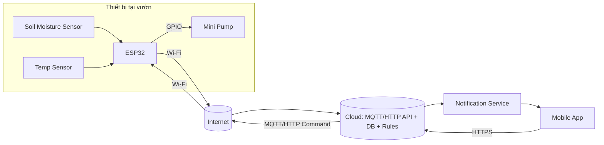
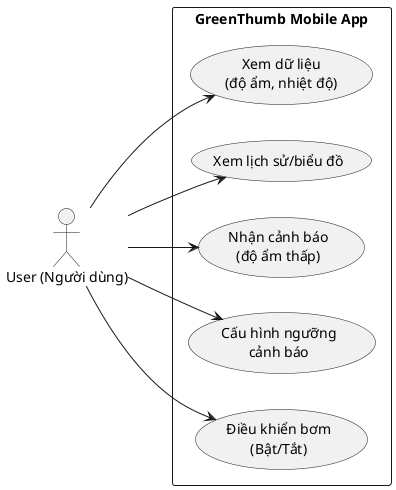
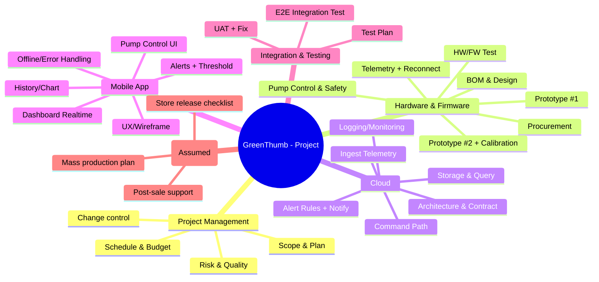

# CHƯƠNG 1: TỔNG QUAN DỰ ÁN

## 1.1. Giới thiệu dự án

### 1.1.1. Tên dự án
**Lập kế hoạch phát triển dự án IoT “Vườn thông minh GreenThumb”.**

### 1.1.2. Mô tả tổng quan hệ thống
GreenThumb là một hệ thống IoT hỗ trợ chăm sóc cây trồng tại gia thông qua việc giám sát các chỉ số môi trường và cho phép tưới nước chủ động/từ xa. Hệ thống gồm hai thành phần chính:

- **Phần cứng (thiết bị IoT):** sử dụng vi điều khiển **ESP32**, tích hợp cảm biến **độ ẩm đất** và **nhiệt độ**. Thiết bị kết nối **Wi‑Fi** để gửi dữ liệu lên nền tảng cloud, đồng thời có thể nhận lệnh điều khiển **bật/tắt bơm** từ cloud.
- **Phần mềm:** gồm **hạ tầng cloud** (MQTT/HTTP, lưu trữ dữ liệu, xử lý cảnh báo) và **ứng dụng di động** giúp người dùng theo dõi số liệu, xem lịch sử, nhận thông báo khi độ ẩm thấp và điều khiển bơm từ xa.

Trong phạm vi học phần, nhóm tập trung xây dựng **kế hoạch quản lý dự án** (phạm vi, WBS, tiến độ, chi phí, rủi ro, chất lượng và triển khai). Việc triển khai sản phẩm hoàn chỉnh (nếu có) chỉ mang tính minh họa để phục vụ lập kế hoạch.

**Hệ thống được thiết kế theo kiến trúc IoT điển hình, đảm bảo khả năng mở rộng và phù hợp với mục tiêu điều khiển, giám sát từ xa trong bối cảnh thực tế.**

### 1.1.3. Bối cảnh và ý nghĩa dự án
Nhu cầu chăm sóc cây trồng tại gia ngày càng tăng, tuy nhiên người dùng thường gặp khó khăn như quên tưới, tưới chưa đúng thời điểm hoặc thiếu thông tin về độ ẩm và nhiệt độ. Ứng dụng IoT giúp tự động hóa quá trình theo dõi, cung cấp cảnh báo kịp thời và hỗ trợ điều khiển tưới từ xa.

Về mặt học phần, GreenThumb phù hợp để mô phỏng một dự án IoT có tính liên ngành (phần cứng–firmware–cloud–mobile), có rủi ro đặc thù và yêu cầu phối hợp song song giữa các nhánh công việc, qua đó giúp nhóm vận dụng kiến thức quản lý dự án CNTT một cách toàn diện.

## 1.2. Mục tiêu dự án

### 1.2.1. Mục tiêu tổng thể
Xây dựng bộ kế hoạch quản lý dự án tương đối đầy đủ và nhất quán cho dự án IoT GreenThumb, đảm bảo tính khả thi theo nguồn lực **05 thành viên** trong **07 tuần**.

### 1.2.2. Mục tiêu cụ thể
(1) Xác định mô hình hệ thống GreenThumb theo hướng IoT kết nối **Wi‑Fi + Cloud (MQTT/HTTP) + Ứng dụng di động**.

(2) Phân tích yêu cầu ban đầu và xác định phạm vi dự án (in-scope/out-of-scope) rõ ràng cho cả phần cứng và phần mềm.

(3) Xây dựng kế hoạch thực hiện gồm **WBS** thể hiện các nhánh công việc song song, **lịch trình tổng hợp (Gantt)** có quan hệ phụ thuộc, các **mốc (milestones)** và đường găng ở mức tổng quan.

(4) Lập dự toán ngân sách sơ bộ có cơ sở/giả định (linh kiện, tích hợp, chi phí phát sinh).

(5) Xây dựng kế hoạch quản lý rủi ro và kế hoạch quản lý chất lượng/kiểm thử phù hợp đặc thù dự án IoT.

(6) Đề xuất kế hoạch triển khai sản phẩm ra thị trường ở mức giả định (phát hành ứng dụng, sản xuất hàng loạt giả định, hỗ trợ sau bán).

## 1.3. Phạm vi tổng quan

### 1.3.1. Phạm vi hệ thống
Hệ thống GreenThumb trong báo cáo gồm các khối chức năng chính:

- **Thiết bị IoT:** đo độ ẩm đất, nhiệt độ; truyền dữ liệu lên cloud; nhận lệnh điều khiển bơm.
- **Cloud:** tiếp nhận dữ liệu (MQTT/HTTP), lưu trữ, cung cấp API/luồng dữ liệu cho ứng dụng; xử lý cảnh báo theo ngưỡng; chuyển lệnh điều khiển xuống thiết bị.
- **Ứng dụng di động:** hiển thị dữ liệu và lịch sử; nhận thông báo; điều khiển bơm từ xa; hiển thị trạng thái kết nối cơ bản.

Các thành phần trên liên kết với nhau thông qua kiến trúc **client–server**, đảm bảo luồng dữ liệu **hai chiều** giữa thiết bị và người dùng.

Nhóm giả định có **02 thiết bị mẫu (02 prototypes)** để phục vụ kiểm thử tích hợp và dự phòng rủi ro linh kiện.

### 1.3.2. Đối tượng sử dụng
- Người dùng chính: cá nhân/hộ gia đình trồng cây tại nhà.
- Đối tượng liên quan: nhóm phát triển/vận hành (xử lý lỗi, hỗ trợ), giảng viên/đơn vị đánh giá trong bối cảnh học phần.

## 1.4. Các giả định (Assumptions)
Bảng 1.1 dưới đây liệt kê các giả định và tác động đến việc lập kế hoạch dự án.

**Bảng 1.1. Assumptions**

| Mã | Giả định | Tác động đến kế hoạch |
|---|---|---|
| A1 | Thiết bị sử dụng ESP32 và có kết nối Wi‑Fi ổn định trong điều kiện triển khai giả định. | Ảnh hưởng thiết kế kiến trúc, tiến độ tích hợp và kế hoạch kiểm thử kết nối. |
| A2 | Kênh truyền giữa thiết bị và cloud sử dụng MQTT hoặc HTTP qua Internet; có xác thực cơ bản bằng token. | Cần đặc tả API/Topic sớm; bổ sung test bảo mật cơ bản và test giao tiếp end‑to‑end. |
| A3 | Cloud sử dụng hạ tầng mức demo/free-tier trong giai đoạn học phần. | Ràng buộc tài nguyên; cần ưu tiên tính năng tối thiểu và phương án dự phòng khi giới hạn dịch vụ. |
| A4 | Nhóm chuẩn bị 02 prototypes để kiểm thử và dự phòng hỏng hóc/thiếu linh kiện. | Tăng ngân sách linh kiện; giảm rủi ro tiến độ do hỏng thiết bị; hỗ trợ test song song. |
| A5 | Yêu cầu người dùng ở mức gia đình; không yêu cầu chứng chỉ/chuẩn công nghiệp trong phạm vi bài. | Giới hạn phạm vi chất lượng (không chứng nhận); tập trung kiểm thử chức năng và độ ổn định cơ bản. |
| A6 | Dự án thực hiện trong 07 tuần với 05 thành viên theo kế hoạch học phần. | Ảnh hưởng ước tính thời lượng, phân công, và lựa chọn phương pháp Hybrid/sprint 1 tuần. |

## 1.5. Các ràng buộc (Constraints)
Bảng 1.2 dưới đây liệt kê các ràng buộc chính và hướng xử lý sơ bộ.

**Bảng 1.2. Constraints**

| Mã | Ràng buộc | Hướng xử lý sơ bộ |
|---|---|---|
| C1 | Thời gian thực hiện: 07 tuần. | Chia theo mốc tuần/sprint; chốt baseline sớm; ưu tiên chức năng lõi để kịp tích hợp và UAT. |
| C2 | Nguồn lực: 05 thành viên; thời gian tham gia giới hạn theo lịch học. | Phân vai rõ ràng (PM/BA, HW, FW, Cloud/QA, Mobile); dùng RACI để tránh chồng chéo. |
| C3 | Chi phí linh kiện và phát sinh bị giới hạn theo ngân sách SV. | Ưu tiên linh kiện phổ biến; mua theo BOM tối thiểu; dự phòng khoản phát sinh; tận dụng công cụ miễn phí. |
| C4 | Ràng buộc kỹ thuật: chất lượng cảm biến, ổn định nguồn khi điều khiển bơm, chất lượng mạng. | Đưa rủi ro kỹ thuật vào Risk Register; test tải bơm sớm; thiết kế cơ chế reconnect/buffer. |
| C5 | Trọng tâm học phần là quản lý dự án; sản phẩm (nếu có) mang tính minh họa. | Tập trung hoàn thiện WBS/Gantt/Budget/Risk/Quality nhất quán; giới hạn phạm vi kỹ thuật chi tiết. |
| C6 | Phụ thuộc bên ngoài: thời gian cung ứng linh kiện, nền tảng cloud/app store (giả định). | Mua linh kiện sớm; có linh kiện thay thế; mô phỏng phát hành app bằng checklist thay vì triển khai thật. |

## (Gợi ý) Hình 1.1 – Kiến trúc hệ thống
Hình 1.1 dưới đây mô tả tổng quan kiến trúc hệ thống GreenThumb.


# CHƯƠNG 2: YÊU CẦU & PHẠM VI

## 2.1. Tổng quan yêu cầu hệ thống

### 2.1.1. Giới thiệu chung
Chương này trình bày các yêu cầu của hệ thống GreenThumb dưới góc nhìn **quản lý dự án** nhằm làm cơ sở cho việc xây dựng phạm vi (scope), WBS, tiến độ (Gantt), ngân sách, kế hoạch rủi ro và kế hoạch chất lượng/kiểm thử.

Hệ thống GreenThumb được định hướng theo mô hình IoT gồm:
- Thiết bị IoT (ESP32 + cảm biến + bơm)
- Kết nối Wi‑Fi và nền tảng cloud (MQTT/HTTP)
- Ứng dụng di động (giám sát, cảnh báo, điều khiển bơm)

### 2.1.2. Mục tiêu chức năng hệ thống
- Hỗ trợ người dùng **theo dõi** độ ẩm đất và nhiệt độ môi trường.
- Cung cấp **cảnh báo** khi độ ẩm thấp hơn ngưỡng.
- Cho phép **điều khiển bơm từ xa** (bật/tắt) thông qua cloud.
- Lưu trữ dữ liệu để người dùng xem **lịch sử/biểu đồ**.

## 2.2. Yêu cầu chức năng (Functional Requirements)

### 2.2.1. Đối với phần cứng/firmware
**Bảng 2.1. Yêu cầu chức năng phần cứng/firmware**

| Mã | Yêu cầu | Mô tả ngắn | Tiêu chí chấp nhận (tóm tắt) |
|---|---|---|---|
| HW-FR1 | Đo độ ẩm đất | Đọc giá trị độ ẩm từ cảm biến theo chu kỳ cấu hình. | Có giá trị đọc được, ổn định theo chu kỳ. |
| HW-FR2 | Đo nhiệt độ | Đọc nhiệt độ môi trường từ cảm biến. | Có giá trị đọc được và cập nhật định kỳ. |
| HW-FR3 | Gửi dữ liệu lên cloud | Gửi telemetry (độ ẩm, nhiệt độ, thời gian, trạng thái) lên cloud bằng Wi‑Fi. | Dữ liệu xuất hiện ở cloud/app theo chu kỳ. |
| HW-FR4 | Tự khôi phục kết nối | Tự reconnect khi mất Wi‑Fi hoặc mất kết nối cloud. | Sau khi mạng ổn định, tự gửi lại dữ liệu. |
| HW-FR5 | Nhận lệnh điều khiển | Nhận lệnh bật/tắt bơm từ cloud. | Nhận lệnh và phản hồi trạng thái thực thi. |
| HW-FR6 | Điều khiển bơm an toàn | Bật/tắt bơm; giới hạn thời gian bơm (chống chạy quá lâu). | Không bơm quá thời lượng tối đa cấu hình. |
| HW-FR7 | Gửi trạng thái thiết bị | Gửi trạng thái online/offline, lỗi cơ bản (nếu có). | App hiển thị được trạng thái kết nối. |

### 2.2.2. Đối với phần mềm (cloud + ứng dụng di động)

#### 2.2.2.1. Yêu cầu chức năng cloud
**Bảng 2.2. Yêu cầu chức năng cloud**

| Mã | Yêu cầu | Mô tả ngắn | Tiêu chí chấp nhận (tóm tắt) |
|---|---|---|---|
| CL-FR1 | Tiếp nhận telemetry | Nhận dữ liệu từ thiết bị qua MQTT/HTTP. | Dữ liệu được ghi nhận đúng cấu trúc. |
| CL-FR2 | Lưu trữ dữ liệu | Lưu dữ liệu đo để truy xuất lịch sử. | Truy vấn được theo khoảng thời gian. |
| CL-FR3 | Cung cấp API cho app | App có thể lấy dữ liệu hiện tại và lịch sử. | App hiển thị được dữ liệu từ API. |
| CL-FR4 | Chuyển lệnh điều khiển | Nhận lệnh từ app và gửi xuống thiết bị. | Thiết bị nhận lệnh và cập nhật trạng thái. |
| CL-FR5 | Xử lý cảnh báo | So sánh độ ẩm với ngưỡng và tạo cảnh báo. | Có bản ghi cảnh báo/trigger khi vượt ngưỡng. |
| CL-FR6 | Gửi thông báo | Gửi thông báo (push/in-app) đến app (mức giả định). | Người dùng nhận được thông báo trong demo. |

#### 2.2.2.2. Yêu cầu chức năng ứng dụng di động
**Bảng 2.3. Yêu cầu chức năng ứng dụng di động**

| Mã | Yêu cầu | Mô tả ngắn | Tiêu chí chấp nhận (tóm tắt) |
|---|---|---|---|
| SW-FR1 | Xem dữ liệu hiện tại | Hiển thị độ ẩm, nhiệt độ, trạng thái thiết bị. | Số liệu hiển thị đúng và cập nhật. |
| SW-FR2 | Xem lịch sử | Xem biểu đồ/ danh sách lịch sử theo ngày/tuần. | Có thể chọn khoảng thời gian và xem dữ liệu. |
| SW-FR3 | Cảnh báo độ ẩm thấp | Hiển thị cảnh báo khi độ ẩm dưới ngưỡng. | Người dùng nhìn thấy cảnh báo/nhận thông báo. |
| SW-FR4 | Cấu hình ngưỡng cảnh báo | Cho phép đặt ngưỡng độ ẩm tối thiểu. | Ngưỡng được lưu và áp dụng cho cảnh báo. |
| SW-FR5 | Điều khiển bơm từ xa | Bật/tắt bơm và xem trạng thái. | Thiết bị phản hồi và app hiển thị trạng thái. |
| SW-FR6 | Xử lý lỗi kết nối | Thông báo offline, lỗi mạng, retry cơ bản. | Có thông điệp rõ ràng, không “treo” UI. |

## 2.3. Yêu cầu phi chức năng (Non-functional Requirements)

**Bảng 2.4. Yêu cầu phi chức năng (NFR)**

| Mã | Nhóm | Yêu cầu | Tiêu chí chấp nhận (tóm tắt) |
|---|---|---|---|
| NFR1 | Hiệu năng | Dữ liệu cập nhật gần thời gian thực. | Trễ hiển thị mục tiêu ≤ 10 giây (điều kiện mạng ổn định). |
| NFR2 | Tin cậy | Thiết bị tự phục hồi kết nối khi mất mạng. | Sau khi mạng ổn định, tự reconnect và gửi tiếp dữ liệu. |
| NFR3 | Bảo mật | Dùng token cho thiết bị/app; ưu tiên TLS (giả định). | Không hard-code credential trong app; có cơ chế xác thực cơ bản. |
| NFR4 | Khả dụng | Hệ thống thông báo trạng thái offline. | App hiển thị offline khi thiết bị/cloud lỗi. |
| NFR5 | Dễ sử dụng | Giao diện rõ ràng, thao tác điều khiển đơn giản. | Người dùng thực hiện xem dữ liệu/điều khiển trong ≤ 3 bước. |
| NFR6 | Bảo trì | Có log sự kiện chính (gửi dữ liệu, nhận lệnh). | Truy vết được lỗi tích hợp trong demo. |

## 2.4. Phân tích Use Case

### 2.4.1. Danh sách Use Case
**Actor chính:** Người dùng (User)

**Bảng 2.5. Danh sách Use Case**

| Mã | Use Case | Actor | Mô tả ngắn |
|---|---|---|---|
| UC01 | Xem dữ liệu cảm biến | User | Xem độ ẩm, nhiệt độ và trạng thái thiết bị trên app. |
| UC02 | Xem lịch sử/biểu đồ | User | Xem dữ liệu theo khoảng thời gian. |
| UC03 | Nhận cảnh báo | User | Nhận cảnh báo khi độ ẩm thấp hơn ngưỡng. |
| UC04 | Cấu hình ngưỡng cảnh báo | User | Đặt ngưỡng độ ẩm tối thiểu để cảnh báo. |
| UC05 | Điều khiển bơm từ xa | User | Bật/tắt bơm và xem trạng thái phản hồi. |

### 2.4.2. Mô tả Use Case chính

#### UC01 – Xem dữ liệu cảm biến
- **Actor:** User
- **Tiền điều kiện:** User có thể truy cập app; thiết bị đã được định danh (device id/token) (giả định).
- **Luồng chính:**
  1) User mở app và vào màn hình Dashboard.
  2) App gọi API cloud để lấy dữ liệu hiện tại.
  3) App hiển thị độ ẩm, nhiệt độ và trạng thái thiết bị.
- **Luồng thay thế:**
  - A1: Thiết bị offline → app hiển thị “offline” và dữ liệu gần nhất.
  - A2: Mất mạng → app thông báo lỗi kết nối và cho phép thử lại.
- **Hậu điều kiện:** Dữ liệu được hiển thị, user nắm được trạng thái hiện tại.

#### UC05 – Điều khiển bơm từ xa
- **Actor:** User
- **Tiền điều kiện:** Thiết bị online; cloud sẵn sàng nhận lệnh.
- **Luồng chính:**
  1) User chọn chức năng điều khiển bơm.
  2) User nhấn Bật/Tắt.
  3) App gửi lệnh lên cloud.
  4) Cloud chuyển lệnh tới thiết bị.
  5) Thiết bị thực thi và phản hồi trạng thái.
  6) App cập nhật trạng thái bơm.
- **Luồng thay thế:**
  - A1: Thiết bị không phản hồi → app thông báo thất bại và cho phép gửi lại.
  - A2: Cloud lỗi → app thông báo lỗi hệ thống.
- **Hậu điều kiện:** Bơm đổi trạng thái hoặc hệ thống ghi nhận lệnh thất bại.

### 2.4.3. Sơ đồ Use Case (nếu có)
Hình 2.1 mô tả Use Case Diagram ở mức tổng quan.



*(Nếu không render PlantUML, có thể dùng hình flowchart Mermaid trong file HTML đi kèm để xuất ảnh đưa vào Word.)*

## 2.5. Xác định phạm vi dự án

### 2.5.1. In-scope
- Phân tích và đặc tả yêu cầu (FR/NFR) cho thiết bị, cloud và app.
- Thiết kế kế hoạch triển khai theo kiến trúc Wi‑Fi + cloud (MQTT/HTTP).
- Kế hoạch WBS, tiến độ (Gantt), ngân sách, rủi ro, chất lượng/kiểm thử.
- Giả định có **02 prototypes** để phục vụ kiểm thử tích hợp.
- Kế hoạch phát hành ứng dụng (mức giả định) và hỗ trợ sau bán.

### 2.5.2. Out-of-scope
- Chứng nhận an toàn điện, tiêu chuẩn IP chống nước/bụi, thử nghiệm công nghiệp.
- Sản xuất hàng loạt thực tế (chỉ lập kế hoạch giả định), tối ưu dây chuyền sản xuất.
- Tính năng nâng cao: đa thiết bị phức tạp, chia sẻ thiết bị cho nhiều tài khoản, thanh toán, thương mại điện tử.
- Bảo mật nâng cao/đáp ứng tiêu chuẩn tuân thủ (chỉ nêu định hướng ở mức cơ bản).
# CHƯƠNG 3: STAKEHOLDERS & PHƯƠNG PHÁP

## 3.1. Xác định các bên liên quan
Trong dự án IoT GreenThumb, các bên liên quan (stakeholders) bao gồm cả nhóm sử dụng sản phẩm, nhóm thực hiện dự án và các bên phụ thuộc bên ngoài (nhà cung cấp, nền tảng phân phối). Việc xác định đúng stakeholders giúp nhóm xây dựng kế hoạch phạm vi, tiến độ, rủi ro và giao tiếp phù hợp.

**Bảng 3.1. Danh sách stakeholders**

| Mã | Stakeholder | Nhóm | Nhu cầu/kỳ vọng chính | Mức độ ảnh hưởng (sơ bộ) |
|---|---|---|---|---|
| SH1 | Người dùng cuối (hộ gia đình trồng cây) | Customer/User | Dễ dùng, dữ liệu rõ ràng, cảnh báo đúng, điều khiển bơm ổn định | Trung bình |
| SH2 | Nhóm dự án (05 SV) | Project Team | Kế hoạch rõ ràng, phân công minh bạch, phối hợp HW–SW tốt | Cao |
| SH3 | Giảng viên/Người chấm | Sponsor/Approver | Hồ sơ quản lý dự án đầy đủ, nhất quán, có minh chứng (WBS/Gantt/Budget/Risk/QA) | Cao |
| SH4 | Nhà cung cấp linh kiện & vận chuyển | Supplier | Đơn hàng rõ ràng, thời gian cung ứng ổn định | Trung bình |
| SH5 | Nền tảng cloud (dịch vụ demo/free-tier) | Platform | Giới hạn tài nguyên, chính sách sử dụng dịch vụ | Trung bình |
| SH6 | App Store/Google Play (mức giả định) | Platform | Tuân thủ chính sách phát hành, mô tả ứng dụng/riêng tư | Thấp–TB |

## 3.2. Vai trò và trách nhiệm

### 3.2.1. Mô tả vai trò từng bên
- **Người dùng cuối:** đưa phản hồi về trải nghiệm sử dụng, kỳ vọng về cảnh báo và điều khiển.
- **Nhóm dự án:** chịu trách nhiệm lập kế hoạch, theo dõi tiến độ, quản lý rủi ro và đảm bảo chất lượng.
- **Giảng viên:** đóng vai trò phê duyệt các deliverables học phần, đưa nhận xét để nhóm cập nhật kế hoạch.
- **Nhà cung cấp linh kiện:** ảnh hưởng trực tiếp đến tiến độ prototype và rủi ro cung ứng.
- **Nền tảng cloud/app store:** ảnh hưởng đến khả năng triển khai demo, giới hạn tài nguyên và yêu cầu chính sách.

### 3.2.2. Trách nhiệm chính (tóm tắt)
**Bảng 3.2. Vai trò & trách nhiệm (tóm tắt)**

| Stakeholder | Trách nhiệm/đóng góp | Đầu ra liên quan |
|---|---|---|
| Người dùng cuối | Phản hồi yêu cầu, xác nhận mức “dễ dùng”, tình huống sử dụng | Use case, acceptance criteria (UAT) |
| Nhóm dự án | Lập và quản lý kế hoạch; thực thi theo mốc; báo cáo | WBS, Gantt, Budget, Risk Register, Test Plan |
| Giảng viên | Nhận xét/đánh giá; xác nhận mức đáp ứng rubric | Biên bản góp ý (nếu có), mốc phê duyệt |
| Nhà cung cấp | Cung ứng linh kiện đúng chất lượng và thời gian | BOM, hóa đơn/đơn hàng (giả định) |
| Nền tảng cloud | Cung cấp dịch vụ chạy demo theo giới hạn | Kế hoạch triển khai cloud, rủi ro giới hạn dịch vụ |
| App store | Quy định phát hành (mức giả định) | Checklist phát hành (giả định) |

## 3.3. Ma trận Stakeholder (Power – Interest)

### 3.3.1. Phân loại mức độ ảnh hưởng
Nhóm sử dụng ma trận Power–Interest để ưu tiên cách quản lý stakeholders.

- **High Power / High Interest (Quản lý chặt):** Giảng viên (SH3), Nhóm dự án (SH2)
- **High Power / Low Interest (Giữ hài lòng):** Nhà cung cấp quan trọng (SH4), Nền tảng cloud (SH5)
- **Low Power / High Interest (Giữ cập nhật):** Người dùng cuối (SH1)
- **Low Power / Low Interest (Theo dõi tối thiểu):** App store (SH6) trong phạm vi mô phỏng

**Hình 3.1. Power–Interest Matrix**
- File hình tham chiếu: xem [Hinh-3-1-Power-Interest.html](Hinh-3-1-Power-Interest.html) để xuất ảnh chèn Word.

### 3.3.2. Chiến lược quản lý từng nhóm
**Bảng 3.3. Chiến lược quản lý stakeholders**

| Nhóm | Stakeholder | Chiến lược | Tần suất |
|---|---|---|---|
| Quản lý chặt | SH2, SH3 | Báo cáo tiến độ + minh chứng, cập nhật thay đổi kế hoạch | Hàng tuần |
| Giữ hài lòng | SH4, SH5 | Theo dõi rủi ro cung ứng/giới hạn dịch vụ; có phương án thay thế | Theo mốc |
| Giữ cập nhật | SH1 | Thu thập phản hồi về tính dễ dùng/cảnh báo | 1–2 lần/sprint |
| Theo dõi tối thiểu | SH6 | Lập checklist phát hành giả định, nêu ràng buộc chính sách | Cuối dự án |

## 3.4. Phương pháp quản lý dự án

### 3.4.1. Giới thiệu các phương pháp
- **Waterfall:** phù hợp khi yêu cầu ổn định, ít thay đổi; ưu điểm là kiểm soát tài liệu và mốc rõ ràng.
- **Agile (Scrum/Kanban):** phù hợp khi yêu cầu có thể thay đổi; ưu điểm là lặp nhanh, phản hồi sớm.
- **Hybrid:** kết hợp Waterfall/Stage-gate cho phần ít linh hoạt (thường là phần cứng) và Agile cho phần cần lặp nhanh (thường là phần mềm).

### 3.4.2. Lựa chọn phương pháp
Nhóm lựa chọn **Hybrid (Stage-gate cho phần cứng + Agile/Scrum cho cloud & mobile)**.

### 3.4.3. Lý do lựa chọn
- **Tính song song HW–SW:** dự án có 2 nhánh công việc (phần cứng/firmware và phần mềm). Hybrid giúp vừa giữ được mốc cứng cho prototype, vừa cho phép phần mềm phát triển theo sprint.
- **Rủi ro cung ứng & vật lý:** phần cứng phụ thuộc linh kiện, lắp ráp, nguồn/bơm → cần mốc kiểm soát (gate) rõ ràng.
- **Độ bất định ở phần mềm:** giao diện, trải nghiệm, logic cảnh báo thường cần điều chỉnh theo phản hồi → phù hợp sprint.
- **Phù hợp học phần:** dễ trình bày WBS, Gantt, rủi ro và minh chứng tiến độ theo tuần.

### 3.4.4. So sánh với phương pháp khác
**Bảng 3.4. So sánh lựa chọn phương pháp (tóm tắt)**

| Tiêu chí | Waterfall thuần | Agile thuần | Hybrid (lựa chọn) |
|---|---|---|---|
| Phù hợp phần cứng | Tốt | Trung bình | **Tốt** |
| Phù hợp phần mềm | Trung bình | Tốt | **Tốt** |
| Quản lý phụ thuộc HW→SW | Trung bình | Trung bình | **Tốt** (có gate + sprint) |
| Linh hoạt thay đổi UI/logic | Thấp | **Cao** | **Cao** (ở nhánh SW) |
| Dễ bám rubric (WBS/Gantt) | **Cao** | Trung bình | **Cao** |

### 3.4.5. Cách áp dụng Hybrid trong dự án (mô tả ngắn)
- **Phần cứng/firmware (Stage-gate):**
  - Gate 1: Chốt BOM + thiết kế nguồn/bơm
  - Gate 2: Prototype #1 chạy telemetry
  - Gate 3: Prototype #2 ổn định + hiệu chuẩn
- **Phần mềm (Sprint 1 tuần):**
  - Lập backlog theo FR/NFR; mỗi sprint có mục tiêu rõ ràng (dashboard, lịch sử, cảnh báo, điều khiển).
  - Cuối sprint có demo/đánh giá và cập nhật kế hoạch (nếu có thay đổi).

## 3.5. Công cụ quản lý dự án (Jira) – không thuộc kiến trúc hệ thống
Nhóm **sử dụng Jira** để quản lý backlog, phân công công việc, theo dõi tiến độ theo sprint/tuần và trích xuất báo cáo (ví dụ: % hoàn thành, burndown). Jira chỉ phục vụ **quản lý dự án** và **không nằm trong phạm vi kiến trúc sản phẩm GreenThumb** (không đưa Jira vào sơ đồ hệ thống).

Minh chứng sử dụng Jira được trình bày tại **Phụ lục A (Hình A.1–A.4)**.

**Bảng 3.5. Thiết lập Jira (gợi ý tối thiểu)**

| Hạng mục | Thiết lập đề xuất |
|---|---|
| Board | Scrum board (sprint 1 tuần) hoặc Kanban (To Do/In Progress/Done) |
| Issue types | Epic (HW/FW/Cloud/App/Test), Story/Task, Bug |
| Trường cần dùng | Assignee, Due date, Priority, Labels, Sprint |
| Báo cáo | Burndown (nếu Scrum), Velocity (tuỳ chọn), % Done theo tuần |

*(Có thể đưa link board hoặc ảnh chụp màn hình Jira vào Phụ lục để làm minh chứng.)*

# CHƯƠNG 4: WBS & PHÂN CÔNG

## 4.1. Tổng quan WBS

### 4.1.1. Khái niệm WBS
WBS (Work Breakdown Structure) là cấu trúc phân rã phạm vi dự án thành các hạng mục/gói công việc (work packages) theo cấp bậc, giúp lập kế hoạch tiến độ, chi phí, phân công trách nhiệm và kiểm soát phạm vi.

### 4.1.2. Nguyên tắc xây dựng
- Tuân thủ nguyên tắc **100%**: WBS bao phủ toàn bộ phạm vi in-scope của dự án.
- Phân rã đến mức **work package** có thể ước tính thời gian/chi phí và gán người chịu trách nhiệm.
- Thể hiện rõ hai nhánh công việc **song song** của dự án IoT: (1) phần cứng/firmware và (2) phần mềm (cloud + mobile), có các điểm hội tụ ở giai đoạn tích hợp/kiểm thử.

## 4.2. Cấu trúc phân rã công việc

### 4.2.1. WBS cấp cao (Level 1–2)
- 1.0 Quản lý dự án
- 2.0 Phần cứng & firmware (HW/FW)
- 3.0 Cloud (MQTT/HTTP + DB + Rules)
- 4.0 Ứng dụng di động
- 5.0 Tích hợp & kiểm thử
- 6.0 Triển khai & bàn giao (giả định)

### 4.2.2. WBS chi tiết (đến Work Packages)
**Bảng 4.1. WBS chi tiết (đến work packages)**

| WBS ID | Hạng mục | Mô tả ngắn | Deliverable chính |
|---|---|---|---|
| 1.1 | Lập kế hoạch tổng thể | Scope/FR-NFR, giả định/ràng buộc, baseline | Chương 1–2 (tóm tắt), baseline scope |
| 1.2 | Quản lý tiến độ/chi phí | Theo dõi kế hoạch, cập nhật | Báo cáo tiến độ (giả định) |
| 1.3 | Quản lý thay đổi | Ghi nhận thay đổi, đánh giá tác động | Change log (giả định) |
| 2.1 | BOM & thiết kế khối | Chọn linh kiện, sơ đồ khối, nguồn/bơm | BOM + block diagram |
| 2.2 | Mua linh kiện | Đặt mua linh kiện cho 02 prototypes | Danh sách mua hàng |
| 2.3 | Lắp prototype #1 | Lắp ráp, kiểm tra nguồn, kết nối | Prototype #1 |
| 2.4 | FW đọc cảm biến | Đọc độ ẩm/nhiệt; format dữ liệu | FW telemetry basic |
| 2.5 | FW kết nối cloud | Wi‑Fi + MQTT/HTTP + reconnect | Telemetry gửi cloud |
| 2.6 | Điều khiển bơm an toàn | Nhận lệnh, bật/tắt, giới hạn thời gian | Pump control stable |
| 2.7 | Prototype #2 + hiệu chuẩn | Ổn định & hiệu chuẩn đo đạc | Prototype #2 ổn định |
| 2.8 | Test HW/FW | Test tải bơm, độ ổn định, độ chính xác | Biên bản test (tóm tắt) |
| 3.1 | Kiến trúc cloud + contract | API/topic naming, payload schema | API/MQTT contract |
| 3.2 | Ingest telemetry | Endpoint/broker nhận dữ liệu | Ingest chạy demo |
| 3.3 | Lưu trữ & truy vấn | DB + query lịch sử | API lịch sử |
| 3.4 | Command path | App→cloud→device command | Command chạy demo |
| 3.5 | Alert rules + notify | Rule ngưỡng + thông báo (giả định) | Cảnh báo hoạt động |
| 3.6 | Logging/monitoring | Log sự kiện chính (tối thiểu) | Log/checklist |
| 4.1 | UX flow + wireframe | Luồng màn hình, bố cục | Wireframe/mockup |
| 4.2 | Dashboard realtime | Hiển thị dữ liệu hiện tại | Màn dashboard |
| 4.3 | Lịch sử/biểu đồ | Xem lịch sử theo ngày/tuần | Màn lịch sử |
| 4.4 | Cảnh báo + cấu hình ngưỡng | Thiết lập ngưỡng, hiển thị cảnh báo | Màn cảnh báo |
| 4.5 | Điều khiển bơm | Bật/tắt + trạng thái | Màn điều khiển |
| 4.6 | Xử lý lỗi kết nối | Offline/error UI, retry cơ bản | UX lỗi kết nối |
| 5.1 | Test plan + test cases | Kế hoạch test HW/SW/Integration | Test plan + sample cases |
| 5.2 | Integration test end-to-end | Test luồng dữ liệu & command | Kết quả test tích hợp |
| 5.3 | UAT + nghiệm thu | Kịch bản UAT, tiêu chí nghiệm thu | Biên bản UAT (tóm tắt) |
| 6.1 | Kế hoạch triển khai | Sản xuất giả định, phát hành app | Deployment checklist |
| 6.2 | Hỗ trợ sau bán | Kênh hỗ trợ, SLA giả định | Support plan |
| 6.3 | Hoàn thiện báo cáo/slide | Tổng hợp tài liệu & phụ lục | Báo cáo + slide |

## 4.3. Work Packages

### 4.3.1. Danh sách work packages (tóm tắt quản lý)
**Bảng 4.2. Work packages (quản lý – gán owner)**

| WP ID | WBS ID | Work Package | Owner (chịu trách nhiệm chính) | Phụ thuộc chính |
|---|---|---|---|---|
| WP01 | 1.1 | Scope + yêu cầu + baseline | SV1 (PM/BA) | - |
| WP02 | 2.1 | BOM + thiết kế nguồn/bơm | SV2 (HW) | WP01 |
| WP03 | 2.2 | Mua linh kiện 02 prototypes | SV2 (HW) | WP02 |
| WP04 | 2.3 | Lắp prototype #1 | SV2 (HW) | WP03 |
| WP05 | 3.1 | Cloud architecture + API/MQTT contract | SV5 (Cloud/QA) | WP01 |
| WP06 | 2.4–2.5 | Firmware telemetry + reconnect | SV3 (FW/IoT) | WP04, WP05 |
| WP07 | 3.2–3.3 | Ingest + storage + query | SV5 (Cloud/QA) | WP05 |
| WP08 | 4.1–4.2 | UX + Dashboard mock→real | SV4 (Mobile) | WP05 |
| WP09 | 2.6 | Command + bơm an toàn | SV3 (FW/IoT) | WP06 |
| WP10 | 3.4 | Command path (cloud) | SV5 (Cloud/QA) | WP07 |
| WP11 | 4.5 | Điều khiển bơm (app) | SV4 (Mobile) | WP08, WP10 |
| WP12 | 2.7 | Prototype #2 ổn định + hiệu chuẩn | SV2 (HW) | WP06 |
| WP13 | 5.1–5.2 | Test plan + integration test | SV5 (Cloud/QA) | WP11, WP12 |
| WP14 | 5.3 | UAT + nghiệm thu | SV1 (PM/BA) | WP13 |
| WP15 | 6.1–6.3 | Deployment plan + báo cáo/slide | SV1 (PM/BA) | WP14 |

### 4.3.2. Mô tả chi tiết mẫu cho một số gói (template)
Nhóm áp dụng template mô tả work package để kiểm soát phạm vi và nghiệm thu:

**Mẫu Work Package**
- Mục tiêu:
- Đầu ra (Deliverable):
- Tiêu chí nghiệm thu (Acceptance):
- Người thực hiện chính (Owner):
- Phụ thuộc:
- Rủi ro chính:

*(Có thể đưa mô tả chi tiết cho toàn bộ WP vào Phụ lục nếu cần.)*

## 4.4. Phân công công việc

### 4.4.1. Danh sách thành viên (quy ước)
- **SV1:** PM/BA
- **SV2:** Hardware
- **SV3:** Firmware/IoT
- **SV4:** Mobile
- **SV5:** Cloud/QA

### 4.4.2. Phân công nhiệm vụ theo nhánh
- **SV1 (PM/BA):** scope, WBS, Gantt, ngân sách, quản lý thay đổi, tổng hợp báo cáo/slide, phối hợp UAT.
- **SV2 (HW):** BOM, mua linh kiện, lắp 02 prototypes, test tải bơm/nguồn, phối hợp hiệu chuẩn.
- **SV3 (FW/IoT):** firmware đọc cảm biến, gửi dữ liệu, nhận lệnh, điều khiển bơm an toàn, reconnect.
- **SV4 (Mobile):** UX flow, dashboard, lịch sử, cảnh báo, điều khiển bơm, xử lý lỗi UI.
- **SV5 (Cloud/QA):** contract MQTT/HTTP, ingest/storage/query, command path, rule cảnh báo, test plan + integration test.

## 4.5. Ma trận RACI

### 4.5.1. Xây dựng ma trận
Quy ước:
- **R (Responsible):** thực hiện
- **A (Accountable):** chịu trách nhiệm cuối cùng
- **C (Consulted):** được tham vấn
- **I (Informed):** được thông báo

### 4.5.2. Ma trận RACI (tóm tắt theo deliverables chính)
**Bảng 4.3. RACI**

| Deliverable | SV1 (PM/BA) | SV2 (HW) | SV3 (FW) | SV4 (Mobile) | SV5 (Cloud/QA) |
|---|---|---|---|---|---|
| Scope + FR/NFR + in/out | A/R | C | C | C | C |
| WBS + phân công | A/R | C | C | C | C |
| Gantt + milestones + critical path | A/R | C | C | C | C |
| BOM + thiết kế nguồn/bơm | I | A/R | C | I | C |
| Prototype #1/#2 | I | A/R | R | I | I |
| Firmware telemetry + command | I | C | A/R | I | C |
| Cloud ingest/storage/command | I | I | C | C | A/R |
| Mobile app UI + integrate | I | I | C | A/R | C |
| Test plan + integration test | C | C | C | C | A/R |
| UAT + acceptance | A/R | C | C | C | C |
| Deployment checklist (giả định) | A/R | C | C | C | C |
| Final report + slide | A/R | C | C | C | C |

## (Gợi ý) Hình 4.1 – Sơ đồ WBS
Hình 4.1 dưới đây thể hiện WBS theo dạng sơ đồ cây.




# CHƯƠNG 5: TIẾN ĐỘ & NGÂN SÁCH

## 5.1. Xác định công việc

### 5.1.1. Danh sách task chính
Dựa trên WBS ở Chương 4, nhóm xây dựng danh sách các công việc chính để lập tiến độ tổng hợp trong 07 tuần.

**Bảng 5.1. Danh sách task (tổng hợp)**

| Mã task | Nhóm | Nội dung công việc | Thời lượng (ước tính) |
|---|---|---|---|
| T1 | PM | Kickoff + chốt scope + FR/NFR + stakeholders | 1 tuần |
| T2 | Cloud/PM | Kiến trúc + API/MQTT contract (payload/topic) | 1 tuần |
| T3 | HW | BOM + thiết kế nguồn/bơm + phương án linh kiện thay thế | 1 tuần |
| T4 | HW | Mua linh kiện cho 02 prototypes | 1 tuần |
| T5 | HW | Lắp prototype #1 + kiểm tra nguồn | 0.5 tuần |
| T6 | FW | Firmware đọc cảm biến + telemetry + reconnect | 1–1.5 tuần |
| T7 | Cloud | Ingest telemetry + lưu trữ + API truy vấn | 1–1.5 tuần |
| T8 | Mobile | App skeleton + dashboard + mock data | 1 tuần |
| T9 | Cloud/FW | Command path (cloud↔device) + bơm an toàn | 1 tuần |
| T10 | Mobile | App tích hợp dữ liệu thật + điều khiển bơm | 1 tuần |
| T11 | HW/FW | Prototype #2 ổn định + hiệu chuẩn | 1 tuần |
| T12 | QA | Integration test end-to-end | 1 tuần |
| T13 | All | UAT + sửa lỗi + chốt nghiệm thu | 1 tuần |
| T14 | PM | Hoàn thiện báo cáo + phụ lục + slide | 1 tuần |

### 5.1.2. Thứ tự thực hiện (nguyên tắc)
- Các hạng mục **thiết kế/contract** cần chốt sớm để HW/FW và SW có thể làm **song song**.
- **Tích hợp end-to-end** chỉ thực hiện hiệu quả khi có **prototype ổn định** (prototype #2) và command path hoạt động.

## 5.2. Biểu đồ Gantt

### 5.2.1. Mô tả biểu đồ
Biểu đồ Gantt được xây dựng theo kế hoạch 07 tuần, thể hiện các công việc HW/FW và Cloud/Mobile chạy song song, đồng thời thể hiện các quan hệ phụ thuộc quan trọng để kiểm soát rủi ro tiến độ.

### 5.2.2. Thời gian thực hiện
**Hình 5.1** (Gantt Chart) được xuất từ sơ đồ Mermaid (file HTML kèm theo) để chèn vào Word.

- File hình tham chiếu: xem [Hinh-5-1-Gantt.html](Hinh-5-1-Gantt.html) để xuất ảnh chèn Word.

## 5.3. Mối quan hệ phụ thuộc (Dependencies)

### 5.3.1. Quan hệ giữa các task (tóm tắt)
**Bảng 5.2. Dependencies chính**

| Task | Phụ thuộc | Lý do |
|---|---|---|
| T2 (contract) | T1 | Chỉ chốt contract sau khi thống nhất phạm vi/yêu cầu |
| T3 (BOM/thiết kế) | T1 | Thiết kế theo yêu cầu và ràng buộc |
| T4 (mua linh kiện) | T3 | Mua theo BOM đã chốt |
| T5 (prototype #1) | T4 | Có linh kiện mới lắp được |
| T6 (FW telemetry) | T5, T2 | Cần thiết bị để chạy FW và cần contract để gửi dữ liệu đúng |
| T7 (cloud ingest/storage) | T2 | Cần contract để thiết kế endpoint/topic/schema |
| T8 (app skeleton) | T2 | Cần biết dữ liệu/luồng chính để dựng UI đúng |
| T9 (command + bơm) | T6, T7 | Command dựa trên FW + cloud |
| T10 (app integrate + control) | T8, T9 | App tích hợp sau khi command path có sẵn |
| T11 (prototype #2 ổn định) | T6 | Ổn định/hiệu chuẩn sau khi telemetry cơ bản hoạt động |
| T12 (integration test) | T10, T11 | Test end-to-end chỉ hiệu quả khi app + prototype ổn định |
| T13 (UAT) | T12 | UAT sau khi integration test đạt mức tối thiểu |
| T14 (final) | T13 | Chốt kết quả và tài liệu sau nghiệm thu |

### 5.3.2. Ảnh hưởng tiến độ
Các phụ thuộc T4→T5→T6→T11→T12 là chuỗi quan trọng vì liên quan đến phần cứng và khả năng tích hợp. Nhóm cần đặt mua linh kiện sớm và có phương án dự phòng để giảm nguy cơ trễ.

## 5.4. Các mốc quan trọng (Milestones)

### 5.4.1. Mốc chính
**Bảng 5.3. Milestones**

| Mã mốc | Thời điểm (tuần) | Mô tả |
|---|---|---|
| M1 | Cuối tuần 1 | Baseline scope + phương pháp + danh sách yêu cầu |
| M2 | Cuối tuần 3 | Prototype #1 gửi telemetry lên cloud |
| M3 | Cuối tuần 5 | Prototype #2 ổn định + app điều khiển bơm qua cloud (demo) |
| M4 | Cuối tuần 6 | UAT đạt tiêu chí nghiệm thu tối thiểu |
| M5 | Cuối tuần 7 | Nộp báo cáo + phụ lục + slide |

### 5.4.2. Ý nghĩa từng mốc
- **M1** giúp “đóng” phạm vi để lập WBS/Gantt/Budget nhất quán.
- **M2–M3** là các mốc kỹ thuật then chốt để giảm rủi ro tích hợp (IoT thường trễ ở giai đoạn này).
- **M4** là mốc xác nhận chất lượng ở mức demo và sẵn sàng tổng kết.

## 5.5. Dự toán ngân sách

### 5.5.1. Nguyên tắc và giả định dự toán
- Dự toán phục vụ mục tiêu lập kế hoạch học phần; số liệu mang tính ước tính dựa trên giá thị trường phổ biến.
- Dự án giả định có **02 prototypes** để phục vụ kiểm thử tích hợp và dự phòng rủi ro linh kiện.
- Không bắt buộc tính chi phí nhân sự; nếu cần có thể xem như **chi phí cơ hội**.

### 5.5.2. Bảng ngân sách sơ bộ (có phân loại)
**Bảng 5.4. Ngân sách sơ bộ**

| Hạng mục | Nhóm chi phí | Tính chất | Số lượng | Đơn giá (VND) | Thành tiền (VND) | Ghi chú/giả định |
|---|---|---|---:|---:|---:|---|
| Linh kiện prototype | Direct | Variable | 2 | 1,050,000 | 2,100,000 | ESP32 + sensor + relay/MOSFET + bơm + vật tư cơ bản |
| Vật tư phụ | Direct | Variable | 1 | 400,000 | 400,000 | Dây, ống, jack, keo, phụ kiện |
| Dụng cụ (nếu cần) | Direct | Fixed | 1 | 600,000 | 600,000 | Có thể = 0 nếu mượn/đã có |
| Ship/đi lại/in ấn | Indirect | Fixed | 1 | 300,000 | 300,000 | Ước tính |
| Cloud (free-tier) dự phòng | Indirect | Fixed | 1 | 200,000 | 200,000 | Phát sinh dịch vụ/duy trì demo |
| **Tổng tạm tính** |  |  |  |  | **3,600,000** | Không bao gồm chi phí nhân sự |

### 5.5.3. Dự phòng rủi ro chi phí (Contingency)
Nhóm đề xuất dự phòng **10%** cho các phát sinh thường gặp (thiếu linh kiện, hỏng cảm biến/bơm, phí vận chuyển tăng).

- Dự phòng (10%): 360,000 VND
- **Tổng dự kiến (bao gồm dự phòng): 3,960,000 VND**

### 5.5.4. Chi phí nhân sự (tuỳ chọn – chi phí cơ hội)
Nếu cần mô phỏng chi phí nhân sự theo giờ:
- Giả định 05 thành viên × 07 tuần × 06 giờ/tuần = 210 giờ
- Đơn giá giả định: 30,000 VND/giờ → 6,300,000 VND

*(Khoản này dùng để minh họa phân tích chi phí, không bắt buộc trong phạm vi học phần nếu giảng viên không yêu cầu.)*

## 5.6. Đường găng (Critical Path) – mức tổng quan
Dựa trên các phụ thuộc chính, đường găng tổng quan của dự án được xác định theo chuỗi:

**T1 → T3 → T4 → T5 → T6 → T11 → T12 → T13 → T14**

Chuỗi trên tập trung vào các hoạt động có rủi ro gây trễ cao (cung ứng linh kiện, ổn định prototype, tích hợp end‑to‑end và UAT). Vì vậy, nhóm ưu tiên theo dõi chặt các task này và chuẩn bị phương án dự phòng.


- File hình tham chiếu: xem [Hinh-4-1-WBS.html](Hinh-4-1-WBS.html) để xuất ảnh chèn Word.
# CHƯƠNG 6: RỦI RO & CHẤT LƯỢNG

## 6.1. Tổng quan rủi ro

### 6.1.1. Khái niệm
Rủi ro là các sự kiện/điều kiện không chắc chắn, nếu xảy ra có thể ảnh hưởng tiêu cực đến mục tiêu dự án (phạm vi, tiến độ, chi phí, chất lượng). Dự án IoT GreenThumb có rủi ro đặc thù do phụ thuộc **phần cứng**, **kết nối mạng** và **tích hợp đa thành phần** (device–cloud–mobile).

### 6.1.2. Vai trò quản lý rủi ro
Quản lý rủi ro giúp nhóm:
- Nhận diện sớm các rủi ro trọng yếu (đặc biệt ở chuỗi cung ứng và tích hợp).
- Ưu tiên xử lý dựa trên xác suất và mức độ ảnh hưởng.
- Chuẩn bị phương án ứng phó, giảm tác động và tránh trễ tiến độ.

## 6.2. Nhận diện rủi ro

### 6.2.1. Nhóm rủi ro (phân loại)
- **Rủi ro kỹ thuật:** lỗi giao tiếp, reset do sụt áp, sai số cảm biến, lỗi phần mềm.
- **Rủi ro thiết bị/cung ứng:** chậm linh kiện, linh kiện lỗi, bơm hỏng.
- **Rủi ro quản lý/tiến độ:** ước lượng sai, phụ thuộc task tích hợp, thay đổi yêu cầu.
- **Rủi ro chất lượng:** test thiếu bao phủ, lỗi lọt qua UAT.

### 6.2.2. Thang đo đánh giá
Nhóm sử dụng thang đo 1–5 cho **Xác suất (P)** và **Ảnh hưởng (I)**:
- P: 1 rất thấp … 5 rất cao
- I: 1 nhỏ … 5 nghiêm trọng

Điểm rủi ro: **Score = P × I**
- **High:** 15–25
- **Medium:** 8–14
- **Low:** 1–7

## 6.3. Ma trận rủi ro

### 6.3.1. Xác suất
Xác suất đánh giá dựa trên kinh nghiệm nhóm, tính phổ biến của sự cố trong dự án IoT và các phụ thuộc bên ngoài.

### 6.3.2. Mức độ ảnh hưởng
Ảnh hưởng được đánh giá theo tác động lên tiến độ (trễ milestone), chi phí (mua lại linh kiện), chất lượng (không đạt tiêu chí nghiệm thu) và trải nghiệm người dùng.

### 6.3.3. Hình ma trận
**Hình 6.1** thể hiện ma trận rủi ro (Probability–Impact) và vị trí các rủi ro chính.

- File hình tham chiếu: xem [Hinh-6-1-Risk-matrix.html](Hinh-6-1-Risk-matrix.html) để xuất ảnh chèn Word.

## 6.4. Kế hoạch xử lý rủi ro

### 6.4.1. Chiến lược ứng phó
Nhóm áp dụng 4 chiến lược:
- **Tránh (Avoid):** thay đổi kế hoạch để loại bỏ rủi ro.
- **Giảm thiểu (Mitigate):** giảm xác suất hoặc giảm tác động.
- **Chuyển giao (Transfer):** chuyển trách nhiệm/tác động cho bên khác (hạn chế trong bài học phần).
- **Chấp nhận (Accept):** chấp nhận và chuẩn bị phương án dự phòng.

### 6.4.2. Sổ theo dõi rủi ro (Risk Register)
**Bảng 6.1. Risk Register**

| ID | Rủi ro | Nhóm | Nguyên nhân | P | I | Score | Mức | Ứng phó (sơ bộ) | Hành động giảm thiểu | Risk owner | Trigger |
|---|---|---|---|---:|---:|---:|---|---|---|---|---|
| R1 | Chậm cung ứng linh kiện | Cung ứng | Nhà cung cấp/vận chuyển trễ, hết hàng | 4 | 4 | 16 | High | Giảm thiểu | Đặt mua sớm (tuần 2), có linh kiện thay thế, mua dư hạng mục quan trọng | SV2 | Quá hạn giao hàng/không tracking |
| R2 | Lỗi giao tiếp app–cloud–device | Kỹ thuật | Contract không rõ, sai payload/topic, thiếu test tích hợp | 3 | 5 | 15 | High | Giảm thiểu | Chốt API/MQTT contract sớm; mock dữ liệu; test contract trước tích hợp | SV5 | Nhiều lỗi parse/timeout khi tích hợp |
| R3 | Reset ESP32 khi bật bơm (sụt áp) | Thiết bị | Bơm kéo dòng lớn, nguồn không đủ, thiết kế mạch chưa phù hợp | 3 | 4 | 12 | Med | Giảm thiểu | Tách nguồn/đệm tụ; test tải sớm; giới hạn thời gian bơm | SV2/SV3 | Thiết bị reset khi bơm chạy |
| R4 | Sai lệch cảm biến độ ẩm theo loại đất | Chất lượng | Cảm biến giá rẻ, môi trường đo biến thiên | 4 | 3 | 12 | Med | Giảm thiểu | Hiệu chuẩn 2–3 điểm; lọc số; cho phép cấu hình ngưỡng theo profile | SV3 | Dữ liệu dao động bất thường |
| R5 | Mất Wi‑Fi/Internet làm gián đoạn dữ liệu | Kỹ thuật | Môi trường mạng không ổn định, router lỗi | 3 | 3 | 9 | Med | Giảm thiểu | Reconnect/backoff; buffer dữ liệu; hiển thị offline | SV3/SV5 | Mất dữ liệu liên tục, device offline |
| R6 | Lộ token/credential (bảo mật) | Bảo mật | Hard-code key, chia sẻ repo không kiểm soát | 2 | 5 | 10 | Med | Giảm thiểu | Không hard-code; dùng env/secret; token theo thiết bị; reset token khi lộ | SV5 | Thấy key trong source / log |
| R7 | Ước lượng sai thời gian tích hợp | Tiến độ | Tích hợp IoT thường phát sinh lỗi khó đoán | 4 | 3 | 12 | Med | Chấp nhận/giảm thiểu | Dự phòng buffer 10–20%; ưu tiên chuỗi đường găng; demo sớm | SV1 | Trễ task T12/T13 |
| R8 | Lỗi cảnh báo (false positive/negative) | Chất lượng | Ngưỡng không phù hợp, dữ liệu nhiễu, rule đơn giản | 3 | 3 | 9 | Med | Giảm thiểu | Lọc dữ liệu; hysteresis đơn giản; test kịch bản đất khô/ẩm | SV5/SV4 | Cảnh báo sai nhiều |
| R9 | Bơm kẹt/chạy khô gây hỏng | Thiết bị | Không có nước, cơ khí kẹt | 2 | 4 | 8 | Med | Giảm thiểu | Giới hạn thời gian bơm; kiểm tra bơm trước demo; dự phòng bơm | SV2 | Bơm kêu to, không hút nước |
| R10 | Thiếu test bao phủ dẫn đến lỗi lọt UAT | Chất lượng | Không có test plan rõ, thiếu test case lỗi mạng | 3 | 4 | 12 | Med | Giảm thiểu | Lập test plan; chạy test theo checklist; log lỗi & ưu tiên sửa | SV5 | Nhiều bug phát hiện muộn ở UAT |

### 6.4.3. Theo dõi và cập nhật
- Cập nhật Risk Register hàng tuần (trạng thái, rủi ro mới, mức ưu tiên).
- Với rủi ro High (R1, R2), nhóm theo dõi theo **mốc** và cập nhật ngay khi có tín hiệu trigger.

## 6.5. Quản lý chất lượng

### 6.5.1. Tiêu chuẩn chất lượng (mức dự án học phần)
Nhóm đặt mục tiêu chất lượng theo tiêu chí:
- Chức năng lõi hoạt động ổn định ở mức demo: **đo cảm biến – hiển thị – cảnh báo – điều khiển bơm**.
- Tích hợp end‑to‑end đạt mức tin cậy tối thiểu theo kịch bản UAT.
- Tài liệu kế hoạch (WBS/Gantt/Budget/Risk/QA) **nhất quán** và có minh chứng.

### 6.5.2. Quy trình kiểm thử phần cứng/firmware
- **Kiểm thử chức năng cảm biến:** đọc dữ liệu theo chu kỳ, kiểm tra ổn định.
- **Kiểm thử độ chính xác tương đối:** so sánh 2–3 trạng thái (đất khô/ẩm) và theo dõi xu hướng.
- **Kiểm thử tải bơm/nguồn:** bật bơm nhiều lần, không reset; đo dòng/điện áp (nếu có điều kiện).
- **Kiểm thử mất kết nối:** ngắt Wi‑Fi, quan sát reconnect và buffer.

### 6.5.3. Quy trình kiểm thử phần mềm (cloud + mobile)
- **Functional test:** dashboard, lịch sử, cảnh báo, điều khiển bơm.
- **Integration test:** app↔cloud↔device, gồm cả trường hợp lỗi (timeout/offline).
- **Connectivity test:** mạng yếu, mất mạng, reconnect.
- **Security basic check:** không hard-code key; token kiểm soát truy cập.

### 6.5.4. Vai trò và trách nhiệm chất lượng
- **SV5 (Cloud/QA):** lập test plan, điều phối chạy test tích hợp, tổng hợp lỗi.
- **SV2/SV3:** chịu trách nhiệm test HW/FW (nguồn, bơm, ổn định).
- **SV4:** test UI/UX và luồng điều khiển/cảnh báo.
- **SV1:** chốt tiêu chí nghiệm thu và điều phối UAT.

### 6.5.5. Tiêu chí nghiệm thu (Acceptance Criteria)
**Bảng 6.2. Acceptance Criteria (tối thiểu cho demo)**

| Mã | Tiêu chí | Mức đạt |
|---|---|---|
| AC1 | App hiển thị đúng độ ẩm, nhiệt độ từ prototype #2 | Có dữ liệu cập nhật; hiển thị trạng thái online/offline |
| AC2 | Điều khiển bơm từ app qua cloud hoạt động | Lệnh bật/tắt thành công trong điều kiện mạng ổn định |
| AC3 | Cảnh báo độ ẩm thấp hoạt động | Khi độ ẩm dưới ngưỡng, có cảnh báo/in-app notification |
| AC4 | Hệ thống xử lý mất kết nối cơ bản | Device/app tự phục hồi; app không “treo”, có thông báo lỗi |

## 6.6. Test Cases mẫu

### 6.6.1. Test cases phần cứng/firmware
**Bảng 6.3. Test cases HW/FW (mẫu)**

| TC ID | Mục tiêu | Bước kiểm thử (tóm tắt) | Kết quả mong đợi |
|---|---|---|---|
| HWTC01 | Đọc cảm biến ổn định | Chạy thiết bị 30 phút, chu kỳ 10s | Dữ liệu không bị gián đoạn bất thường |
| HWTC02 | Reconnect Wi‑Fi | Ngắt Wi‑Fi 2 phút rồi bật lại | Thiết bị tự reconnect và gửi lại dữ liệu |
| HWTC03 | Điều khiển bơm an toàn | Gửi lệnh bật bơm liên tục 5 lần | Không reset; bơm tắt theo giới hạn thời gian |
| HWTC04 | Sai số tương đối | So sánh đất khô vs đất ẩm | Dữ liệu phản ánh xu hướng tăng/giảm hợp lý |

### 6.6.2. Test cases cloud
**Bảng 6.4. Test cases Cloud (mẫu)**

| TC ID | Mục tiêu | Bước kiểm thử (tóm tắt) | Kết quả mong đợi |
|---|---|---|---|
| CLTC01 | Ingest telemetry | Device gửi 10 bản ghi liên tiếp | Cloud nhận đủ và lưu trữ |
| CLTC02 | Query lịch sử | App gọi API lấy dữ liệu 24h | Trả dữ liệu đúng định dạng/thời gian |
| CLTC03 | Command delivery | App gửi lệnh bật/tắt | Cloud chuyển lệnh tới device, có ack |
| CLTC04 | Trigger cảnh báo | Đặt độ ẩm dưới ngưỡng | Cloud tạo sự kiện cảnh báo |

### 6.6.3. Test cases ứng dụng di động
**Bảng 6.5. Test cases Mobile (mẫu)**

| TC ID | Mục tiêu | Bước kiểm thử (tóm tắt) | Kết quả mong đợi |
|---|---|---|---|
| SWTC01 | Hiển thị dashboard | Mở app, xem dashboard | Hiển thị độ ẩm/nhiệt/trạng thái |
| SWTC02 | Điều khiển bơm | Nhấn bật/tắt, quan sát phản hồi | Trạng thái cập nhật đúng; có loading/error |
| SWTC03 | Offline UI | Tắt mạng điện thoại | App báo lỗi kết nối, không crash |
| SWTC04 | Cảnh báo | Độ ẩm thấp hơn ngưỡng | App hiển thị cảnh báo/in-app notification |

## 6.7. UAT (tóm tắt)
Nhóm thực hiện UAT theo các kịch bản bám sát Use Case (UC01, UC03, UC05) và chốt nghiệm thu theo các tiêu chí AC1–AC4. Kết quả UAT (nếu có) và danh sách lỗi/khắc phục có thể đưa vào Phụ lục.

# CHƯƠNG 7: TRIỂN KHAI & KẾT LUẬN

## 7.1. Kế hoạch triển khai

### 7.1.1. Sản xuất (giả định)
Trong phạm vi học phần, nhóm chỉ mô phỏng kế hoạch triển khai và sản xuất. Ở bối cảnh thực tế, quy trình sản xuất có thể được triển khai theo các bước:

- **Chốt thiết kế & BOM:** cố định danh sách linh kiện (BOM), lựa chọn phương án thay thế cho linh kiện rủi ro cao.
- **Sản xuất thử (Pilot run):** sản xuất lô nhỏ để kiểm tra lỗi lắp ráp, độ ổn định nguồn/bơm và sai số cảm biến.
- **Kiểm tra chất lượng (QC) đầu vào/đầu ra:** kiểm tra linh kiện chính (ESP32, cảm biến, bơm), test nhanh sau lắp ráp.
- **Đóng gói:** hướng dẫn sử dụng, cảnh báo an toàn, tem nhãn.

**Bảng 7.1. Checklist triển khai sản xuất (giả định)**

| Hạng mục | Nội dung | Kết quả mong đợi |
|---|---|---|
| BOM + linh kiện thay thế | Danh sách linh kiện + phương án thay thế | Giảm rủi ro thiếu hàng |
| Quy trình lắp ráp | Các bước lắp và kiểm tra nhanh | Rút ngắn thời gian lắp |
| Test xuất xưởng | Test nguồn/bơm, cảm biến, kết nối Wi‑Fi | Phát hiện lỗi sớm |
| Tài liệu hướng dẫn | HDSD, lưu ý an toàn, bảo hành | Người dùng dễ tiếp cận |

### 7.1.2. Triển khai ứng dụng (App Store/Google Play)
Nhóm mô phỏng kế hoạch phát hành ứng dụng theo checklist chuẩn, nhằm đảm bảo sản phẩm sẵn sàng ra mắt.

**Bảng 7.2. Checklist phát hành ứng dụng (giả định)**

| Hạng mục | Nội dung |
|---|---|
| Phiên bản (versioning) | Đặt phiên bản, ghi chú phát hành (release notes) |
| Thông tin store | Tên app, mô tả ngắn/dài, từ khóa |
| Hình ảnh | Screenshot màn hình chính, icon, banner (nếu có) |
| Chính sách | Mô tả quyền truy cập (network/notification), chính sách riêng tư mức cơ bản |
| Kiểm thử trước phát hành | Smoke test, test kết nối, test điều khiển bơm |

### 7.1.3. Phân phối sản phẩm
Kế hoạch phân phối (giả định) tập trung vào kênh bán hàng đơn giản và hỗ trợ thiết lập ban đầu:
- Kênh phân phối: online/offline (cửa hàng nhỏ, sàn thương mại điện tử – nếu mở rộng).
- Hỗ trợ onboarding: hướng dẫn kết nối Wi‑Fi, thêm thiết bị, thiết lập ngưỡng cảnh báo.
- Chính sách bảo hành/đổi trả (giả định) để tăng niềm tin người dùng.

## 7.2. Bảo trì và hỗ trợ

### 7.2.1. Bảo trì hệ thống
Nhóm đề xuất phân loại bảo trì theo 3 nhóm:
- **Bảo trì sửa lỗi (Corrective):** sửa lỗi firmware/app/cloud khi phát sinh.
- **Bảo trì phòng ngừa (Preventive):** cải thiện ổn định kết nối, giảm reset, tối ưu cảnh báo.
- **Bảo trì cải tiến (Perfective):** bổ sung tính năng mới theo phản hồi (nâng cấp biểu đồ, nhiều profile cây).

### 7.2.2. Hỗ trợ người dùng (giả định)
**Bảng 7.3. Kế hoạch hỗ trợ sau bán (giả định)**

| Nội dung | Mô tả |
|---|---|
| Kênh hỗ trợ | Email/Zalo/Fanpage (tùy điều kiện) |
| Thời gian phản hồi | 24–48 giờ làm việc (giả định) |
| Phân loại vấn đề | Kết nối Wi‑Fi, cảnh báo, điều khiển bơm, phần cứng (bơm/cảm biến) |
| Quy trình xử lý | Tiếp nhận → phân loại → hướng dẫn khắc phục → ghi nhận lỗi → cập nhật bản vá |
| Tài liệu hỗ trợ | FAQ, hướng dẫn reset thiết bị, hướng dẫn kết nối lại |

## 7.3. KPIs theo dõi (giả định)
Để đo lường hiệu quả quản lý và “sức khỏe” dự án, nhóm đề xuất các KPIs đơn giản (có thể báo cáo theo tuần/sprint):

**Bảng 7.4. KPIs đề xuất**

| KPI | Công thức/định nghĩa | Mục tiêu (giả định) |
|---|---|---|
| KPI1 – Tỷ lệ hoàn thành đúng hạn | Task Done đúng deadline / Task planned | ≥ 80% |
| KPI2 – Test pass rate | Test case Pass / Tổng test case chạy | ≥ 90% |
| KPI3 – Lỗi phát hiện ở UAT | Số lỗi phát hiện ở UAT | Giảm dần theo tuần |
| KPI4 – Tỷ lệ lệnh điều khiển thành công | Số lệnh thành công / tổng lệnh | ≥ 95% (mạng ổn định) |

*(Nếu học phần yêu cầu EVM, nhóm có thể mở rộng thêm SPI/CPI dựa trên dữ liệu giả định.)*

## 7.4. Kết luận
Dự án GreenThumb được xây dựng dưới dạng một hồ sơ lập kế hoạch phát triển dự án IoT, bao gồm phân tích yêu cầu và phạm vi, nhận diện stakeholders, lựa chọn phương pháp quản lý phù hợp, xây dựng WBS, lập tiến độ và ngân sách, đồng thời đề xuất kế hoạch quản lý rủi ro và kế hoạch kiểm thử/đảm bảo chất lượng. Kế hoạch triển khai và hỗ trợ sau bán cũng được mô phỏng để hoàn thiện bức tranh vòng đời sản phẩm.

Trong quá trình thực hiện, nhóm nhận thấy điểm quan trọng của dự án IoT là quản lý tốt sự phụ thuộc giữa phần cứng và phần mềm, đặc biệt ở giai đoạn tích hợp end‑to‑end. Do đó, các mốc prototype và kế hoạch kiểm thử tích hợp được ưu tiên theo dõi nhằm giảm rủi ro trễ tiến độ và không đạt tiêu chí nghiệm thu.

## 7.5. Lessons Learned (giả định)
- Ước lượng cho các hạng mục tích hợp IoT nên có buffer do độ bất định cao (đề xuất hệ số 1.3–1.5 cho task tích hợp).
- Chốt **API/MQTT contract** sớm giúp phần mềm phát triển song song với phần cứng và giảm rework.
- Rủi ro về **nguồn/bơm** (sụt áp, reset) cần được test sớm ngay từ prototype #1 để tránh dồn lỗi đến giai đoạn tích hợp.
- Việc dùng công cụ quản lý (Jira) và cập nhật trạng thái thường xuyên giúp minh bạch tiến độ và hỗ trợ báo cáo theo tuần.

## 7.6. Hướng phát triển
- Bổ sung thêm cảm biến (ánh sáng, độ ẩm không khí) và xây dựng profile theo loại cây.
- Tự động tưới theo lịch/tham số (auto mode) thay vì chỉ bật/tắt.
- Nâng cấp bảo mật (xoay token, audit log), cải thiện trải nghiệm onboarding.
- Tối ưu phần cứng: vỏ chống nước, cải thiện tiêu thụ năng lượng, pin/solar (nếu mở rộng).

## (Gợi ý) Hình 7.1 – Luồng triển khai (giả định)
Hình 7.1 dưới đây mô tả luồng triển khai tổng quan.

```mermaid
flowchart LR
  A[Chốt BOM + thiết kế] --> B[Pilot run (lô thử)]
  B --> C[QC + Test xuất xưởng]
  C --> D[Đóng gói + HDSD]
  D --> E[Phân phối thiết bị]

  F[Chuẩn bị phát hành app] --> G[Smoke test]
  G --> H[Đăng tải store (giả định)]
  H --> I[Người dùng cài app]

  E --> J[Onboarding: kết nối Wi‑Fi + thêm thiết bị]
  I --> J
  J --> K[Vận hành + hỗ trợ sau bán]
```

- File hình tham chiếu: xem [Hinh-7-1-Deployment-flow.html](Hinh-7-1-Deployment-flow.html) để xuất ảnh chèn Word.

# TÀI LIỆU THAM KHẢO

1. Espressif Systems. **ESP32 Series Datasheet**. https://www.espressif.com/sites/default/files/documentation/esp32_datasheet_en.pdf (truy cập: 2026-04-07)
2. Espressif Systems. **ESP-IDF Programming Guide (ESP32)**. https://docs.espressif.com/projects/esp-idf/en/latest/esp32/ (truy cập: 2026-04-07)
3. OASIS. **MQTT Version 3.1.1 (OASIS Standard)**. https://docs.oasis-open.org/mqtt/mqtt/v3.1.1/os/mqtt-v3.1.1-os.html (truy cập: 2026-04-07)
4. RFC Editor. **RFC 9110: HTTP Semantics**. https://www.rfc-editor.org/rfc/rfc9110 (truy cập: 2026-04-07)
5. HiveMQ. **MQTT Essentials (Series)**. https://www.hivemq.com/mqtt-essentials/ (truy cập: 2026-04-07)
6. Google Firebase. **Cloud Messaging documentation**. https://firebase.google.com/docs/cloud-messaging (truy cập: 2026-04-07)
7. OWASP. **OWASP Internet of Things Project**. https://owasp.org/www-project-internet-of-things/ (truy cập: 2026-04-07)
8. Scrum Guides. **The Scrum Guide (2020)**. https://scrumguides.org/scrum-guide.html (truy cập: 2026-04-07)
