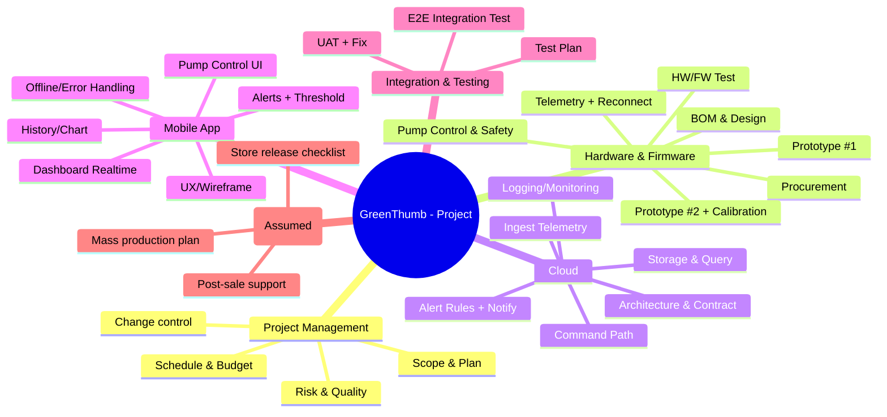

# CHƯƠNG 4: WBS & PHÂN CÔNG

## 4.1. Tổng quan WBS

### 4.1.1. Khái niệm WBS
WBS (Work Breakdown Structure) là cấu trúc phân rã phạm vi dự án thành các hạng mục/gói công việc (work packages) theo cấp bậc, giúp lập kế hoạch tiến độ, chi phí, phân công trách nhiệm và kiểm soát phạm vi.

### 4.1.2. Nguyên tắc xây dựng
- Tuân thủ nguyên tắc **100%**: WBS bao phủ toàn bộ phạm vi in-scope của dự án.
- Phân rã đến mức **work package** có thể ước tính thời gian/chi phí và gán người chịu trách nhiệm.
- Thể hiện rõ hai nhánh công việc **song song** của dự án IoT: (1) phần cứng/firmware và (2) phần mềm (cloud + mobile), có các điểm hội tụ ở giai đoạn tích hợp/kiểm thử.

## 4.2. Cấu trúc phân rã công việc

### 4.2.1. WBS cấp cao (Level 1–2)
- 1.0 Quản lý dự án
- 2.0 Phần cứng & firmware (HW/FW)
- 3.0 Cloud (MQTT/HTTP + DB + Rules)
- 4.0 Ứng dụng di động
- 5.0 Tích hợp & kiểm thử
- 6.0 Triển khai & bàn giao (giả định)

### 4.2.2. WBS chi tiết (đến Work Packages)
**Bảng 4.1. WBS chi tiết (đến work packages)**

| WBS ID | Hạng mục | Mô tả ngắn | Deliverable chính |
|---|---|---|---|
| 1.1 | Lập kế hoạch tổng thể | Scope/FR-NFR, giả định/ràng buộc, baseline | Chương 1–2 (tóm tắt), baseline scope |
| 1.2 | Quản lý tiến độ/chi phí | Theo dõi kế hoạch, cập nhật | Báo cáo tiến độ (giả định) |
| 1.3 | Quản lý thay đổi | Ghi nhận thay đổi, đánh giá tác động | Change log (giả định) |
| 2.1 | BOM & thiết kế khối | Chọn linh kiện, sơ đồ khối, nguồn/bơm | BOM + block diagram |
| 2.2 | Mua linh kiện | Đặt mua linh kiện cho 02 prototypes | Danh sách mua hàng |
| 2.3 | Lắp prototype #1 | Lắp ráp, kiểm tra nguồn, kết nối | Prototype #1 |
| 2.4 | FW đọc cảm biến | Đọc độ ẩm/nhiệt; format dữ liệu | FW telemetry basic |
| 2.5 | FW kết nối cloud | Wi‑Fi + MQTT/HTTP + reconnect | Telemetry gửi cloud |
| 2.6 | Điều khiển bơm an toàn | Nhận lệnh, bật/tắt, giới hạn thời gian | Pump control stable |
| 2.7 | Prototype #2 + hiệu chuẩn | Ổn định & hiệu chuẩn đo đạc | Prototype #2 ổn định |
| 2.8 | Test HW/FW | Test tải bơm, độ ổn định, độ chính xác | Biên bản test (tóm tắt) |
| 3.1 | Kiến trúc cloud + contract | API/topic naming, payload schema | API/MQTT contract |
| 3.2 | Ingest telemetry | Endpoint/broker nhận dữ liệu | Ingest chạy demo |
| 3.3 | Lưu trữ & truy vấn | DB + query lịch sử | API lịch sử |
| 3.4 | Command path | App→cloud→device command | Command chạy demo |
| 3.5 | Alert rules + notify | Rule ngưỡng + thông báo (giả định) | Cảnh báo hoạt động |
| 3.6 | Logging/monitoring | Log sự kiện chính (tối thiểu) | Log/checklist |
| 4.1 | UX flow + wireframe | Luồng màn hình, bố cục | Wireframe/mockup |
| 4.2 | Dashboard realtime | Hiển thị dữ liệu hiện tại | Màn dashboard |
| 4.3 | Lịch sử/biểu đồ | Xem lịch sử theo ngày/tuần | Màn lịch sử |
| 4.4 | Cảnh báo + cấu hình ngưỡng | Thiết lập ngưỡng, hiển thị cảnh báo | Màn cảnh báo |
| 4.5 | Điều khiển bơm | Bật/tắt + trạng thái | Màn điều khiển |
| 4.6 | Xử lý lỗi kết nối | Offline/error UI, retry cơ bản | UX lỗi kết nối |
| 5.1 | Test plan + test cases | Kế hoạch test HW/SW/Integration | Test plan + sample cases |
| 5.2 | Integration test end-to-end | Test luồng dữ liệu & command | Kết quả test tích hợp |
| 5.3 | UAT + nghiệm thu | Kịch bản UAT, tiêu chí nghiệm thu | Biên bản UAT (tóm tắt) |
| 6.1 | Kế hoạch triển khai | Sản xuất giả định, phát hành app | Deployment checklist |
| 6.2 | Hỗ trợ sau bán | Kênh hỗ trợ, SLA giả định | Support plan |
| 6.3 | Hoàn thiện báo cáo/slide | Tổng hợp tài liệu & phụ lục | Báo cáo + slide |

## 4.3. Work Packages

### 4.3.1. Danh sách work packages (tóm tắt quản lý)
**Bảng 4.2. Work packages (quản lý – gán owner)**

| WP ID | WBS ID | Work Package | Owner (chịu trách nhiệm chính) | Phụ thuộc chính |
|---|---|---|---|---|
| WP01 | 1.1 | Scope + yêu cầu + baseline | SV1 (PM/BA) | - |
| WP02 | 2.1 | BOM + thiết kế nguồn/bơm | SV2 (HW) | WP01 |
| WP03 | 2.2 | Mua linh kiện 02 prototypes | SV2 (HW) | WP02 |
| WP04 | 2.3 | Lắp prototype #1 | SV2 (HW) | WP03 |
| WP05 | 3.1 | Cloud architecture + API/MQTT contract | SV5 (Cloud/QA) | WP01 |
| WP06 | 2.4–2.5 | Firmware telemetry + reconnect | SV3 (FW/IoT) | WP04, WP05 |
| WP07 | 3.2–3.3 | Ingest + storage + query | SV5 (Cloud/QA) | WP05 |
| WP08 | 4.1–4.2 | UX + Dashboard mock→real | SV4 (Mobile) | WP05 |
| WP09 | 2.6 | Command + bơm an toàn | SV3 (FW/IoT) | WP06 |
| WP10 | 3.4 | Command path (cloud) | SV5 (Cloud/QA) | WP07 |
| WP11 | 4.5 | Điều khiển bơm (app) | SV4 (Mobile) | WP08, WP10 |
| WP12 | 2.7 | Prototype #2 ổn định + hiệu chuẩn | SV2 (HW) | WP06 |
| WP13 | 5.1–5.2 | Test plan + integration test | SV5 (Cloud/QA) | WP11, WP12 |
| WP14 | 5.3 | UAT + nghiệm thu | SV1 (PM/BA) | WP13 |
| WP15 | 6.1–6.3 | Deployment plan + báo cáo/slide | SV1 (PM/BA) | WP14 |

### 4.3.2. Mô tả chi tiết mẫu cho một số gói (template)
Nhóm áp dụng template mô tả work package để kiểm soát phạm vi và nghiệm thu:

**Mẫu Work Package**
- Mục tiêu:
- Đầu ra (Deliverable):
- Tiêu chí nghiệm thu (Acceptance):
- Người thực hiện chính (Owner):
- Phụ thuộc:
- Rủi ro chính:

*(Có thể đưa mô tả chi tiết cho toàn bộ WP vào Phụ lục nếu cần.)*

## 4.4. Phân công công việc

### 4.4.1. Danh sách thành viên (quy ước)
- **SV1:** PM/BA
- **SV2:** Hardware
- **SV3:** Firmware/IoT
- **SV4:** Mobile
- **SV5:** Cloud/QA

### 4.4.2. Phân công nhiệm vụ theo nhánh
- **SV1 (PM/BA):** scope, WBS, Gantt, ngân sách, quản lý thay đổi, tổng hợp báo cáo/slide, phối hợp UAT.
- **SV2 (HW):** BOM, mua linh kiện, lắp 02 prototypes, test tải bơm/nguồn, phối hợp hiệu chuẩn.
- **SV3 (FW/IoT):** firmware đọc cảm biến, gửi dữ liệu, nhận lệnh, điều khiển bơm an toàn, reconnect.
- **SV4 (Mobile):** UX flow, dashboard, lịch sử, cảnh báo, điều khiển bơm, xử lý lỗi UI.
- **SV5 (Cloud/QA):** contract MQTT/HTTP, ingest/storage/query, command path, rule cảnh báo, test plan + integration test.

## 4.5. Ma trận RACI

### 4.5.1. Xây dựng ma trận
Quy ước:
- **R (Responsible):** thực hiện
- **A (Accountable):** chịu trách nhiệm cuối cùng
- **C (Consulted):** được tham vấn
- **I (Informed):** được thông báo

### 4.5.2. Ma trận RACI (tóm tắt theo deliverables chính)
**Bảng 4.3. RACI**

| Deliverable | SV1 (PM/BA) | SV2 (HW) | SV3 (FW) | SV4 (Mobile) | SV5 (Cloud/QA) |
|---|---|---|---|---|---|
| Scope + FR/NFR + in/out | A/R | C | C | C | C |
| WBS + phân công | A/R | C | C | C | C |
| Gantt + milestones + critical path | A/R | C | C | C | C |
| BOM + thiết kế nguồn/bơm | I | A/R | C | I | C |
| Prototype #1/#2 | I | A/R | R | I | I |
| Firmware telemetry + command | I | C | A/R | I | C |
| Cloud ingest/storage/command | I | I | C | C | A/R |
| Mobile app UI + integrate | I | I | C | A/R | C |
| Test plan + integration test | C | C | C | C | A/R |
| UAT + acceptance | A/R | C | C | C | C |
| Deployment checklist (giả định) | A/R | C | C | C | C |
| Final report + slide | A/R | C | C | C | C |

## (Gợi ý) Hình 4.1 – Sơ đồ WBS
Hình 4.1 dưới đây thể hiện WBS theo dạng sơ đồ cây.

- File hình tham chiếu: xem [Hinh-4-1-WBS.html](Hinh-4-1-WBS.html) để xuất ảnh chèn Word.
