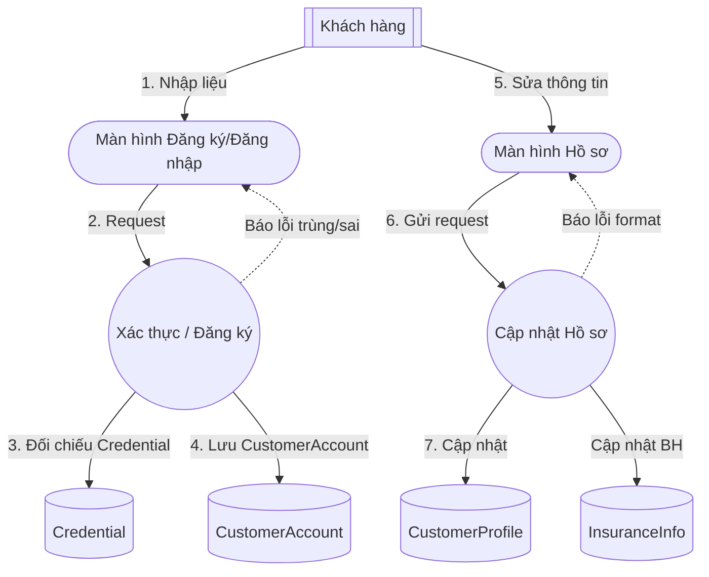
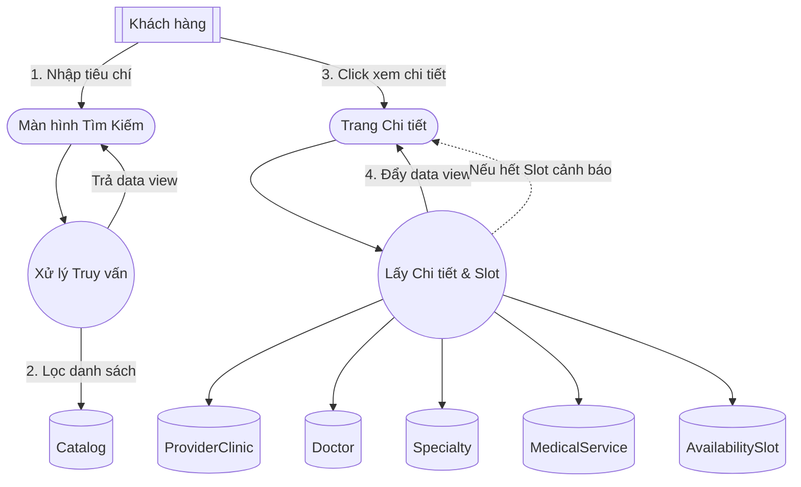
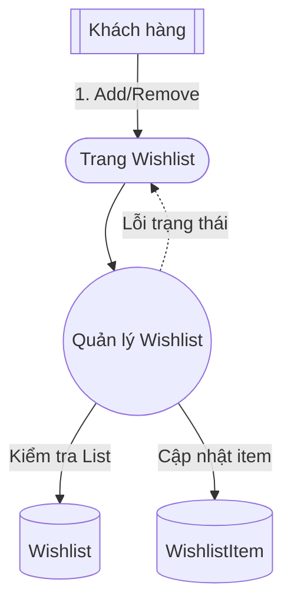
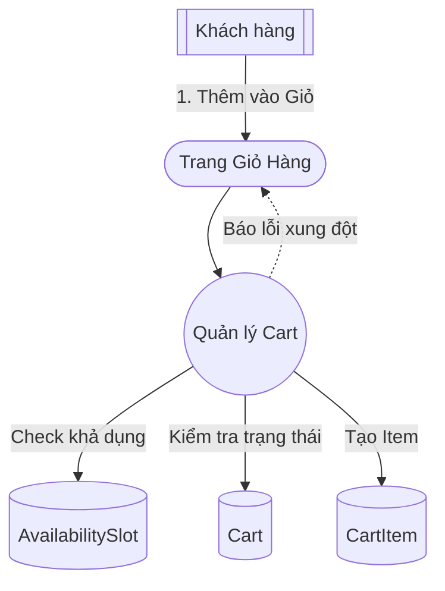
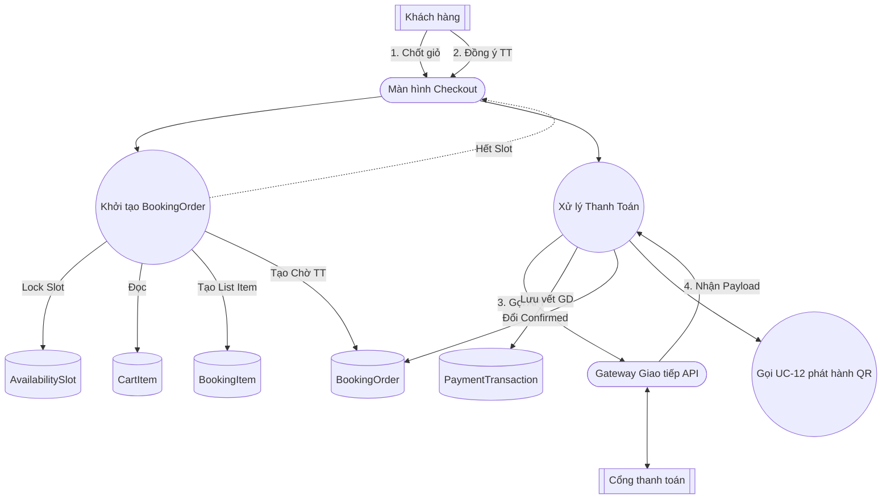
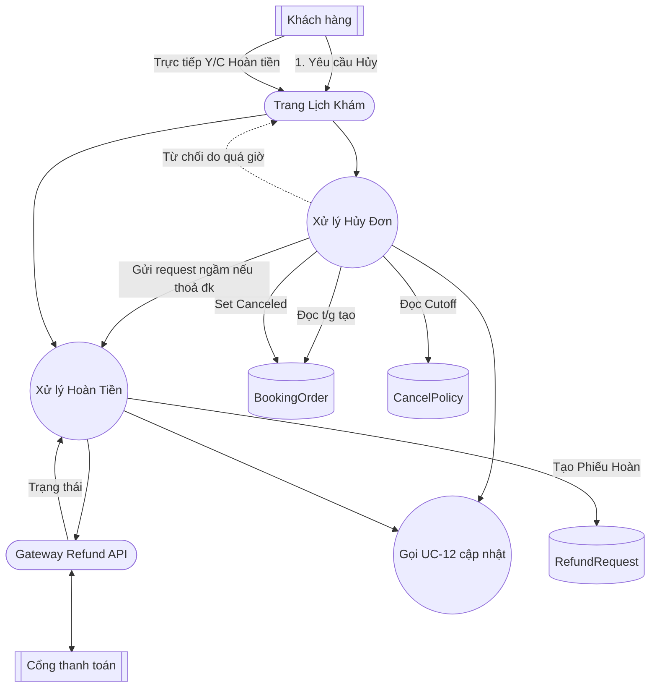
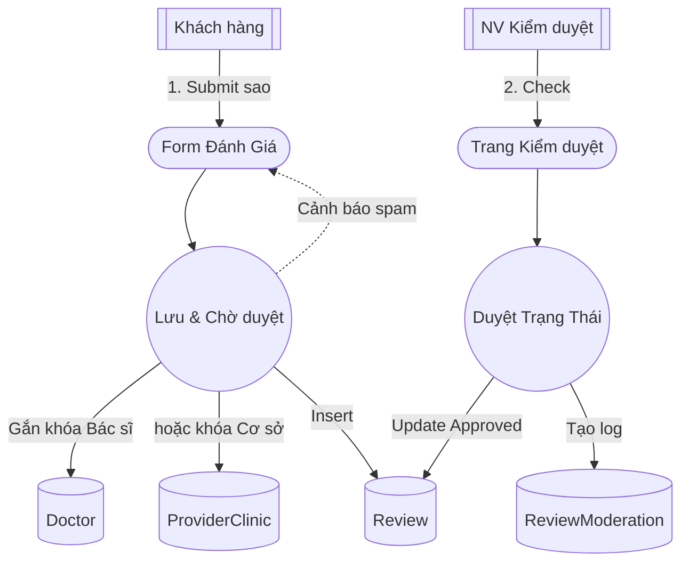
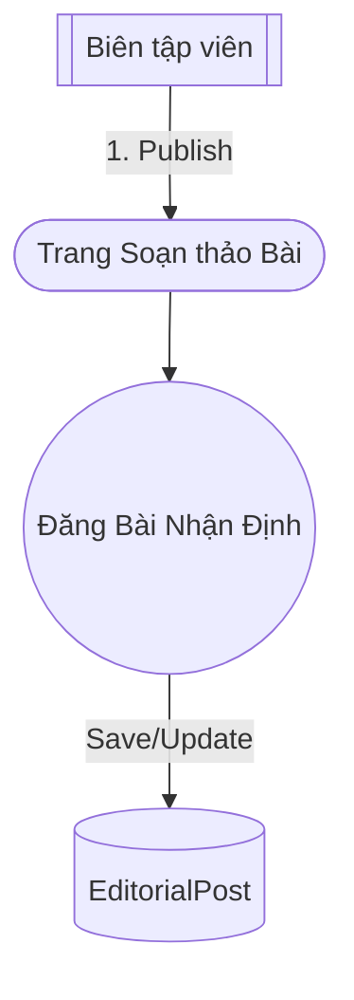
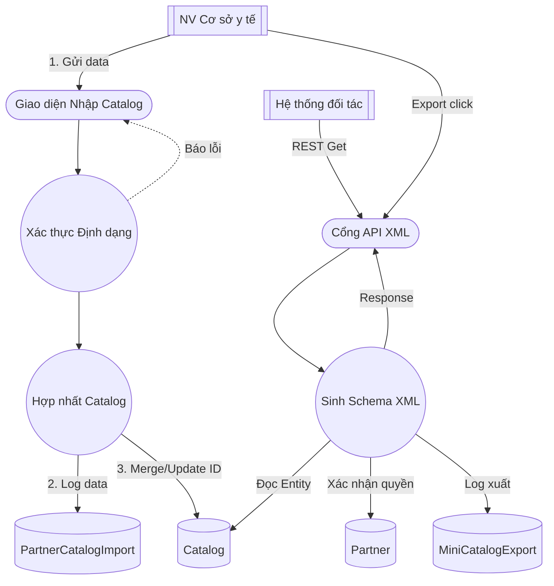
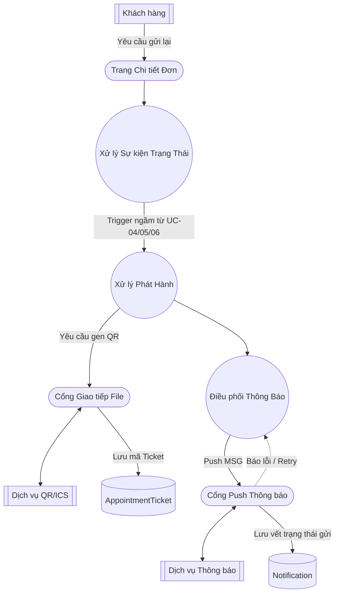

# CHƯƠNG 3. BIỂU ĐỒ MẠNH MẼ (ROBUSTNESS DIAGRAM)

## 3.1 Nền tảng phân tích và quy ước ký hiệu
Trong tiến trình mô hình hóa định hướng Use-Case (ICONIX), Sơ đồ Robustness đóng vai trò là "cầu nối" (phân tích) kết nối giữa các kịch bản Use Case (Chương 2) và các lớp tĩnh trong Domain Model (Chương 1). 

Mục tiêu của sơ đồ là phân tích luồng sự kiện (BASIC/ALTERNATE COURSE) thành ba nhóm đối tượng nhằm chứng minh mô hình miền đã đủ sức mạnh để chạy kịch bản Use Case:
1. **Tác nhân (Actor)**: Yếu tố bên ngoài tương tác với hệ thống.
2. **Giao diện (Boundary)**: Nơi Actor tương tác (Màn hình, Cổng API v.v).
3. **Xử lý (Control)**: Đóng vai trò thực thi nghiệp vụ, kiểm tra tính hợp lệ.
4. **Thực thể (Entity)**: Các dữ liệu nghiệp vụ có từ Domain Model.

**Bốn quy tắc vàng (ICONIX rules) áp dụng nghiêm ngặt:**
*   Actor KHÔNG trực tiếp gọi Entity.
*   Boundary KHÔNG trực tiếp gọi Entity (mà phải giao tiếp qua Control).
*   Boundary KHÔNG nối trực tiếp với Boundary (ngoại trừ điều hướng hiển thị).
*   Actor chỉ tương tác với Boundary.

Do Mermaid.js không hỗ trợ chuẩn format UML Robustness truyền thống nguyên thủy, báo cáo dùng quy ước hình tối giản, tiêu chuẩn (Clean format) sau đây để thay thế:
*   `Actor[[Tác nhân]]` (Cặp ngoặc vuông kép thể hiện đối tượng ngoại cảnh)
*   `Boundary([Tên Giao diện])` (Cặp ngoặc đơn oval lồi thể hiện Boundary)
*   `Control((Tên Xử lý))` (Hình tròn lõi thể hiện Control)
*   `Entity[(Tên Thực Thể)]` (Hình trụ Database thể hiện kho lưu trữ Entity)

---

## 3.2 Các sơ đồ Robustness chi tiết cho từng Use Case

### 3.2.1 Sơ đồ thiết kế cho UC-00 – Đăng ký/Đăng nhập & quản lý hồ sơ (RB-UC00)

Sơ đồ thể hiện chu trình nhận form Đăng nhập đến việc đối chiếu và khởi tạo `CustomerAccount` hoặc `CustomerProfile`.

### 3.2.2 Sơ đồ thiết kế cho UC-01 – Tìm kiếm & xem chi tiết (RB-UC01)

### 3.2.3 Sơ đồ thiết kế cho UC-02 – Quản lý Wishlist (RB-UC02)

### 3.2.4 Sơ đồ thiết kế cho UC-03 – Quản lý Cart (RB-UC03)

### 3.2.5 Sơ đồ thiết kế cho UC-04 – Đặt lịch & Thanh toán (RB-UC04)

### 3.2.6 Sơ đồ thiết kế cho UC-05 & UC-06 – Hủy lịch & Hoàn tiền (RB-UC05-06)

### 3.2.7 Sơ đồ thiết kế cho UC-07 & UC-08 – Đánh giá & Kiểm duyệt (RB-UC07-08)

Đã bổ sung liên kết Review tới cả Doctor và ProviderClinic như kịch bản đặt ra.

### 3.2.8 Sơ đồ thiết kế cho UC-09 – Quản lý nội dung biên tập (RB-UC09)

### 3.2.9 Sơ đồ thiết kế nhóm Đối tác & XML (RB-UC10-11)

### 3.2.10 Sơ đồ thiết kế phân đoạn cho UC-12 (RB-UC12)

---
*Ghi chú đánh giá độ bền vững (Robustness Verification)*: 
Quá trình thiết kế hệ thống đồ thị đã nỗ lực tuân thủ ICONIX. Sự nhất quán giữa Use Case (Chương 2) và Domain (Chương 1) được phân tích và trích xuất. Các cặp Entity tổ hợp đã được bóc tách và các Use Case đã được nhóm theo Ma trận truy vết ở Chương 2, tạo nền tảng mang ý nghĩa tham khảo 1:1 cho Sequence Diagram ở Chương 4.
