# CHƯƠNG 4. BIỂU ĐỒ TRÌNH TỰ (SEQUENCE DIAGRAM)

## 4.1 Nền tảng và quy ước trình bày
Trong ICONIX, Sequence Diagram là bước “thiết kế động” (dynamic design) được phát triển dựa trên kịch bản Use Case (Chương 2) và các đối tượng BCE trong Robustness Diagram (Chương 3). Nếu Robustness trả lời câu hỏi “ai tương tác với ai” (Actor–Boundary–Control–Entity), thì Sequence Diagram trả lời câu hỏi “tương tác theo thứ tự nào” (trình tự message theo thời gian) để hoàn thành mục tiêu use case.

Mục tiêu của các sơ đồ trình tự trong chương này:
- Chuẩn hóa luồng xử lý nghiệp vụ theo đúng BASIC/ALTERNATE COURSE đã mô tả.
- Làm rõ vai trò điều phối của lớp Control (điểm đặt logic nghiệp vụ/kiểm tra hợp lệ), và phạm vi đọc/ghi của các Entity liên quan.
- Tạo nền tảng trực tiếp cho việc triển khai (API/service), kiểm thử (test case theo nhánh alt), và đối chiếu tính nhất quán giữa Use Case ↔ Robustness ↔ Domain.

Nguyên tắc ánh xạ từ Robustness (Chương 3) sang Sequence (Chương 4):
- Actor trong Robustness trở thành tác nhân khởi phát message vào Boundary.
- Boundary đại diện cho màn hình/UI hoặc gateway/endpoint; Boundary chỉ gửi/nhận request/response mức nghiệp vụ.
- Control là nơi điều phối: nhận request từ Boundary, thực hiện kiểm tra/ra quyết định, gọi Entity để truy xuất/cập nhật dữ liệu.
- Entity thể hiện trạng thái dữ liệu nghiệp vụ (đọc/ghi). Các tương tác Entity được thể hiện ở mức “read/save/update” thay vì đi sâu chi tiết truy vấn.

Quy ước trình bày:
- Mỗi use case có 1 sơ đồ trình tự mô tả luồng chính; các nhánh ngoại lệ quan trọng được gom trong khối `alt` (rẽ nhánh loại trừ) hoặc `opt` (tùy chọn).
- Chỉ thể hiện thông điệp ở mức nghiệp vụ (không mô tả chi tiết kỹ thuật như HTTP status, SQL, cache…), nhưng vẫn đủ rõ để truy vết từng bước trong BASIC/ALTERNATE COURSE.
- Tên lifeline ưu tiên bám theo stereotype ICONIX: `<<boundary>>`, `<<control>>`, `<<entity>>` như ở Chương 3 để đối chiếu nhanh.
- Thông điệp dạng gọi xử lý dùng mũi tên liền (`->>`), phản hồi/hiển thị/nhắc lỗi dùng mũi tên nét đứt (`-->>`) để nhấn mạnh đây là kết quả trả về cho Boundary/Actor.
- Với các dịch vụ ngoài hệ thống (cổng thanh toán, dịch vụ QR/ICS, dịch vụ thông báo…), lifeline được biểu diễn như tác nhân/hệ thống bên ngoài để làm rõ ranh giới hệ thống.
- Các bước có điều hướng UI (Boundary→Boundary) chỉ dùng để biểu diễn chuyển màn hình hoặc render/refresh; không dùng để thay thế logic nghiệp vụ vốn phải nằm ở Control.

Lưu ý đánh giá: các sơ đồ trong chương này được thiết kế để bám sát Robustness đã trình bày và tuân thủ quy tắc ICONIX (Actor chỉ tương tác Boundary; Boundary không gọi Entity trực tiếp; Control là trung tâm điều phối nghiệp vụ).

---

## 4.2 Các sơ đồ Sequence Diagram chi tiết cho từng Use Case

### 4.2.1 Sơ đồ trình tự cho UC-00 – Đăng ký/Đăng nhập & quản lý hồ sơ (SD-UC00)

| Use Case: UC-00 – Đăng ký/Đăng nhập & quản lý hồ sơ |
|---|
| **BASIC COURSE** 1. Khách hàng chọn đăng ký hoặc đăng nhập. 2. Hệ thống hiển thị form và yêu cầu nhập email/số điện thoại + mật khẩu. 3. Với đăng ký: kiểm tra trùng; tạo tài khoản; khởi tạo hồ sơ. 4. Với đăng nhập: đối chiếu mật khẩu; tạo phiên đăng nhập. 5. Khách hàng cập nhật hồ sơ/bảo hiểm (nếu có). 6. Hệ thống lưu và thông báo thành công.  **ALTERNATE COURSE** - Trùng email/số điện thoại / sai thông tin đăng nhập. - Dữ liệu hồ sơ/bảo hiểm không hợp lệ. |

Để sơ đồ dễ đọc (không quá tải lifeline), UC-00 được tách thành 3 sơ đồ tương ứng 3 nhóm thao tác: đăng ký, đăng nhập và quản lý hồ sơ.

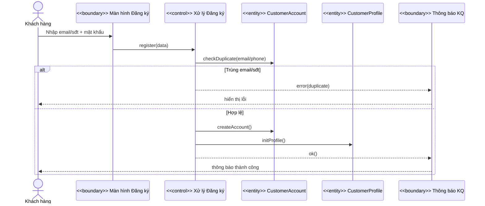

**Hình 4.1a – SD-UC00: Đăng ký tài khoản**

Nội dung Hình 4.1a: Khách hàng thao tác trên Boundary đăng ký; Control kiểm tra trùng và tạo tài khoản/khởi tạo hồ sơ, kèm nhánh ngoại lệ khi trùng email/số điện thoại.

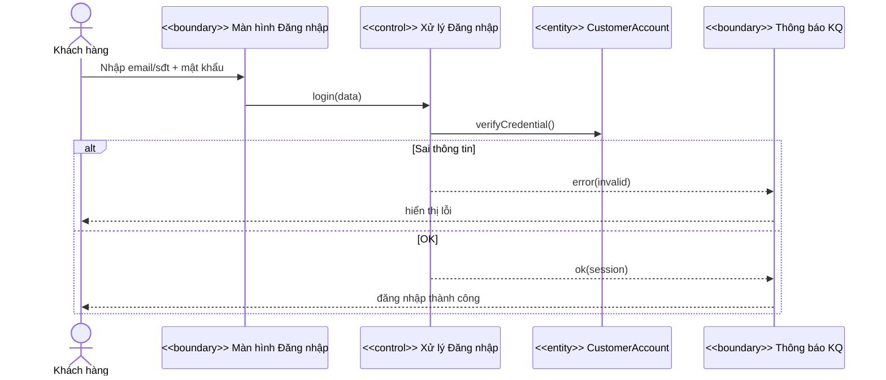

**Hình 4.1b – SD-UC00: Đăng nhập**

Nội dung Hình 4.1b: Control xác thực thông tin đăng nhập và trả kết quả về Boundary để hiển thị, kèm nhánh ngoại lệ khi sai thông tin.

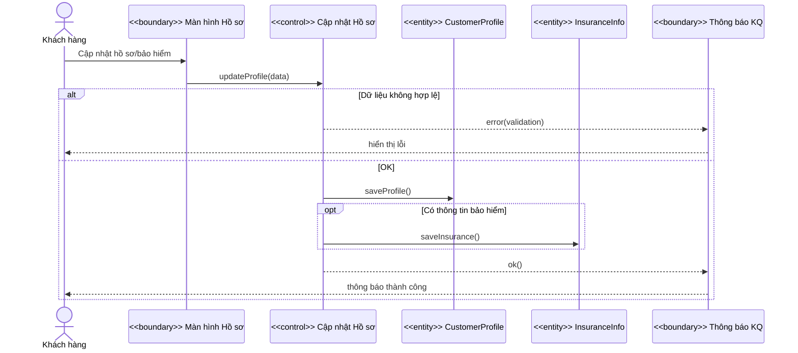

**Hình 4.1c – SD-UC00: Quản lý hồ sơ**

Nội dung Hình 4.1c: Khách hàng cập nhật thông tin trên Boundary hồ sơ; Control kiểm tra hợp lệ, lưu `CustomerProfile` và (tùy chọn) `InsuranceInfo`, kèm nhánh ngoại lệ khi dữ liệu không hợp lệ.

### 4.2.2 Sơ đồ trình tự cho UC-01 – Tìm kiếm & xem chi tiết (SD-UC01)

| Use Case: UC-01 – Tìm kiếm & xem chi tiết |
|---|
| **BASIC COURSE** 1. Khách hàng nhập tiêu chí tìm kiếm. 2. Hệ thống truy vấn catalog và hiển thị danh sách kết quả. 3. Khách hàng chọn 1 mục. 4. Hệ thống hiển thị trang chi tiết và danh sách slot còn trống.  **ALTERNATE COURSE** - Không có kết quả. - Slot vừa hết: UI cập nhật lại. |

Để sơ đồ dễ đọc và tránh quá dày đối tượng, UC-01 được tách thành 2 sơ đồ: (1) luồng tìm kiếm và hiển thị danh sách; (2) luồng xem chi tiết và tải slot.

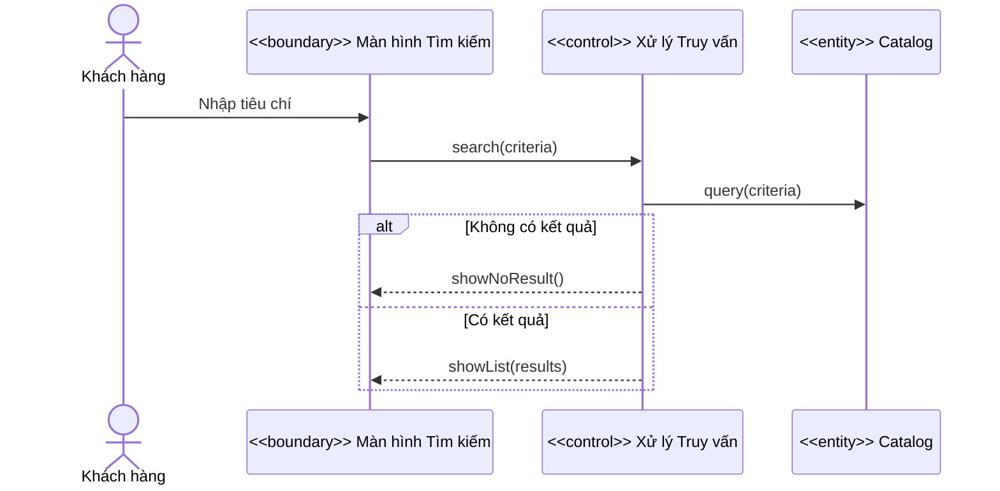

**Hình 4.2a – SD-UC01: Tìm kiếm & hiển thị danh sách**

Nội dung Hình 4.2a: Khách hàng nhập tiêu chí trên Boundary, Control truy vấn `Catalog` và trả kết quả để UI hiển thị danh sách hoặc thông báo không có kết quả.

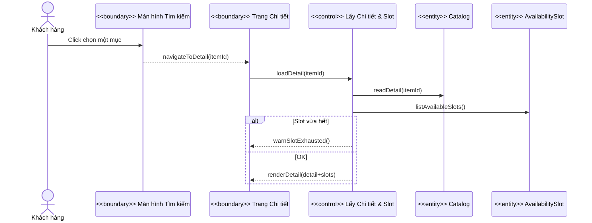

**Hình 4.2b – SD-UC01: Xem chi tiết & tải slot**

Nội dung Hình 4.2b: Từ danh sách kết quả, Boundary điều hướng sang trang chi tiết. Control tải dữ liệu chi tiết từ các Entity và danh sách slot còn trống, kèm nhánh ngoại lệ khi slot vừa hết.

### 4.2.3 Sơ đồ trình tự cho UC-02 – Quản lý Wishlist (SD-UC02)

| Use Case: UC-02 – Quản lý Wishlist |
|---|
| **BASIC COURSE** 1. Khách hàng thêm/xóa mục yêu thích. 2. Hệ thống cập nhật wishlist và hiển thị danh sách mới.  **ALTERNATE COURSE** - Chưa đăng nhập: yêu cầu đăng nhập. |

Sơ đồ mô tả luồng thêm/xóa wishlist thông qua Control quản lý wishlist.

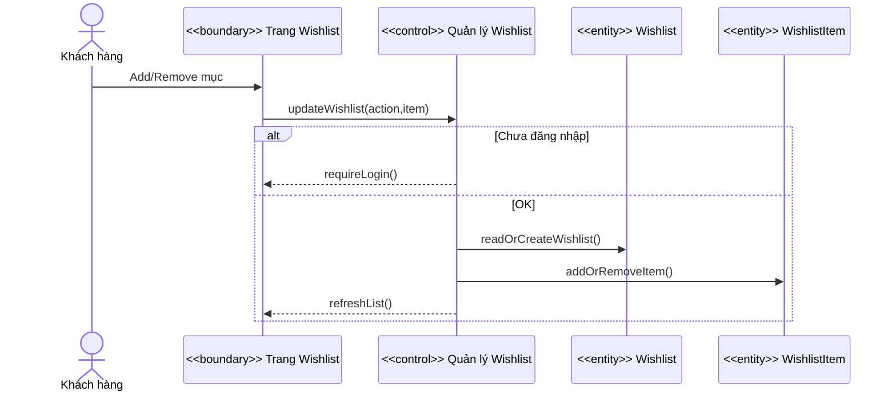

**Hình 4.3 – SD-UC02: Quản lý Wishlist**

Nội dung Hình 4.3: Boundary nhận thao tác thêm/xóa, Control kiểm tra điều kiện và cập nhật `Wishlist`/`WishlistItem`, sau đó trả danh sách mới hoặc yêu cầu đăng nhập.

### 4.2.4 Sơ đồ trình tự cho UC-03 – Quản lý Cart (SD-UC03)

| Use Case: UC-03 – Quản lý Cart |
|---|
| **BASIC COURSE** 1. Khách hàng thêm/xóa mục trong giỏ. 2. Hệ thống kiểm tra slot và cập nhật giỏ.  **ALTERNATE COURSE** - Slot không còn trống. - Xung đột thời gian. |

Sơ đồ mô tả kiểm tra khả dụng slot và cập nhật các Entity giỏ đặt lịch.

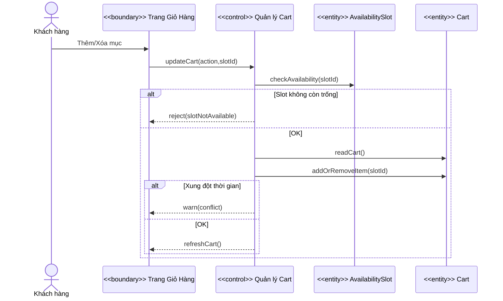

**Hình 4.4 – SD-UC03: Quản lý Cart**

Nội dung Hình 4.4: Control kiểm tra slot, cập nhật `Cart`, và trả thông báo lỗi/xung đột hoặc danh sách giỏ mới.

### 4.2.5 Sơ đồ trình tự cho UC-04 – Đặt lịch & Thanh toán (SD-UC04)

| Use Case: UC-04 – Đặt lịch & Thanh toán |
|---|
| **BASIC COURSE** 1. Khách hàng xác nhận giỏ. 2. Hệ thống kiểm tra từng mục và khởi tạo đơn chờ thanh toán. 3. Khách hàng chọn phương thức thanh toán, hệ thống gọi cổng thanh toán. 4. Thanh toán thành công, hệ thống cập nhật Paid/Confirmed và gọi UC-12.  **ALTERNATE COURSE** - Hết slot / nhiều cơ sở y tế. - Thanh toán thất bại/hủy. - Lỗi phát hành QR/ICS hoặc gửi thông báo: ghi nhận & retry. |

Sơ đồ mô tả luồng checkout và thanh toán, đồng thời thể hiện các nhánh ngoại lệ chính đúng theo Robustness UC-04.

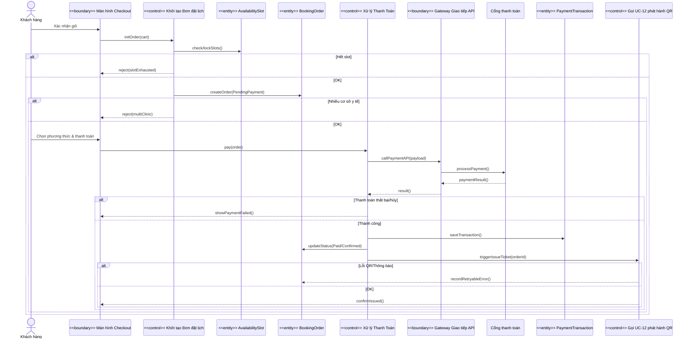

**Hình 4.5 – SD-UC04: Đặt lịch & Thanh toán**

Nội dung Hình 4.5: Control khởi tạo đơn kiểm tra/lock slot và tạo `BookingOrder` (PendingPayment). Control thanh toán giao tiếp cổng thanh toán qua gateway, ghi `PaymentTransaction`, cập nhật trạng thái đơn; sau đó kích hoạt UC-12 phát hành QR/ICS và gửi thông báo, kèm nhánh ngoại lệ khi lỗi hoặc thanh toán thất bại.

### 4.2.6 Sơ đồ trình tự cho UC-05 & UC-06 – Hủy lịch & Hoàn tiền (SD-UC05-06)

| Use Case: UC-05 – Hủy lịch; UC-06 – Yêu cầu hoàn tiền |
|---|
| **UC-05 – BASIC COURSE** 1. Khách hàng yêu cầu hủy đơn. 2. Hệ thống kiểm tra cut-off và cập nhật Cancelled. 3. Hệ thống gọi UC-12 để thông báo kết quả.  **UC-06 – BASIC COURSE** 1. Khách hàng yêu cầu hoàn tiền. 2. Hệ thống kiểm tra chính sách, tạo `RefundRequest`, gửi cổng thanh toán. 3. Cập nhật trạng thái và gọi UC-12 thông báo.  **ALTERNATE COURSE** - Quá cut-off / không đủ điều kiện / gateway lỗi. |

Để trình bày gọn theo từng chức năng, mục này được tách thành 2 sơ đồ: UC-05 (hủy lịch) và UC-06 (hoàn tiền).

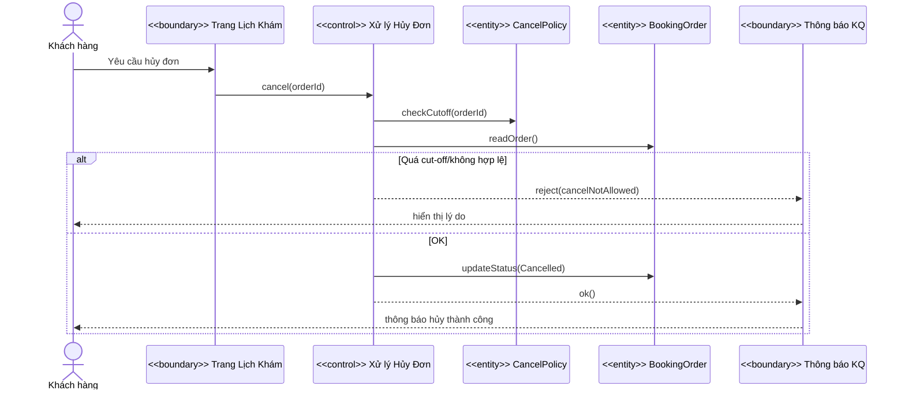

**Hình 4.6a – SD-UC05: Hủy lịch**

Nội dung Hình 4.6a: Khách hàng gửi yêu cầu hủy; Control kiểm tra chính sách cut-off, cập nhật trạng thái `BookingOrder` và trả kết quả để UI thông báo.

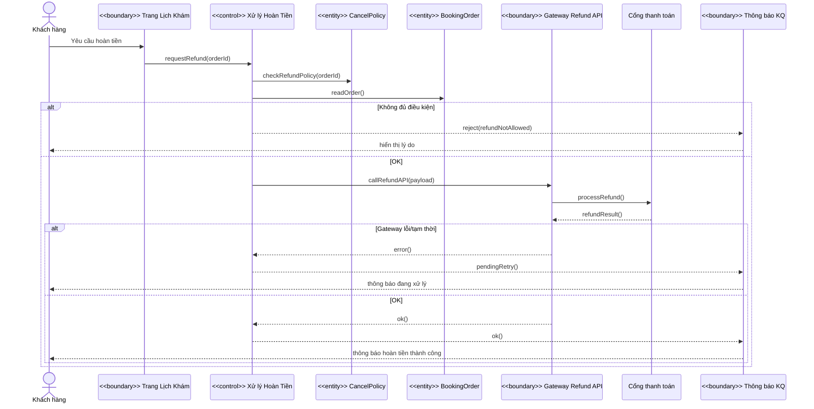

**Hình 4.6b – SD-UC06: Yêu cầu hoàn tiền**

Nội dung Hình 4.6b: Control kiểm tra điều kiện hoàn, gọi gateway/cổng thanh toán để xử lý hoàn, và trả trạng thái thành công/đang retry hoặc từ chối theo chính sách.

### 4.2.7 Sơ đồ trình tự cho UC-07 & UC-08 – Đánh giá & Kiểm duyệt (SD-UC07-08)

| Use Case: UC-07 – Gửi review; UC-08 – Kiểm duyệt review |
|---|
| **UC-07 – BASIC COURSE** 1. Khách hàng gửi review (rating + nội dung). 2. Hệ thống lưu review ở trạng thái Pending và thông báo đã tiếp nhận.  **UC-08 – BASIC COURSE** 1. Nhân viên kiểm duyệt duyệt hoặc từ chối review. 2. Hệ thống cập nhật trạng thái và ghi nhận log.  **ALTERNATE COURSE** - Chưa đăng nhập / nội dung không hợp lệ / spam. - Review không còn hợp lệ khi kiểm duyệt. |

Để dễ theo dõi, mục này được tách thành 2 sơ đồ: UC-07 (gửi review) và UC-08 (kiểm duyệt review).

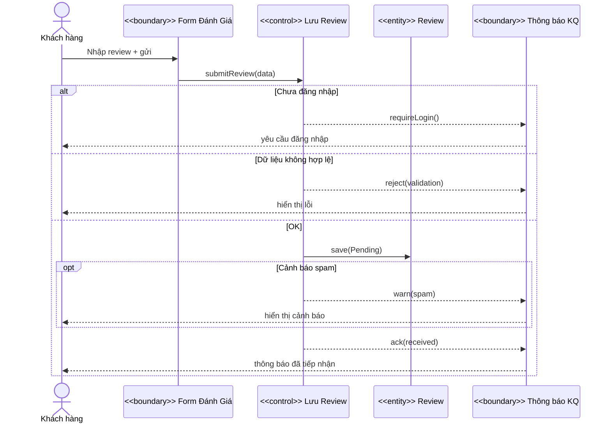

**Hình 4.7a – SD-UC07: Gửi review**

Nội dung Hình 4.7a: Khách hàng gửi review qua Boundary; Control kiểm tra điều kiện và lưu `Review` ở trạng thái Pending, kèm nhánh ngoại lệ khi chưa đăng nhập/không hợp lệ và tùy chọn cảnh báo spam.

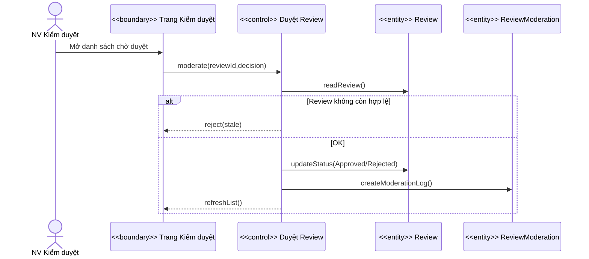

**Hình 4.7b – SD-UC08: Kiểm duyệt review**

Nội dung Hình 4.7b: Nhân viên kiểm duyệt thao tác trên Boundary; Control đọc review, cập nhật trạng thái và ghi log kiểm duyệt, kèm nhánh ngoại lệ khi review không còn hợp lệ.

### 4.2.8 Sơ đồ trình tự cho UC-09 – Quản lý nội dung biên tập (SD-UC09)

| Use Case: UC-09 – Quản lý editorial review |
|---|
| **BASIC COURSE** 1. Biên tập viên tạo/lưu nháp. 2. Biên tập viên xuất bản bài.  **ALTERNATE COURSE** - Thiếu thông tin bắt buộc. |

Sơ đồ mô tả luồng soạn thảo và xuất bản bài biên tập.

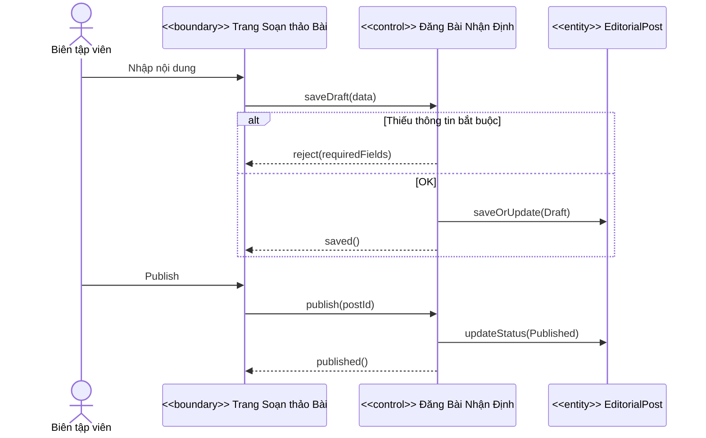

**Hình 4.8 – SD-UC09: Quản lý nội dung biên tập**

Nội dung Hình 4.8: Biên tập viên thao tác trên Boundary, Control lưu nháp/xuất bản và cập nhật `EditorialPost`, kèm nhánh từ chối khi thiếu trường bắt buộc.

### 4.2.9 Sơ đồ trình tự cho UC-10 & UC-11 – Đối tác & XML (SD-UC10-11)

| Use Case: UC-10 – Nhập catalog đối tác; UC-11 – Xuất mini-catalog XML |
|---|
| **UC-10 – BASIC COURSE** 1. NV cơ sở y tế gửi dữ liệu catalog. 2. Hệ thống xác thực định dạng và hợp nhất vào catalog tổng. 3. Ghi log kết quả nhập.  **UC-11 – BASIC COURSE** 1. Đối tác yêu cầu xuất mini-catalog XML. 2. Hệ thống kiểm tra quyền, đọc catalog tổng và sinh XML theo schema. 3. Ghi log xuất và trả XML.  **ALTERNATE COURSE** - Dữ liệu sai định dạng/thiếu trường; thiếu dữ liệu; cảnh báo trùng ID. |

Để tránh quá tải, mục này được tách thành 2 sơ đồ: UC-10 (nhập catalog) và UC-11 (xuất mini-catalog XML).

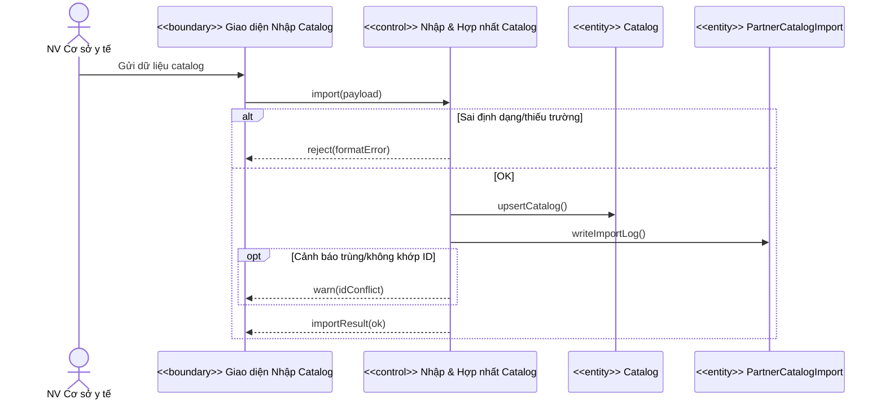

**Hình 4.9a – SD-UC10: Nhập catalog đối tác**

Nội dung Hình 4.9a: Boundary nhận dữ liệu catalog; Control kiểm tra hợp lệ, hợp nhất vào `Catalog` và ghi `PartnerCatalogImport`, kèm nhánh từ chối khi sai định dạng.

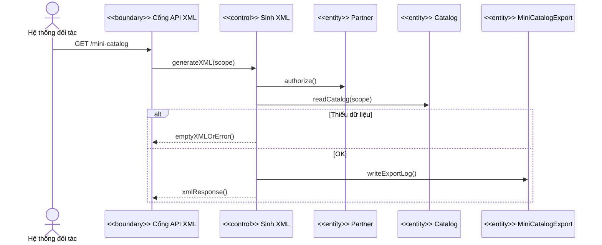

**Hình 4.9b – SD-UC11: Xuất mini-catalog XML**

Nội dung Hình 4.9b: Đối tác gọi Boundary API; Control kiểm tra quyền theo `Partner`, đọc `Catalog` để sinh XML, ghi log `MiniCatalogExport`, và trả kết quả hoặc thông báo thiếu dữ liệu.

### 4.2.10 Sơ đồ trình tự cho UC-12 – Phát hành QR/ICS & gửi thông báo (SD-UC12)

| Use Case: UC-12 – Phát hành QR/ICS & gửi thông báo |
|---|
| **BASIC COURSE** 1. UC-12 được kích hoạt bởi sự kiện trạng thái đơn (Confirmed/Cancelled/Refunded) hoặc yêu cầu gửi lại từ khách hàng. 2. Hệ thống phát hành QR/ICS qua dịch vụ ngoài và lưu ticket. 3. Hệ thống gửi thông báo email/SMS qua dịch vụ ngoài và lưu log trạng thái gửi.  **ALTERNATE COURSE** - Dịch vụ QR/ICS hoặc thông báo lỗi: ghi nhận & retry. - Gửi lại: dùng ticket có sẵn (hoặc phát hành lại nếu cần). |

Sơ đồ mô tả phát hành vé và gửi thông báo như một luồng dùng lại bởi các use case thanh toán/hủy/hoàn.

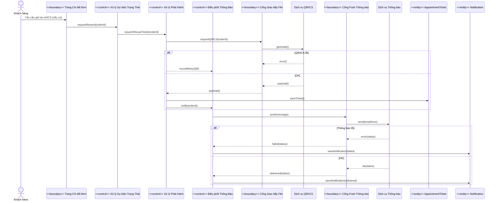

**Hình 4.10 – SD-UC12: Phát hành QR/ICS & gửi thông báo**

Nội dung Hình 4.10: UC-12 nhận kích hoạt từ UI hoặc sự kiện trạng thái, Control phát hành tương tác dịch vụ QR/ICS và lưu `AppointmentTicket`, sau đó Control điều phối gửi thông báo và lưu `Notification`, kèm nhánh lỗi để retry.
