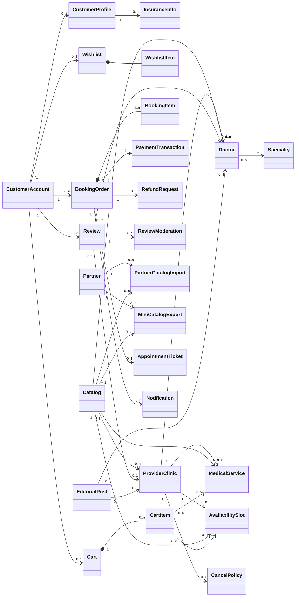
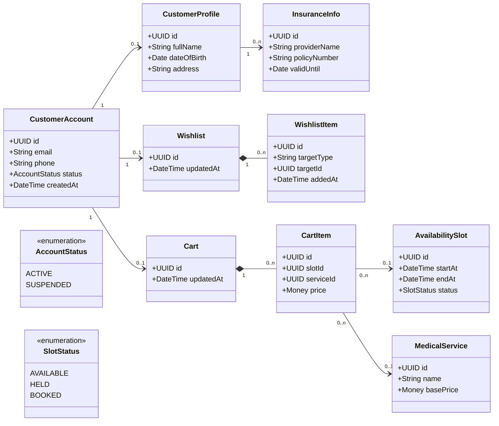
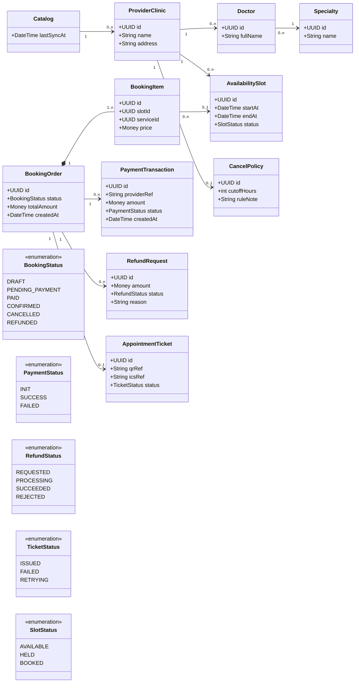
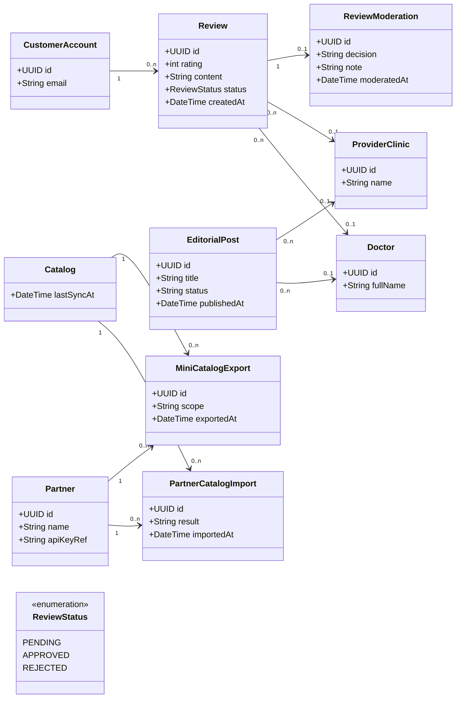
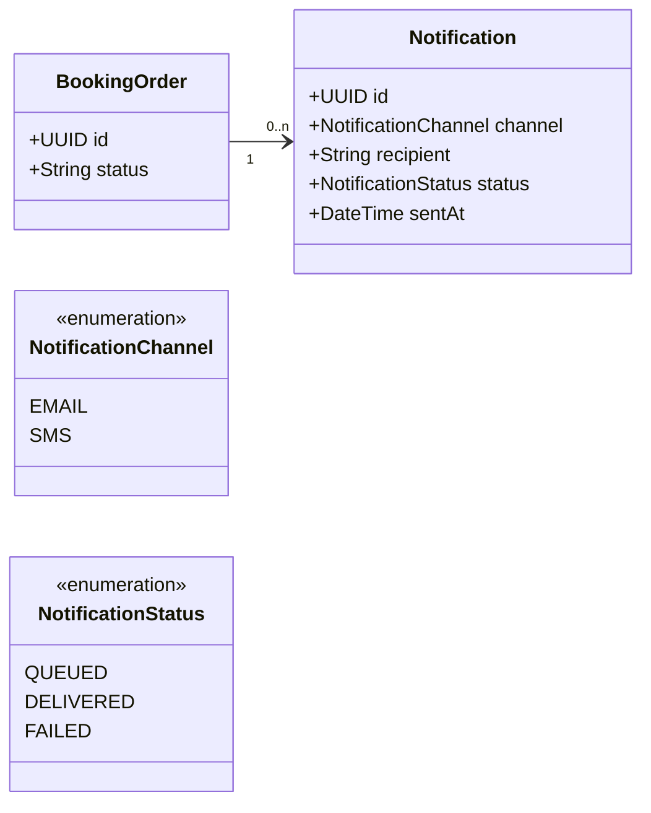

# CHƯƠNG 5. BIỂU ĐỒ LỚP (CLASS DIAGRAM)

## 5.1 Nền tảng và quy ước trình bày
Trong ICONIX, **Class Diagram** là bước “thiết kế tĩnh” (static design) nhằm mô tả cấu trúc lớp của hệ thống: thuộc tính cốt lõi, các quan hệ (association/composition), bội số (multiplicity) và kế thừa (generalization) khi cần. Class Diagram ở chương này được xây dựng dựa trên:
- **Domain Model (Chương 1)**: tập lớp nghiệp vụ và quan hệ chính.
- **Use Case/Robustness/Sequence (Chương 2–4)**: xác nhận lớp nào thực sự tham gia luồng nghiệp vụ và phạm vi đọc/ghi dữ liệu.

Quy ước:
- Tập trung vào **lớp nghiệp vụ (entity/domain)** và các cấu trúc dữ liệu cần lưu vết; không đi sâu chi tiết kỹ thuật (ORM/SQL/HTTP…).
- Thuộc tính liệt kê ở mức tối thiểu để hiểu mô hình; kiểu dữ liệu dùng ký hiệu chung (`String`, `UUID`, `DateTime`, `Money`, `Enum`).
- Quan hệ **chứa/thành phần** (composition) dùng `*--` để thể hiện vòng đời phụ thuộc (ví dụ: `BookingOrder` chứa `BookingItem`).
- Bội số thể hiện theo thực tế nghiệp vụ đã mô tả ở Chương 1 và các UC.

---

## 5.2 Sơ đồ lớp tổng quan
Sơ đồ tổng quan thể hiện các nhóm lớp chính: tài khoản & hồ sơ, catalog y tế, wishlist/cart, đặt lịch & thanh toán, nội dung & review, đối tác & XML, và nhóm phát hành vé/ thông báo.

**Hình 5.1 – Class Diagram tổng quan hệ thống**

Nội dung Hình 5.1: Mô tả cấu trúc lớp nghiệp vụ chính và quan hệ giữa các nhóm đối tượng: từ tài khoản/hồ sơ, catalog dịch vụ y tế, wishlist/cart, đặt lịch & thanh toán, review/nội dung, đến tích hợp đối tác (import/export XML) và nhóm phát hành vé/ thông báo.

---

## 5.3 Sơ đồ lớp chi tiết theo nhóm chức năng
Để tránh sơ đồ tổng quan quá dày, phần này trình bày các sơ đồ chi tiết theo nhóm UC tương ứng, tập trung vào lớp có liên quan trực tiếp đến luồng nghiệp vụ.

### 5.3.1 Nhóm UC-00/UC-02/UC-03: Tài khoản – Hồ sơ – Wishlist/Cart

**Hình 5.2 – Class Diagram chi tiết: Tài khoản – Hồ sơ – Wishlist/Cart**

Nội dung Hình 5.2: Thể hiện cấu trúc lớp phục vụ đăng ký/đăng nhập và quản lý hồ sơ (UC-00), cùng các lớp wishlist/cart để lưu lựa chọn trước khi đặt lịch (UC-02/UC-03). `WishlistItem` dùng mô hình tham chiếu tổng quát (`targetType/targetId`) để có thể lưu nhiều loại đối tượng quan tâm.

### 5.3.2 Nhóm UC-01/UC-04/UC-05/UC-06/UC-12: Catalog – Đặt lịch – Thanh toán – Hủy/Hoàn – Phát hành vé

**Hình 5.3 – Class Diagram chi tiết: Catalog – Đặt lịch – Thanh toán – Hủy/Hoàn – Ticket**

Nội dung Hình 5.3: Mô tả cấu trúc dữ liệu phục vụ tìm kiếm/xem chi tiết theo catalog (UC-01), khởi tạo đơn và thanh toán (UC-04), hủy/hoàn theo `CancelPolicy` (UC-05/UC-06), và phát hành `AppointmentTicket` (UC-12).

### 5.3.3 Nhóm UC-07/UC-08/UC-09/UC-10/UC-11: Review – Biên tập – Đối tác XML

**Hình 5.4 – Class Diagram chi tiết: Review – Biên tập – Đối tác XML**

Nội dung Hình 5.4: Thể hiện cấu trúc lớp phục vụ review và kiểm duyệt (UC-07/UC-08), nội dung biên tập (UC-09), và luồng nhập/xuất mini-catalog cho đối tác (UC-10/UC-11).

### 5.3.4 Nhóm UC-12: Thông báo (Notification)

**Hình 5.5 – Class Diagram chi tiết: Notification**

Nội dung Hình 5.5: Mô tả lớp `Notification` lưu vết việc gửi email/SMS trong UC-12, gồm kênh gửi, người nhận và trạng thái (queued/delivered/failed) để phục vụ truy vết và retry khi cần.
